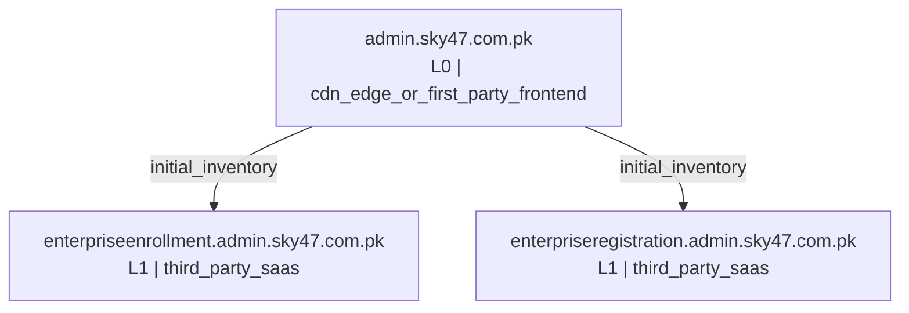
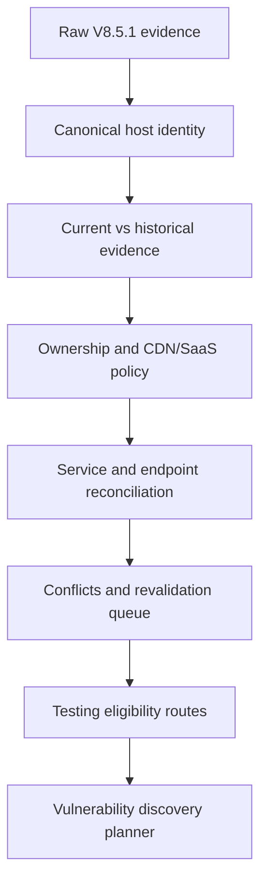
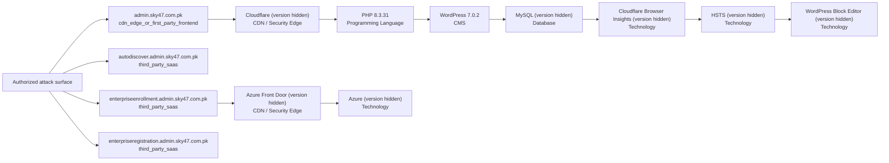

# Combined VAPT Intelligence Report: `admin.sky47.com.pk`

- **Combined report status:** `PARTIAL`
- **Source run:** `/Users/talha/Desktop/internship gelecek/0xCrawllerV10_updated/recon_runs/admin.sky47.com.pk-20260804-125032`
- **Generated at:** `2026-08-04T08:05:46.712762Z`
- **Report generator:** `0xCrawller Combined Report v10.0.0`

> This document consolidates reconnaissance, normalized asset intelligence, and technology/service identification. It does **not** by itself prove exploitable vulnerabilities.

## Pipeline status

| Stage | Purpose | Status | Primary evidence |
|---|---|---|---|
| 1. Reconnaissance | Discover and validate hosts, URLs, DNS, WAF/CDN, screenshots, passive observations, and bounded ports | `COMPLETE` | `summary.json` |
| 2. Normalization | Convert raw tool outputs into canonical assets, services, endpoints, conflicts, and testing eligibility | `COMPLETE` | `normalization_v9/normalization_summary.json` |
| 3. Technology identification | Correlate HTTP, JavaScript, tool fingerprints, and eligible service evidence | `PARTIAL` | `technology_enrichment_v9_2/technology_enrichment_summary.json` |

## Executive coverage

| Metric | Count | Meaning |
|---|---:|---|
| Canonical assets | 4 | Unique normalized hosts in the current inventory |
| DNS-validated assets | 3 | Hosts resolved in the current run |
| Live web assets | 3 | Hosts with a current HTTP observation |
| Normalized endpoints | 110 | Canonical URLs/endpoints after deduplication |
| Suspicious endpoints | 8 | Crawler observations requiring focused revalidation |
| Current services | 3 | Normalized web/network service records |
| Confirmed/current services | 3 | Services supported by current validation evidence |
| Technology records | 9 | Per-host technology/component fingerprints |
| Exact versions | 2 | Versions supported by defensible evidence |
| Versions not exposed | 7 | Detected products without an exact observed version |
| Technology conflicts | 0 | Conflicting technology/version observations |
| Normalization conflicts | 1 | Evidence requiring reconciliation or revalidation |
| Normalization revalidation items | 1 | Assets/endpoints queued for additional validation |
| Technology revalidation items | 5 | Technology evidence requiring additional validation |
| Screenshot-covered assets | 3 | Assets with captured screenshot evidence |
| CDN-detected assets | 3 | Assets identified behind an edge/CDN |
| WAF-detected assets | 1 | Assets with passive or active WAF evidence |
| Active-testing eligible assets | 1 | Assets permitted by the generated routing policy |

## Important interpretation

- Reconnaissance discovers and validates the attack surface; it does not confirm a vulnerability.
- Normalization is the trust boundary that separates current first-party assets from historical, third-party, wildcard-like, conflicting, or unvalidated observations.
- Technology identification reports only evidence-backed products and versions. `NOT_EXPOSED` means the product was detected but an exact version was not defensibly observable.
- Vulnerability mapping and validation should consume normalized eligibility and technology evidence, not raw scanner output.

## Asset-level consolidated inventory

| Host | HTTP | Priority | Asset types | CDN / WAF | Current services | Technologies | Testing decision |
|---|---|---|---|---|---|---|---|
| `admin.sky47.com.pk` | 200 Sky47 \| AI-Ready Tier III/IV Data Centre & Sovereign Cloud Pakistan - Sky47 delivers Tier III/IV colocation, sovereign cloud, high-density compute and AI-ready infrastructure to power secure enterprise-grade digital transformation. | High | admin_or_management_surface, api_surface, cdn_fronted_web, web_application, wordpress_application | CDN: Cloudflare, WAF: Cloudflare | tcp/443 https | Cloudflare, Cloudflare Browser Insights, HSTS, MySQL, PHP 8.3.31, WordPress 7.0.2, WordPress Block Editor | `ALLOWED_ACTIVE` |
| `autodiscover.admin.sky47.com.pk` | not live | — | admin_or_management_surface, dns_only_asset, third_party_saas | — | — | — | `THIRD_PARTY_RESTRICTED` |
| `enterpriseenrollment.admin.sky47.com.pk` | 404 Page not found | Medium | admin_or_management_surface, third_party_saas, web_application | CDN: azure | tcp/443 https | Azure, Azure Front Door | `THIRD_PARTY_RESTRICTED` |
| `enterpriseregistration.admin.sky47.com.pk` | 404 Unknown / Needs Review | Medium | admin_or_management_surface, third_party_saas, web_application | CDN: azure | tcp/443 https | — | `THIRD_PARTY_RESTRICTED` |

## Technology intelligence

### Categories

| Category | Records |
|---|---:|
| Technology | 4 |
| CDN / Security Edge | 2 |
| CMS | 1 |
| Database | 1 |
| Programming Language | 1 |

### Exact observed versions

| Host | Technology | Version | Category | Confidence | Sources |
|---|---|---|---|---|---|
| `admin.sky47.com.pk` | PHP | `8.3.31` | Programming Language | medium | httpx_wappalyzer |
| `admin.sky47.com.pk` | WordPress | `7.0.2` | CMS | medium | httpx_wappalyzer |

### Technology tool lanes

| Lane | Status | Targets/records | Note |
|---|---|---:|---|
| `zgrab2` | `SKIPPED` | 0 | no_network_service_targets |
| `http_evidence` | `PARTIAL` | 1 | — |
| `retirejs` | `FAILED` | 0 | javascript_downloads_failed |
| `wappalyzer_next` | `FAILED` | 1 | Unable to find image '0xcrawller/wappalyzer-next:2.0.0' locally docker: Error response from daemon: pull access denied for 0xcrawller/wappalyzer-next, repository does not exist or… |
| `whatweb` | `FAILED` | 1 | Unable to find image '0xcrawller/whatweb:0.6.4' locally docker: Error response from daemon: pull access denied for 0xcrawller/whatweb, repository does not exist or may require 'do… |
| `nuclei` | `COMPLETE` | 1 | [FTL] Could not run nuclei: no templates provided for scan |

## Services and ports

| Host | Protocol | Port | Family/product | Version | Status |
|---|---|---:|---|---|---|
| `admin.sky47.com.pk` | tcp | 443 | https | — | `HTTP_VALIDATED` |
| `enterpriseenrollment.admin.sky47.com.pk` | tcp | 443 | https | — | `HTTP_VALIDATED` |
| `enterpriseregistration.admin.sky47.com.pk` | tcp | 443 | https | — | `HTTP_VALIDATED` |

## Revalidation and evidence conflicts

### Normalization revalidation queue

| Host | Priority | Reason | Recommended action |
|---|---|---|---|
| `admin.sky47.com.pk` | Medium | suspicious_endpoints | HTTP-revalidate only the suspicious URLs before vulnerability routing. |

### Normalization conflicts

| Host | Severity | Type | Description |
|---|---|---|---|
| `admin.sky47.com.pk` | low | suspicious_crawler_endpoints | One or more crawler-derived URLs appear syntactically malformed or derived from JavaScript strings. |

No conflicting exact technology versions were observed.

## Authorized next-stage routing

| Route | Eligible assets |
|---|---:|
| HTTP security headers, cookie flags, methods, and disclosure checks | 1 |
| Safe and rate-limited web vulnerability templates | 1 |
| Evidence-driven checks selected from confirmed technologies | 1 |
| TLS protocol, certificate, and cipher configuration checks | 1 |

The next implementation layer should perform vulnerability discovery, CVE/CPE mapping, evidence-backed validation, false-positive control, and human approval for intrusive or authenticated checks.

## Evidence files consumed

- `summary.json` — read
- `final_report.md` — read
- `normalization_v9/normalization_summary.json` — read
- `normalization_v9/asset_inventory.json` — read
- `normalization_v9/service_inventory.json` — read
- `normalization_v9/endpoint_inventory.json` — read
- `normalization_v9/asset_conflicts.json` — read
- `normalization_v9/asset_revalidation_queue.json` — read
- `normalization_v9/testing_eligibility.json` — read
- `normalization_v9/asset_normalization_report.md` — read
- `technology_enrichment_v9_2/technology_enrichment_summary.json` — read
- `technology_enrichment_v9_2/technology_inventory.json` — read
- `technology_enrichment_v9_2/service_inventory_enriched.json` — read
- `technology_enrichment_v9_2/technology_conflicts.json` — read
- `technology_enrichment_v9_2/technology_revalidation_queue.json` — read
- `technology_enrichment_v9_2/technology_tool_status.json` — read
- `technology_enrichment_v9_2/technology_enrichment_report.md` — read

## Embedded source reports

The original stage reports are embedded below so the consolidated file remains self-contained.

### Reconnaissance source report

#### Smart Subdomain Recon Report: `admin.sky47.com.pk`

**Overall run status: `COMPLETE`**

Run folder: `recon_runs/admin.sky47.com.pk-20260804-125032`
Generated: `2026-08-04T13:04:28`

##### Run health and coverage

- Mode: `max`
- Canonical crawl target: `https://admin.sky47.com.pk`
- Candidates selected: `5239`
- Candidates generated before cap: `5239`
- Candidate list truncated: `False`
- Bulk DNS coverage: `5115/5115` (`100.0%`)
- DNSX chunks completed: `1/1`
- Katana requested configuration: `{"depth": 5, "crawl_duration": "10m", "known_files": "all", "enabled": true}`
- Katana effective configuration: `{"depth": 5, "crawl_duration": "10m", "known_files": "all", "scope": "fqdn", "enabled": true, "concurrency": 10, "rate_limit": 50, "javascript_crawl": true, "ignore_query_params": true}`

##### Tool status

| Tool | Status | OK | Timed out | Warnings | Errors | Seconds | Return code |
|---|---|---:|---:|---:|---:|---:|---:|
| subfinder | OK | True | False | 0 | 0 | 4.20 | 0 |
| gobuster_base | Warning | True | False | 1 | 1 | 6.07 | 0 |
| amass | OK | True | False | 0 | 0 | 57.27 | 0 |
| bbot | Warning | True | False | 19 | 0 | 262.54 | 0 |
| httpx_root_probe | OK | True | False | 0 | 0 | 17.26 | 0 |
| katana_canonical | OK | True | False | 0 | 0 | 47.45 | 0 |
| dnsx_priority | OK | True | False | 0 | 0 | 10.30 | 0 |
| dnsx_chunk_0001 | OK | True | False | 0 | 0 | 334.61 | 0 |
| gobuster_custom | Warning | True | False | 1 | 0 | 3.68 | 0 |
| dnsx_wildcards | OK | True | False | 0 | 0 | 1.80 | 0 |
| httpx_probe | Warning | True | False | 1 | 0 | 70.61 | 0 |
| httpx_screenshot | OK | True | False | 0 | 0 | 73.11 | 0 |
| wafw00f | OK | True | False | 0 | 0 | 1.92 | 0 |

###### Tool diagnostics

###### `gobuster_base`
- Warning: `[+] Timeout:    5s`
- Error: `[ERROR] error on word cdn: lookup cdn.admin.sky47.com.pk.: i/o timeout`

###### `bbot`
- Warning: `[INFO] Setup soft-failed for chaos: No API key set`
- Warning: `[INFO] Setup soft-failed for bevigil: No API key set`
- Warning: `[INFO] Setup soft-failed for bufferoverrun: No API key set`
- Warning: `[INFO] Setup soft-failed for builtwith: No API key set`
- Warning: `[INFO] Setup soft-failed for c99: No API key set`

###### `gobuster_custom`
- Warning: `[+] Timeout:    5s`

###### `httpx_probe`
- Warning: `443 chain="network is unreachable; connection refused"`

##### Wildcard analysis

Zones tested: `1`
Random probes sent: `3`

| Zone | Wildcard answer | Answers | Matching signature probes |
|---|---:|---:|---:|
| `admin.sky47.com.pk` | False | 0 | 0 |

##### DNS-validated assets (3)

- `autodiscover.admin.sky47.com.pk` state=`dns_resolved` A=[40.99.32.120, 40.99.60.8, 40.99.68.40, 40.99.70.184, 40.99.70.200, 40.99.70.216, 40.99.70.232, 52.98.61.40, 52.98.61.56] CNAME=[acdcatm.autodiscover.mira.tm.svc.cloud.microsoft, atm.autodiscover.mira.tm.svc.cloud.microsoft, autod.ms-acdc-autod.office.com, autodiscover.outlook.cloud.microsoft, autodiscover.outlook.com]
- `enterpriseenrollment.admin.sky47.com.pk` state=`dns_resolved` A=[13.107.228.46, 13.107.228.51] CNAME=[azurefd-t54-prod.trafficmanager.net, enterpriseenrollment-s.manage.microsoft.com, manage-pe.trafficmanager.net, pexsucp-drgzexethuh8cpen.b02.azurefd.net, s-part-0020.t-0009.t-s1-msedge.net, s-part-0035.t-0009.t-s1-msedge.net, s-part-0040.t-0009.t-s1-msedge.net, shed.dual-low.s-part-0020.t-0009.t-s1-msedge.net, shed.dual-low.s-part-0035.t-0009.t-s1-msedge.net, shed.dual-low.s-part-0040.t-0009.t-s1-msedge.net]
- `enterpriseregistration.admin.sky47.com.pk` state=`dns_resolved` A=[20.190.147.34, 20.190.147.36, 20.190.147.37, 20.190.147.38, 20.190.147.39, 20.190.163.0, 20.190.163.128, 20.190.163.23, 20.190.177.145, 20.190.177.18, 20.190.177.81, 40.126.18.35, 40.126.18.36, 40.126.35.131, 40.126.35.132] CNAME=[enterpriseregistration.windows.net, na.privatelink.msidentity.com, prdf.aadg.msidentity.com, www.tm.f.prd.aadg.akadns.net, www.tm.f.prd.aadg.trafficmanager.net]

##### Accepted keyword evidence (35)

Rejected noisy/random tokens: `395`

| Keyword | Score | Source(s) |
|---|---:|---|
| `admin` | 100 | katana_url |
| `media` | 100 | katana_url |
| `images` | 95 | katana_url |
| `api` | 92 | katana_url |
| `users` | 92 | katana_url |
| `blocks` | 75 | katana_url |
| `content` | 75 | katana_url |
| `embed` | 75 | katana_url |
| `includes` | 75 | katana_url |
| `leadership` | 75 | katana_url |
| `mauto` | 75 | katana_url |
| `plugins` | 75 | katana_url |
| `services` | 75 | katana_url |
| `style` | 75 | katana_url |
| `themes` | 75 | katana_url |
| `ver` | 75 | katana_url |
| `wpspeed` | 75 | katana_url |
| `ali` | 72 | katana_url |
| `cache` | 72 | katana_url |
| `emoji` | 72 | katana_url |
| `muhammad` | 72 | katana_url |
| `autodiscover` | 70 | exact_subdomain_label |
| `chrome` | 69 | katana_url |
| `lazysizes` | 69 | katana_url |
| `enterpriseenrollment` | 68 | exact_subdomain_label |
| `enterpriseregistration` | 68 | exact_subdomain_label |
| `author` | 66 | katana_url |
| `loader` | 66 | katana_url |
| `modules` | 66 | katana_url |
| `optimole` | 66 | katana_url |
| `calculator` | 63 | katana_url |
| `instantpage` | 63 | katana_url |
| `navigation` | 63 | katana_url |
| `optimizer` | 63 | katana_url |
| `wordpress` | 63 | katana_url |

##### CDN, Wappalyzer technology, and WAF detection

Passive detection is always collected from HTTPX. Technology fingerprints come from HTTPX `-tech-detect` using the Wappalyzer dataset; CDN/WAF provider evidence comes primarily from HTTPX CDNCheck and DNS/CNAME context. Wappalyzer technology alone is supporting evidence, not proof of proxying.

- Assets with CDN evidence: `3`
- Assets with any WAF/security-edge evidence: `1`
- Assets with passive WAF/security-edge evidence: `1`
- Conflicting or multi-layer WAF attributions: `0`
- Generic active WAF detections: `0`
- Unique technologies detected: `9`
- Active WAFW00F requested: `True`
- Active WAFW00F targets: `1`
- Active WAFW00F detections: `1`

| Host | CDN | CDN confidence | WAF/security edge | WAF confidence | Attribution | Detection mode | Technologies |
|---|---|---|---|---|---|---|---|
| `admin.sky47.com.pk` | Cloudflare | high | Cloudflare | high | named_active_fingerprint | active_fingerprinting | Cloudflare, Cloudflare Browser Insights, HSTS, MySQL, PHP:8.3.31, WordPress Block Editor, WordPress:7.0.2 |
| `enterpriseenrollment.admin.sky47.com.pk` | azure | high |  | none |  | passive | Azure, Azure Front Door |
| `enterpriseregistration.admin.sky47.com.pk` | azure | high |  | none |  | passive |  |

##### Passive Shodan reconnaissance

This stage queries Shodan's existing DNS, search, and host databases. It does not submit on-demand Shodan scans.

- Requested: `True`
- Status: `NOT_CONFIGURED`
- API key configured: `False`
- Shodan DNS records collected: `0`
- Scoped dorks planned: `0`
- Dorks with non-zero counts: `0`
- Estimated query credits spent: `0` / `0`
- API-reported query-credit delta: `None`
- Host lookups completed: `0`
- Services collected: `0`
- Assets enriched: `0`
- Unique vulnerability identifiers observed in Shodan metadata: `0`

Warnings:
- SHODAN_API_KEY is empty; passive Shodan stage was skipped.

##### Recursive recon expansion, clustering, and topology

The canonical root is level 0. Newly discovered in-scope web hosts are revalidated and crawled in parallel for at most three descendant levels. Third-party SaaS is retained as evidence but excluded from active recursive crawling.

- Requested: `True`
- Status: `COMPLETE`
- Maximum descendant depth: `3`
- Levels completed: `0`
- Parallel crawl workers: `4`
- Hosts crawled: `0`
- In-scope hosts observed during expansion: `0`
- Newly DNS-validated hosts: `0`
- URLs observed across canonical and recursive crawls: `136`
- Maximum-depth boundary hosts not followed: `0`
- Host-cap truncation: `False`
- Recursive screenshots skipped because the host was already captured: `0`

###### Expansion by level

| Level | Crawled hosts | URLs observed | New hosts observed | New hosts validated | Next-level targets | Boundary |
|---:|---:|---:|---:|---:|---:|---:|

###### Asset clusters

| Cluster | Assets | Samples |
|---|---:|---|
| `dns_only` | 1 | `autodiscover.admin.sky47.com.pk` |
| `first_party_cdn_fronted` | 1 | `admin.sky47.com.pk` |
| `root` | 1 | `admin.sky47.com.pk` |
| `third_party_saas` | 2 | `enterpriseenrollment.admin.sky47.com.pk` `enterpriseregistration.admin.sky47.com.pk` |

###### Recon mind map

The complete machine-readable graph is stored in `recon_topology.json`; the standalone Mermaid source is `recon_mindmap.mmd`.

##### HTTP probing and host classification

| Host | Status | Title | Category | Priority | Edge response | Ownership | Application/SaaS provider | Network CDN | WAF | WAF attribution |
|---|---:|---|---|---|---|---|---|---|---|---|
| `admin.sky47.com.pk` | 200 | Sky47 \| AI-Ready Tier III/IV Data Centre & Sovereign Cloud Pakistan - Sky47 delivers Tier III/IV colocation, sovereign cloud, high-density compute and AI-ready infrastructure to power secure enterprise-grade digital transformation. | Admin / Management Surface | High | application_live | cdn_edge_or_first_party_frontend |  | Cloudflare | Cloudflare | named_active_fingerprint |
| `enterpriseenrollment.admin.sky47.com.pk` | 404 | Page not found | Unknown / Needs Review | Medium | default_404_or_missing_root_route | third_party_saas | Microsoft Intune | azure |  |  |
| `enterpriseregistration.admin.sky47.com.pk` | 404 |  | Unknown / Needs Review | Medium | default_404_or_missing_root_route | third_party_saas | Microsoft Azure / Entra ID | azure |  |  |

##### Controlled port enumeration

This stage is opt-in. DNS CNAME ownership is evaluated before HTTP classification. Third-party delegated services, CDN/security edges, and unresolved ownership are excluded by default. Naabu reports candidate TCP ports; Nmap independently rechecks only valid candidates. A Naabu result is not treated as confirmed open until Nmap reports the port state as `open`.

- Requested: `True`
- Targets selected: `0`
- Targets excluded: `4`
- Naabu candidate hosts: `0`
- Naabu candidate ports: `0`
- Rejected invalid Naabu records: `0`
- Nmap validation requested: `True`
- Nmap port-state/service records: `0`
- Nmap-confirmed open ports: `0`
- Nmap-not-confirmed candidates: `0`

| Host | Port | Naabu status | Nmap state | Final status | Service evidence |
|---|---:|---|---|---|---|
|  |  |  |  |  |  |

##### Endpoint classification across canonical and recursive crawls

Raw unique URLs seen: `136`
Normalized in-scope endpoints: `110`
Deduplicated/filtered/malformed/external: `26`
External references recorded but not crawled into candidate generation: `25`
OpenAPI/Swagger candidates: `0`

| Category | Count | Priority | Samples |
|---|---:|---|---|
| Other Endpoint | 66 | Low | `https://admin.sky47.com.pk/` `https://admin.sky47.com.pk/admin.sky47.com.pk/wp-admin/authorize-application.php` `https://admin.sky47.com.pk/?p=171` `https://admin.sky47.com.pk/?post_type=leadership` `https://admin.sky47.com.pk/about` |
| CSS/Font Asset | 14 | Low | `https://admin.sky47.com.pk/cdn-cgi/styles/cf.errors.css` `https://admin.sky47.com.pk/cdn-cgi/styles/cf.errors.ie.css` `https://admin.sky47.com.pk/wp-content/cache/wpspeed/css/98244f1aefb944ed671c2def296f228f.css` `https://admin.sky47.com.pk/wp-content/themes/sky47/github.com/necolas/normalize.css` `https://admin.sky47.com.pk/wp-content/themes/sky47/style.css?ver=1.0.0` |
| API Endpoint | 13 | High | `https://admin.sky47.com.pk/wp-json/wp/v2/leadership/1114` `https://admin.sky47.com.pk/wp-json/wp/v2/leadership/512` `https://admin.sky47.com.pk/wp-json/wp/v2/leadership/513` `https://admin.sky47.com.pk/wp-json/wp/v2/leadership/515` `https://admin.sky47.com.pk/wp-json/wp/v2/leadership/516` |
| JavaScript/Static Bundle | 13 | Medium | `https://admin.sky47.com.pk/wp-content/cache/wpspeed/js/74fe2dc3a61a6f9bcb7695289ced4f86.js` `https://admin.sky47.com.pk/wp-content/cache/wpspeed/js/b1bb8e7d00119fd95efb6dffad8ef2f3.js` `https://admin.sky47.com.pk/wp-content/plugins/optimole-wp/assets/build/optimizer/optimizer.js?v=4.2.10` `https://admin.sky47.com.pk/wp-content/plugins/wpspeed/media/core/js/instantpage-5.2.0.js?ver=2.6.10` `https://admin.sky47.com.pk/wp-content/plugins/wpspeed/media/core/js/ls.loader.js?ver=2.6.10` |
| File/Storage Endpoint | 4 | Medium | `https://admin.sky47.com.pk/wp-content/plugins/wpspeed/media/core/js/Chrome` `https://admin.sky47.com.pk/wp-content/plugins/wpspeed/media/core/js/Chrome/` `https://admin.sky47.com.pk/wp-content/plugins/wpspeed/media/lazysizes/types/global` `https://admin.sky47.com.pk/wp-content/plugins/wpspeed/media/lazysizes/types/lazysizes-config` |

##### Internal IP leak / private address references

No private IP reference was found in fields classified as target-controlled response content.

##### Screenshot capture

Screenshot execution status: `OK`
Eligible unique hosts: `3`
Selected unique hosts: `3`
Skipped by configured limit: `0`
Coverage: `100.0%`
Main screenshot JSON records: `3`
Unique hosts captured: `3`
Unique screenshot contents: `3`
Total screenshot artifacts retained: `3`
Duplicate-content artifacts: `0`
- Selection policy: One best URL per host; high-priority assets first, then successful/redirecting HTTPS responses, then remaining live responses.
- Screenshot image files were created for the selected URLs.
- `httpx_screenshots/screenshot/admin.sky47.com.pk/67850d20affe62963409c6f68e1b74880de9c305.png`
- `httpx_screenshots/screenshot/enterpriseenrollment.admin.sky47.com.pk/513e500767f9fad9abae1c1f0fb2a12611f63b17.png`
- `httpx_screenshots/screenshot/enterpriseregistration.admin.sky47.com.pk/1ba4a951105857cfc0fe48a6efe74ae361aa80fd.png`

##### Browser-rendered host/API discovery

Target-scope URLs observed by browser: `9`
All target-scope hosts observed by browser: `3`
New browser-only hosts: `0`
New browser-only hosts validated by DNS: `0`

##### Manual VAPT review plan

> These are review tasks, not vulnerability claims. Perform only with explicit authorization and test accounts.

###### Admin / Management Surface
- `admin.sky47.com.pk` status=`200` title=`Sky47 \| AI-Ready Tier III/IV Data Centre & Sovereign Cloud Pakistan - Sky47 delivers Tier III/IV colocation, sovereign cloud, high-density compute and AI-ready infrastructure to power secure enterprise-grade digital transformation.` ownership=`cdn_edge_or_first_party_frontend`
  - CDN/WAF edge evidence exists; do not treat edge IP ports as confirmed origin exposure.
  - Check role separation, session timeout, MFA and rate limiting if in scope.
  - Verify authentication is enforced on every administrative route.

###### Unknown / Needs Review
- `enterpriseenrollment.admin.sky47.com.pk` status=`404` title=`Page not found` ownership=`third_party_saas`
  - CDN/WAF edge evidence exists; do not treat edge IP ports as confirmed origin exposure.
  - The host answered, but the root route was not found.
  - Third-party managed service; intrusive testing requires explicit authorization for that provider/service.
- `enterpriseregistration.admin.sky47.com.pk` status=`404` title=`` ownership=`third_party_saas`
  - CDN/WAF edge evidence exists; do not treat edge IP ports as confirmed origin exposure.
  - The host answered, but the root route was not found.
  - Third-party managed service; intrusive testing requires explicit authorization for that provider/service.

##### Output files

- `summary.json`
- `command_manifest.json`
- `tool_versions.json`
- `validated_dns_hosts.txt` / `.json` / `.csv`
- `wildcard_suspected_hosts.json`
- `wildcard_check.json`
- `candidate_manifest.jsonl` / `.csv`
- `keyword_evidence.json`
- `rejected_keywords.json`
- `dnsx_chunk_manifest.json`
- `canonical_target.json`
- `katana_urls.txt`
- `endpoint_classification.json`
- `external_references.txt`
- `openapi_candidates.txt`
- `httpx_probe.jsonl`
- `http_review_classification.json` / `.csv`
- `edge_detection_summary.json`
- `waf_targets.txt`
- `waf_detection.json` / `.csv`
- `wafw00f.json` when active WAF fingerprinting is enabled
- `port_scan_target_manifest.json` / `.csv`
- `port_scan_targets.txt`
- `naabu_ports_raw.jsonl` (unaltered tool evidence when available)
- `naabu_ports.jsonl` / `.json` / `.csv` (normalized valid candidates)
- `naabu_rejected_records.jsonl`
- `nmap/*.xml` when Nmap service validation is enabled
- `nmap_services.json` / `.csv`
- `port_candidate_reconciliation.json` / `.csv`
- `port_scan_summary.json`
- `shodan_summary.json` / `shodan_api_info.json` / `shodan_credit_ledger.json`
- `shodan_dork_plan.json` / `shodan_dork_counts.json`
- `shodan_dns_domain.jsonl` / `shodan_search_results.jsonl` / `shodan_host_lookups.jsonl`
- `shodan_services.jsonl` / `shodan_assets.json` / `shodan_ports.csv` / `shodan_vulnerabilities.json`
- `shodan_discovered_hosts.txt` / `shodan_search_filters.json` / `shodan_host_no_data.jsonl`
- `recursive_recon_summary.json` / `recursive_hosts_by_level.json` / `recursive_urls_all.txt`
- `recon_topology.json` / `recon_clusters.json` / `recon_mindmap.mmd`
- `recursive/level_*/` per-level DNS, HTTP, Katana, screenshot, and Shodan evidence
- `screenshot_status.json`
- `internal_ip_leaks.json`
- `final_report.md`

Compatibility aliases are also retained as `confirmed_subdomains.*`.

### Normalization source report

#### V9 Asset Validation and Normalization Report: `admin.sky47.com.pk`

- Schema version: `9.0.0`
- Source recon version: `8.5.1-normalization-fixed`
- Source run: `/Users/talha/Desktop/internship gelecek/0xCrawllerV10_updated/recon_runs/admin.sky47.com.pk-20260804-125032`
- Normalized: `2026-08-04T08:04:29.069002Z`

##### Executive normalization result

- Canonical assets: `4`
- Current validated assets: `4`
- Historical/unresolved assets: `0`
- Third-party assets restricted: `3`
- Assets eligible for some active testing: `1`
- Canonical services: `3`
- Current confirmed HTTP/network services: `3`
- Endpoints normalized: `110`
- Syntactically suspicious endpoints: `8`
- Evidence conflicts: `1`
- Revalidation queue items: `1`

> This report does not claim vulnerabilities. It converts recon evidence into policy-controlled assets that can be safely routed to later vulnerability-discovery stages.

##### Normalization decision flow

##### Canonical asset inventory

| Host | Types | Ownership | Freshness | DNS | HTTP | Confirmed ports | Testing decision |
|---|---|---|---|---:|---:|---|---|
| `admin.sky47.com.pk` | admin_or_management_surface, api_surface, cdn_fronted_web, web_application, wordpress_application | cdn_edge_or_first_party_frontend | current_validated | No | 200 |  | ALLOWED_ACTIVE |
| `autodiscover.admin.sky47.com.pk` | admin_or_management_surface, dns_only_asset, third_party_saas | third_party_saas | current_validated | Yes |  |  | THIRD_PARTY_RESTRICTED |
| `enterpriseenrollment.admin.sky47.com.pk` | admin_or_management_surface, third_party_saas, web_application | third_party_saas | current_validated | Yes | 404 |  | THIRD_PARTY_RESTRICTED |
| `enterpriseregistration.admin.sky47.com.pk` | admin_or_management_surface, third_party_saas, web_application | third_party_saas | current_validated | Yes | 404 |  | THIRD_PARTY_RESTRICTED |

##### Scanner eligibility

| Host | Decision | Headers | TLS | Safe web | Technology-specific | Network/OpenVAS | Reasons |
|---|---|---:|---:|---:|---:|---:|---|
| `admin.sky47.com.pk` | ALLOWED_ACTIVE | Yes | Yes | Yes | Yes | No | web_vhost_checks_only_on_cdn_edge; waf_present_use_rate_limited_checks |
| `autodiscover.admin.sky47.com.pk` | THIRD_PARTY_RESTRICTED | No | No | No | No | No | third_party_infrastructure_restricted |
| `enterpriseenrollment.admin.sky47.com.pk` | THIRD_PARTY_RESTRICTED | No | No | No | No | No | third_party_infrastructure_restricted |
| `enterpriseregistration.admin.sky47.com.pk` | THIRD_PARTY_RESTRICTED | No | No | No | No | No | third_party_infrastructure_restricted |

##### Service reconciliation

Final service states:
- `HTTP_VALIDATED`: `3`

| Host | Protocol | Port | Final state | Service | Product/version |
|---|---|---:|---|---|---|
| `admin.sky47.com.pk` | tcp | 443 | `HTTP_VALIDATED` | https |  |
| `enterpriseenrollment.admin.sky47.com.pk` | tcp | 443 | `HTTP_VALIDATED` | https |  |
| `enterpriseregistration.admin.sky47.com.pk` | tcp | 443 | `HTTP_VALIDATED` | https |  |

##### Endpoint normalization

- `CRAWLER_OBSERVED`: `72`
- `STATIC_ASSET`: `27`
- `SYNTACTICALLY_SUSPICIOUS`: `8`
- `VALIDATED_ROOT_ENDPOINT`: `3`

Top categories:
- `Other Endpoint`: `66`
- `CSS/Font Asset`: `14`
- `JavaScript/Static Bundle`: `13`
- `API Endpoint`: `13`
- `File/Storage Endpoint`: `4`

###### Suspicious crawler observations

These URLs must be HTTP-revalidated before any vulnerability tool uses them:

- `https://admin.sky47.com.pk/admin.sky47.com.pk/wp-admin/authorize-application.php` — encoded_or_literal_backslash, hostname_repeated_inside_path
- `https://admin.sky47.com.pk/wp-content/cache/wpspeed/js/Chrome` — javascript_string_misclassified_as_path
- `https://admin.sky47.com.pk/wp-content/cache/wpspeed/js/Chrome/` — javascript_string_misclassified_as_path
- `https://admin.sky47.com.pk/wp-content/plugins/wpspeed/media/core/js/Chrome` — javascript_string_misclassified_as_path
- `https://admin.sky47.com.pk/wp-content/plugins/wpspeed/media/core/js/Chrome/` — javascript_string_misclassified_as_path
- `https://admin.sky47.com.pk/wp-content/plugins/wpspeed/media/lazysizes/types/global` — javascript_string_misclassified_as_path
- `https://admin.sky47.com.pk/wp-content/plugins/wpspeed/media/lazysizes/types/lazysizes-config` — javascript_string_misclassified_as_path
- `https://admin.sky47.com.pk/wp-includes/js/wp-embed.min.js/n` — encoded_or_literal_backslash

##### Evidence conflicts

| ID | Host | Type | Severity | Description |
|---|---|---|---|---|
| `C-0001` | `admin.sky47.com.pk` | suspicious_crawler_endpoints | low | One or more crawler-derived URLs appear syntactically malformed or derived from JavaScript strings. |

##### Revalidation queue

| Queue ID | Host | Priority | Reason | Recommended action |
|---|---|---|---|---|
| `R-0001` | `admin.sky47.com.pk` | Medium | suspicious_endpoints | HTTP-revalidate only the suspicious URLs before vulnerability routing. |

##### V10 handoff

The next stage should consume `testing_eligibility.json`, not raw scanner output.

Recommended first vulnerability-discovery routes:

1. HTTP headers, cookie flags, TLS configuration, methods, and disclosure checks.
2. Safe technology-specific templates only for current, owned assets.
3. OpenVAS remote checks only for direct first-party services with confirmed current ports.
4. Third-party SaaS and historical/unresolved assets remain blocked pending explicit authorization or revalidation.

### Technology source report

#### V9.2 Technology and Service Intelligence Report

Source run: `/Users/talha/Desktop/internship gelecek/0xCrawllerV10_updated/recon_runs/admin.sky47.com.pk-20260804-125032`
Overall status: **PARTIAL**

##### Coverage

- Canonical assets considered: `4`
- Web targets enriched: `1`
- Network services fingerprinted: `0`
- JavaScript assets considered: `13`
- Technologies/components consolidated: `9`
- Exact versions observed: `2`
- Technology detected but version not exposed: `7`
- Technology version conflicts: `0`

`NOT_EXPOSED` means the product/framework was detected, but the remote evidence did not reveal a defensible exact version. It is not treated as a scanner failure.

##### Parallel tool lanes

| Lane | Status | Targets | Notes |
|---|---|---:|---|
| `http_evidence` | `PARTIAL` | 1 |  |
| `whatweb` | `FAILED` | 1 | Unable to find image '0xcrawller/whatweb:0.6.4' locally docker: Error response from daemon: pull access denied for 0xcrawller/whatweb, repository does not exist or may require 'docker login'  Run 'docker run --help' for more information  |
| `wappalyzer_next` | `FAILED` | 1 |  |
| `retirejs` | `FAILED` | 0 | javascript_downloads_failed |
| `zgrab2` | `SKIPPED` | 0 | no_network_service_targets |
| `nuclei` | `COMPLETE` | 1 | [FTL] Could not run nuclei: no templates provided for scan  |

##### Technology categories

| Category | Count |
|---|---:|
| Technology | 4 |
| CDN / Security Edge | 2 |
| CMS | 1 |
| Database | 1 |
| Programming Language | 1 |

##### Exact observed versions

| Host | Technology | Version | Category | Confidence | Sources |
|---|---|---|---|---|---|
| `admin.sky47.com.pk` | WordPress | `7.0.2` | CMS | `medium` | httpx_wappalyzer |
| `admin.sky47.com.pk` | PHP | `8.3.31` | Programming Language | `medium` | httpx_wappalyzer |

##### Database, cache, search, and queue evidence

| Host | Component | Version state | Scope | Service confirmed | Confidence |
|---|---|---|---|---:|---|
| `admin.sky47.com.pk` | MySQL | `NOT_EXPOSED` | application_reference_not_service_confirmation | False | `medium` |

##### Service handshakes

| Host | Port | Module | Status | Product | Version | Sources |
|---|---:|---|---|---|---|---|
| — | — | — | — | — | — | No eligible direct first-party network services |

##### Vulnerability findings (Nuclei)

Template matches are corroborating evidence for manual review — they are **not** auto-merged into technology confidence scoring above, since a template match can be behavior-based rather than a confirmed exact version.

| Host | Severity | Template | CVE | Matched at |
|---|---|---|---|---|
| — | — | — | — | No Nuclei findings for the enriched web targets |

High/Critical severity findings: `0` (also added to `technology_revalidation_queue.json`)

##### Version conflicts

No conflicting exact versions were observed.

##### Technology stack map

##### Interpretation rules

- A framework-like login page can establish a technology fingerprint, but it cannot guarantee an exact backend version.
- Database or queue names found in application errors, HTML, or JavaScript are recorded as application references until a current protocol handshake confirms an exposed service.
- Current Nmap/ZGrab2 evidence has precedence over passive historical records.
- CDN-fronted hostnames receive bounded HTTP technology enrichment, not direct origin-service attribution.
- Third-party SaaS is excluded from active enrichment unless separately authorized.

##### Output files

- `technology_inventory.json` / `.csv`
- `technology_evidence.jsonl`
- `technology_conflicts.json`
- `service_fingerprints.json` / `.csv`
- `wappalyzer_next_results.json`
- `javascript_components.json`
- `asset_inventory_enriched.json` / `.csv`
- `service_inventory_enriched.json` / `.csv`
- `technology_revalidation_queue.json`
- `vulnerability_findings.json`
- `technology_stack_map.mmd`
- `technology_enrichment_summary.json`
