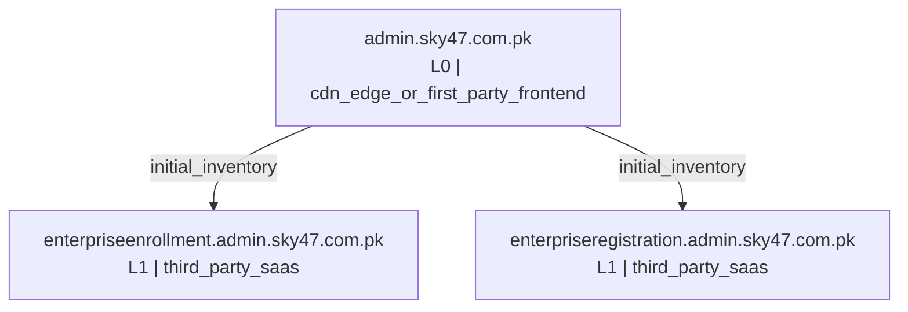

# Smart Subdomain Recon Report: `admin.sky47.com.pk`

**Overall run status: `COMPLETE`**

Run folder: `recon_runs/admin.sky47.com.pk-20260811-142405`
Generated: `2026-08-11T14:32:15`

## Run health and coverage

- Mode: `max`
- Canonical crawl target: `https://admin.sky47.com.pk`
- Candidates selected: `5239`
- Candidates generated before cap: `5239`
- Candidate list truncated: `False`
- Bulk DNS coverage: `5115/5115` (`100.0%`)
- DNSX chunks completed: `1/1`
- Katana requested configuration: `{"depth": 5, "crawl_duration": "10m", "known_files": "all", "enabled": true}`
- Katana effective configuration: `{"depth": 5, "crawl_duration": "10m", "known_files": "all", "scope": "fqdn", "enabled": true, "concurrency": 10, "rate_limit": 50, "javascript_crawl": true, "ignore_query_params": true}`

## Tool status

| Tool | Status | OK | Timed out | Warnings | Errors | Seconds | Return code |
|---|---|---:|---:|---:|---:|---:|---:|
| gobuster_base | Warning | True | False | 1 | 0 | 6.65 | 0 |
| subfinder | OK | True | False | 0 | 0 | 7.25 | 0 |
| amass | OK | True | False | 0 | 0 | 38.76 | 0 |
| bbot | Warning | True | False | 19 | 0 | 169.84 | 0 |
| httpx_root_probe | OK | True | False | 0 | 0 | 13.58 | 0 |
| katana_canonical | OK | True | False | 0 | 0 | 47.65 | 0 |
| dnsx_priority | OK | True | False | 0 | 0 | 2.87 | 0 |
| dnsx_chunk_0001 | OK | True | False | 0 | 0 | 199.16 | 0 |
| gobuster_custom | Warning | True | False | 1 | 0 | 3.98 | 0 |
| dnsx_wildcards | OK | True | False | 0 | 0 | 1.59 | 0 |
| httpx_probe | Warning | True | False | 1 | 0 | 14.07 | 0 |
| httpx_screenshot | OK | True | False | 0 | 0 | 18.29 | 0 |
| wafw00f | OK | True | False | 0 | 0 | 1.62 | 0 |

### Tool diagnostics

#### `gobuster_base`
- Warning: `[+] Timeout:    5s`

#### `bbot`
- Warning: `[INFO] Setup soft-failed for builtwith: No API key set`
- Warning: `[INFO] Setup soft-failed for c99: No API key set`
- Warning: `[INFO] Setup soft-failed for censys_dns: No API key set`
- Warning: `[INFO] Setup soft-failed for chaos: No API key set`
- Warning: `[INFO] Setup soft-failed for bevigil: No API key set`

#### `gobuster_custom`
- Warning: `[+] Timeout:    5s`

#### `httpx_probe`
- Warning: `443 chain="network is unreachable; connection refused"`

## Wildcard analysis

Zones tested: `1`
Random probes sent: `3`

| Zone | Wildcard answer | Answers | Matching signature probes |
|---|---:|---:|---:|
| `admin.sky47.com.pk` | False | 0 | 0 |

## DNS-validated assets (3)

- `autodiscover.admin.sky47.com.pk` state=`dns_resolved` A=[40.104.52.120, 40.104.52.152, 40.104.52.168, 40.104.52.216, 40.104.52.232, 40.104.52.248, 40.99.32.104, 40.99.60.8, 40.99.70.184, 40.99.9.136, 40.99.9.152, 52.97.123.24, 52.97.123.72, 52.97.123.8, 52.98.61.40, 52.98.61.56] CNAME=[acdcatm.autodiscover.mira.tm.svc.cloud.microsoft, atm.autodiscover.mira.tm.svc.cloud.microsoft, autod.ms-acdc-autod.office.com, autodiscover.outlook.cloud.microsoft, autodiscover.outlook.com]
- `enterpriseenrollment.admin.sky47.com.pk` state=`dns_resolved` A=[13.107.228.45, 13.107.228.46] CNAME=[azurefd-t54-prod.trafficmanager.net, enterpriseenrollment-s.manage.microsoft.com, manage-pe.trafficmanager.net, pexsucp-drgzexethuh8cpen.b02.azurefd.net, s-part-0020.t-0009.t-s1-msedge.net, s-part-0034.t-0009.t-s1-msedge.net, s-part-0035.t-0009.t-s1-msedge.net, shed.dual-low.s-part-0020.t-0009.t-s1-msedge.net, shed.dual-low.s-part-0034.t-0009.t-s1-msedge.net, shed.dual-low.s-part-0035.t-0009.t-s1-msedge.net]
- `enterpriseregistration.admin.sky47.com.pk` state=`dns_resolved` A=[20.190.145.128, 20.190.145.139, 20.190.147.34, 20.190.147.35, 20.190.147.36, 20.190.147.37, 20.190.147.38, 20.190.147.39, 20.190.177.145, 20.190.177.17, 20.190.177.18, 20.190.177.81] CNAME=[enterpriseregistration.windows.net, na.privatelink.msidentity.com, prdf.aadg.msidentity.com, www.tm.f.prd.aadg.akadns.net, www.tm.f.prd.aadg.trafficmanager.net]

## Accepted keyword evidence (35)

Rejected noisy/random tokens: `395`

| Keyword | Score | Source(s) |
|---|---:|---|
| `admin` | 100 | katana_url |
| `media` | 100 | katana_url |
| `images` | 95 | katana_url |
| `api` | 92 | katana_url |
| `users` | 92 | katana_url |
| `blocks` | 75 | katana_url |
| `content` | 75 | katana_url |
| `embed` | 75 | katana_url |
| `includes` | 75 | katana_url |
| `leadership` | 75 | katana_url |
| `mauto` | 75 | katana_url |
| `plugins` | 75 | katana_url |
| `services` | 75 | katana_url |
| `style` | 75 | katana_url |
| `themes` | 75 | katana_url |
| `ver` | 75 | katana_url |
| `wpspeed` | 75 | katana_url |
| `ali` | 72 | katana_url |
| `cache` | 72 | katana_url |
| `emoji` | 72 | katana_url |
| `muhammad` | 72 | katana_url |
| `autodiscover` | 70 | exact_subdomain_label |
| `chrome` | 69 | katana_url |
| `lazysizes` | 69 | katana_url |
| `enterpriseenrollment` | 68 | exact_subdomain_label |
| `enterpriseregistration` | 68 | exact_subdomain_label |
| `author` | 66 | katana_url |
| `loader` | 66 | katana_url |
| `modules` | 66 | katana_url |
| `optimole` | 66 | katana_url |
| `calculator` | 63 | katana_url |
| `instantpage` | 63 | katana_url |
| `navigation` | 63 | katana_url |
| `optimizer` | 63 | katana_url |
| `wordpress` | 63 | katana_url |

## CDN, Wappalyzer technology, and WAF detection

Passive detection is always collected from HTTPX. Technology fingerprints come from HTTPX `-tech-detect` using the Wappalyzer dataset; CDN/WAF provider evidence comes primarily from HTTPX CDNCheck and DNS/CNAME context. Wappalyzer technology alone is supporting evidence, not proof of proxying.

- Assets with CDN evidence: `3`
- Assets with any WAF/security-edge evidence: `1`
- Assets with passive WAF/security-edge evidence: `1`
- Conflicting or multi-layer WAF attributions: `0`
- Generic active WAF detections: `0`
- Unique technologies detected: `9`
- Active WAFW00F requested: `True`
- Active WAFW00F targets: `1`
- Active WAFW00F detections: `1`

| Host | CDN | CDN confidence | WAF/security edge | WAF confidence | Attribution | Detection mode | Technologies |
|---|---|---|---|---|---|---|---|
| `admin.sky47.com.pk` | Cloudflare | high | Cloudflare | high | named_active_fingerprint | active_fingerprinting | Cloudflare, Cloudflare Browser Insights, HSTS, MySQL, PHP:8.3.31, WordPress Block Editor, WordPress:7.0.3 |
| `enterpriseenrollment.admin.sky47.com.pk` | azure | high |  | none |  | passive | Azure, Azure Front Door |
| `enterpriseregistration.admin.sky47.com.pk` | office365 | high |  | none |  | passive |  |

## Passive Shodan reconnaissance

This stage queries Shodan's existing DNS, search, and host databases. It does not submit on-demand Shodan scans.

- Requested: `False`
- Status: `NOT_REQUESTED`
- API key configured: `False`
- Shodan DNS records collected: `0`
- Scoped dorks planned: `0`
- Dorks with non-zero counts: `0`
- Estimated query credits spent: `0` / `0`
- API-reported query-credit delta: `None`
- Host lookups completed: `0`
- Services collected: `0`
- Assets enriched: `0`
- Unique vulnerability identifiers observed in Shodan metadata: `0`

## Recursive recon expansion, clustering, and topology

The canonical root is level 0. Newly discovered in-scope web hosts are revalidated and crawled in parallel for at most three descendant levels. Third-party SaaS is retained as evidence but excluded from active recursive crawling.

- Requested: `True`
- Status: `COMPLETE`
- Maximum descendant depth: `3`
- Levels completed: `0`
- Parallel crawl workers: `4`
- Hosts crawled: `0`
- In-scope hosts observed during expansion: `0`
- Newly DNS-validated hosts: `0`
- URLs observed across canonical and recursive crawls: `136`
- Maximum-depth boundary hosts not followed: `0`
- Host-cap truncation: `False`
- Recursive screenshots skipped because the host was already captured: `0`

### Expansion by level

| Level | Crawled hosts | URLs observed | New hosts observed | New hosts validated | Next-level targets | Boundary |
|---:|---:|---:|---:|---:|---:|---:|

### Asset clusters

| Cluster | Assets | Samples |
|---|---:|---|
| `dns_only` | 1 | `autodiscover.admin.sky47.com.pk` |
| `first_party_cdn_fronted` | 1 | `admin.sky47.com.pk` |
| `root` | 1 | `admin.sky47.com.pk` |
| `third_party_saas` | 2 | `enterpriseenrollment.admin.sky47.com.pk` `enterpriseregistration.admin.sky47.com.pk` |

### Recon mind map

The complete machine-readable graph is stored in `recon_topology.json`; the standalone Mermaid source is `recon_mindmap.mmd`.

## HTTP probing and host classification

| Host | Status | Title | Category | Priority | Edge response | Ownership | Application/SaaS provider | Network CDN | WAF | WAF attribution |
|---|---:|---|---|---|---|---|---|---|---|---|
| `admin.sky47.com.pk` | 200 | Sky47 \| AI-Ready Tier III/IV Data Centre & Sovereign Cloud Pakistan - Sky47 delivers Tier III/IV colocation, sovereign cloud, high-density compute and AI-ready infrastructure to power secure enterprise-grade digital transformation. | Admin / Management Surface | High | application_live | cdn_edge_or_first_party_frontend |  | Cloudflare | Cloudflare | named_active_fingerprint |
| `enterpriseenrollment.admin.sky47.com.pk` | 404 | Page not found | Unknown / Needs Review | Medium | default_404_or_missing_root_route | third_party_saas | Microsoft Intune | azure |  |  |
| `enterpriseregistration.admin.sky47.com.pk` | 404 |  | Unknown / Needs Review | Medium | default_404_or_missing_root_route | third_party_saas | Microsoft Azure / Entra ID | office365 |  |  |

## Controlled port enumeration

This stage is opt-in. DNS CNAME ownership is evaluated before HTTP classification. Third-party delegated services, CDN/security edges, and unresolved ownership are excluded by default. Naabu reports candidate TCP ports; Nmap independently rechecks only valid candidates. A Naabu result is not treated as confirmed open until Nmap reports the port state as `open`.

- Requested: `True`
- Targets selected: `0`
- Targets excluded: `4`
- Naabu candidate hosts: `0`
- Naabu candidate ports: `0`
- Rejected invalid Naabu records: `0`
- Nmap validation requested: `True`
- Nmap port-state/service records: `0`
- Nmap-confirmed open ports: `0`
- Nmap-not-confirmed candidates: `0`

| Host | Port | Naabu status | Nmap state | Final status | Service evidence |
|---|---:|---|---|---|---|
|  |  |  |  |  |  |

## Endpoint classification across canonical and recursive crawls

Raw unique URLs seen: `136`
Normalized in-scope endpoints: `110`
Deduplicated/filtered/malformed/external: `26`
External references recorded but not crawled into candidate generation: `25`
OpenAPI/Swagger candidates: `0`

| Category | Count | Priority | Samples |
|---|---:|---|---|
| Other Endpoint | 66 | Low | `https://admin.sky47.com.pk/` `https://admin.sky47.com.pk/admin.sky47.com.pk/wp-admin/authorize-application.php` `https://admin.sky47.com.pk/?p=1134` `https://admin.sky47.com.pk/?post_type=leadership` `https://admin.sky47.com.pk/about` |
| CSS/Font Asset | 14 | Low | `https://admin.sky47.com.pk/cdn-cgi/styles/cf.errors.css` `https://admin.sky47.com.pk/cdn-cgi/styles/cf.errors.ie.css` `https://admin.sky47.com.pk/wp-content/cache/wpspeed/css/98244f1aefb944ed671c2def296f228f.css` `https://admin.sky47.com.pk/wp-content/themes/sky47/github.com/necolas/normalize.css` `https://admin.sky47.com.pk/wp-content/themes/sky47/style.css?ver=1.0.0` |
| API Endpoint | 13 | High | `https://admin.sky47.com.pk/wp-json/wp/v2/leadership/1114` `https://admin.sky47.com.pk/wp-json/wp/v2/leadership/512` `https://admin.sky47.com.pk/wp-json/wp/v2/leadership/513` `https://admin.sky47.com.pk/wp-json/wp/v2/leadership/515` `https://admin.sky47.com.pk/wp-json/wp/v2/leadership/516` |
| JavaScript/Static Bundle | 13 | Medium | `https://admin.sky47.com.pk/wp-content/cache/wpspeed/js/250d046379d14baa799c7d8cc065a5d5.js` `https://admin.sky47.com.pk/wp-content/cache/wpspeed/js/9f9426bf9597e34cc6c3f203f10c9ef9.js` `https://admin.sky47.com.pk/wp-content/plugins/optimole-wp/assets/build/optimizer/optimizer.js?v=4.2.10` `https://admin.sky47.com.pk/wp-content/plugins/wpspeed/media/core/js/instantpage-5.2.0.js?ver=2.6.10` `https://admin.sky47.com.pk/wp-content/plugins/wpspeed/media/core/js/ls.loader.js?ver=2.6.10` |
| File/Storage Endpoint | 4 | Medium | `https://admin.sky47.com.pk/wp-content/plugins/wpspeed/media/core/js/Chrome` `https://admin.sky47.com.pk/wp-content/plugins/wpspeed/media/core/js/Chrome/` `https://admin.sky47.com.pk/wp-content/plugins/wpspeed/media/lazysizes/types/global` `https://admin.sky47.com.pk/wp-content/plugins/wpspeed/media/lazysizes/types/lazysizes-config` |

## Internal IP leak / private address references

No private IP reference was found in fields classified as target-controlled response content.

## Screenshot capture

Screenshot execution status: `OK`
Eligible unique hosts: `3`
Selected unique hosts: `3`
Skipped by configured limit: `0`
Coverage: `100.0%`
Main screenshot JSON records: `3`
Unique hosts captured: `3`
Unique screenshot contents: `3`
Total screenshot artifacts retained: `3`
Duplicate-content artifacts: `0`
- Selection policy: One best URL per host; high-priority assets first, then successful/redirecting HTTPS responses, then remaining live responses.
- Screenshot image files were created for the selected URLs.
- `httpx_screenshots/screenshot/admin.sky47.com.pk/67850d20affe62963409c6f68e1b74880de9c305.png`
- `httpx_screenshots/screenshot/enterpriseenrollment.admin.sky47.com.pk/513e500767f9fad9abae1c1f0fb2a12611f63b17.png`
- `httpx_screenshots/screenshot/enterpriseregistration.admin.sky47.com.pk/1ba4a951105857cfc0fe48a6efe74ae361aa80fd.png`

## Browser-rendered host/API discovery

Target-scope URLs observed by browser: `9`
All target-scope hosts observed by browser: `3`
New browser-only hosts: `0`
New browser-only hosts validated by DNS: `0`

## Manual VAPT review plan

> These are review tasks, not vulnerability claims. Perform only with explicit authorization and test accounts.

### Admin / Management Surface
- `admin.sky47.com.pk` status=`200` title=`Sky47 \| AI-Ready Tier III/IV Data Centre & Sovereign Cloud Pakistan - Sky47 delivers Tier III/IV colocation, sovereign cloud, high-density compute and AI-ready infrastructure to power secure enterprise-grade digital transformation.` ownership=`cdn_edge_or_first_party_frontend`
  - CDN/WAF edge evidence exists; do not treat edge IP ports as confirmed origin exposure.
  - Check role separation, session timeout, MFA and rate limiting if in scope.
  - Verify authentication is enforced on every administrative route.

### Unknown / Needs Review
- `enterpriseenrollment.admin.sky47.com.pk` status=`404` title=`Page not found` ownership=`third_party_saas`
  - CDN/WAF edge evidence exists; do not treat edge IP ports as confirmed origin exposure.
  - The host answered, but the root route was not found.
  - Third-party managed service; intrusive testing requires explicit authorization for that provider/service.
- `enterpriseregistration.admin.sky47.com.pk` status=`404` title=`` ownership=`third_party_saas`
  - CDN/WAF edge evidence exists; do not treat edge IP ports as confirmed origin exposure.
  - The host answered, but the root route was not found.
  - Third-party managed service; intrusive testing requires explicit authorization for that provider/service.

## Output files

- `summary.json`
- `command_manifest.json`
- `tool_versions.json`
- `validated_dns_hosts.txt` / `.json` / `.csv`
- `wildcard_suspected_hosts.json`
- `wildcard_check.json`
- `candidate_manifest.jsonl` / `.csv`
- `keyword_evidence.json`
- `rejected_keywords.json`
- `dnsx_chunk_manifest.json`
- `canonical_target.json`
- `katana_urls.txt`
- `endpoint_classification.json`
- `external_references.txt`
- `openapi_candidates.txt`
- `httpx_probe.jsonl`
- `http_review_classification.json` / `.csv`
- `edge_detection_summary.json`
- `waf_targets.txt`
- `waf_detection.json` / `.csv`
- `wafw00f.json` when active WAF fingerprinting is enabled
- `port_scan_target_manifest.json` / `.csv`
- `port_scan_targets.txt`
- `naabu_ports_raw.jsonl` (unaltered tool evidence when available)
- `naabu_ports.jsonl` / `.json` / `.csv` (normalized valid candidates)
- `naabu_rejected_records.jsonl`
- `nmap/*.xml` when Nmap service validation is enabled
- `nmap_services.json` / `.csv`
- `port_candidate_reconciliation.json` / `.csv`
- `port_scan_summary.json`
- `shodan_summary.json` / `shodan_api_info.json` / `shodan_credit_ledger.json`
- `shodan_dork_plan.json` / `shodan_dork_counts.json`
- `shodan_dns_domain.jsonl` / `shodan_search_results.jsonl` / `shodan_host_lookups.jsonl`
- `shodan_services.jsonl` / `shodan_assets.json` / `shodan_ports.csv` / `shodan_vulnerabilities.json`
- `shodan_discovered_hosts.txt` / `shodan_search_filters.json` / `shodan_host_no_data.jsonl`
- `recursive_recon_summary.json` / `recursive_hosts_by_level.json` / `recursive_urls_all.txt`
- `recon_topology.json` / `recon_clusters.json` / `recon_mindmap.mmd`
- `recursive/level_*/` per-level DNS, HTTP, Katana, screenshot, and Shodan evidence
- `screenshot_status.json`
- `internal_ip_leaks.json`
- `final_report.md`

Compatibility aliases are also retained as `confirmed_subdomains.*`.
