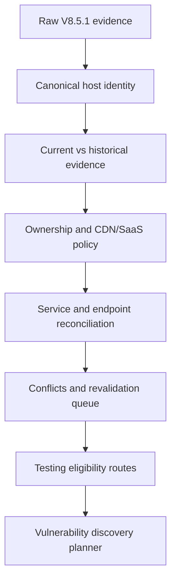

# Combined VAPT Intelligence Report: `geleceksoln.com`

- **Combined report status:** `PARTIAL`
- **Source run:** `/Users/talha/Desktop/internship gelecek/0xCrawllerV10_updated/recon_runs/geleceksoln.com-20260804-161140`
- **Generated at:** `2026-08-04T13:25:19.986685Z`
- **Report generator:** `0xCrawller Combined Report v10.0.0`

> This document consolidates reconnaissance, normalized asset intelligence, and technology/service identification. It does **not** by itself prove exploitable vulnerabilities.

## Pipeline status

| Stage | Purpose | Status | Primary evidence |
|---|---|---|---|
| 1. Reconnaissance | Discover and validate hosts, URLs, DNS, WAF/CDN, screenshots, passive observations, and bounded ports | `COMPLETE` | `summary.json` |
| 2. Normalization | Convert raw tool outputs into canonical assets, services, endpoints, conflicts, and testing eligibility | `COMPLETE` | `normalization_v9/normalization_summary.json` |
| 3. Technology identification | Correlate HTTP, JavaScript, tool fingerprints, and eligible service evidence | `PARTIAL` | `technology_enrichment_v9_2/technology_enrichment_summary.json` |

## Executive coverage

| Metric | Count | Meaning |
|---|---:|---|
| Canonical assets | 16 | Unique normalized hosts in the current inventory |
| DNS-validated assets | 15 | Hosts resolved in the current run |
| Live web assets | 16 | Hosts with a current HTTP observation |
| Normalized endpoints | 762 | Canonical URLs/endpoints after deduplication |
| Suspicious endpoints | 35 | Crawler observations requiring focused revalidation |
| Current services | 40 | Normalized web/network service records |
| Confirmed/current services | 8 | Services supported by current validation evidence |
| Technology records | 108 | Per-host technology/component fingerprints |
| Exact versions | 20 | Versions supported by defensible evidence |
| Versions not exposed | 88 | Detected products without an exact observed version |
| Technology conflicts | 0 | Conflicting technology/version observations |
| Normalization conflicts | 2 | Evidence requiring reconciliation or revalidation |
| Normalization revalidation items | 2 | Assets/endpoints queued for additional validation |
| Technology revalidation items | 10 | Technology evidence requiring additional validation |
| Screenshot-covered assets | 16 | Assets with captured screenshot evidence |
| CDN-detected assets | 5 | Assets identified behind an edge/CDN |
| WAF-detected assets | 9 | Assets with passive or active WAF evidence |
| Active-testing eligible assets | 16 | Assets permitted by the generated routing policy |

## Important interpretation

- Reconnaissance discovers and validates the attack surface; it does not confirm a vulnerability.
- Normalization is the trust boundary that separates current first-party assets from historical, third-party, wildcard-like, conflicting, or unvalidated observations.
- Technology identification reports only evidence-backed products and versions. `NOT_EXPOSED` means the product was detected but an exact version was not defensibly observable.
- Vulnerability mapping and validation should consume normalized eligibility and technology evidence, not raw scanner output.

## Asset-level consolidated inventory

| Host | HTTP | Priority | Asset types | CDN / WAF | Current services | Technologies | Testing decision |
|---|---|---|---|---|---|---|---|
| `autoconfig.geleceksoln.com` | 200 Unknown / Needs Review | Medium | cdn_fronted_web, web_application | CDN: Google, WAF: Google Cloud App Armor | tcp/443 https | Google Cloud, Google Cloud CDN, HTTP/3, Nginx | `ALLOWED_ACTIVE` |
| `autoconfig.newsdemo.geleceksoln.com` | 200 Unknown / Needs Review | Medium | cdn_fronted_web, web_application | CDN: Google, WAF: Google Cloud App Armor | tcp/443 https | Google Cloud, Google Cloud CDN, HTTP/3, Nginx | `ALLOWED_ACTIVE` |
| `autodiscover.geleceksoln.com` | 200 Unknown / Needs Review | Medium | cdn_fronted_web, web_application | CDN: Google, WAF: Google Cloud App Armor | tcp/443 https | Google Cloud, Google Cloud CDN, HTTP/3, Nginx | `ALLOWED_ACTIVE` |
| `autodiscover.newsdemo.geleceksoln.com` | 200 Unknown / Needs Review | Medium | cdn_fronted_web, web_application | CDN: Google, WAF: Google Cloud App Armor | tcp/443 https | Google Cloud, Google Cloud CDN, HTTP/3, Nginx | `ALLOWED_ACTIVE` |
| `demo.geleceksoln.com` | 200 Gelecek Demo - Experience Our Expertise | Medium | network_service_host, web_application | — | tcp/21 ftp, tcp/80 http, tcp/443 http, tcp/3306 mysql | HTTP/3, Hostinger, LiteSpeed, LiteSpeed httpd, ProFTPD or KnFTPD | `ALLOWED_ACTIVE` |
| `ftp.geleceksoln.com` | 403 403 Forbidden | Medium | network_service_host, web_application | WAF: LiteSpeed | tcp/21 ftp, tcp/80 http, tcp/443 https, tcp/3306 mysql | Hostinger, LiteSpeed, LiteSpeed httpd, ProFTPD or KnFTPD | `ALLOWED_ACTIVE` |
| `ftp.newsdemo.geleceksoln.com` | 403 403 Forbidden | Medium | network_service_host, web_application | WAF: LiteSpeed | tcp/21 ftp, tcp/80 http, tcp/443 https, tcp/3306 mysql | Hostinger, LiteSpeed, LiteSpeed httpd, ProFTPD or KnFTPD | `ALLOWED_ACTIVE` |
| `geleceksoln.com` | 200 Gelecek Solutions - Where Technology Meets Ingenuity. | Medium | web_application | — | tcp/443 https | Bootstrap 5.0.2, HTTP/3, Hostinger, LiteSpeed, React, jsDelivr | `ALLOWED_ACTIVE` |
| `newsdemo.geleceksoln.com` | 200 Front Page - newsdemo.geleceksoln.com | Medium | api_surface, network_service_host, web_application, wordpress_application | — | tcp/21 ftp, tcp/80 http, tcp/443 http, tcp/3306 mysql | Elementor 4.1.1, Gravatar, HTTP/3, Hostinger, LiteSpeed, LiteSpeed httpd, MySQL, PHP 8.2.31, ProFTPD or KnFTPD, Tiny Slider, WooCommerce 10.3.8, WordPress 6.7.5, imagesLoaded 5.0.0, jQuery, jQuery Migrate 3.4.1, wpBakery | `ALLOWED_ACTIVE` |
| `nfa.geleceksoln.com` | 200 Create Next App | Medium | network_service_host, web_application | — | tcp/21 ftp, tcp/80 http, tcp/443 http, tcp/3306 mysql | HTTP/3, Hostinger, LiteSpeed, LiteSpeed httpd, ProFTPD or KnFTPD | `ALLOWED_ACTIVE` |
| `ntsexam.geleceksoln.com` | 403 403 Forbidden | Medium | network_service_host, web_application | WAF: LiteSpeed | tcp/21 ftp, tcp/80 http, tcp/443 https, tcp/3306 mysql | Hostinger, LiteSpeed, LiteSpeed httpd, ProFTPD or KnFTPD | `ALLOWED_ACTIVE` |
| `pasb.geleceksoln.com` | 200 Pakistan Armed Services Board (PASB) | Medium | cdn_fronted_web, web_application | CDN: Cloudflare, WAF: Cloudflare | tcp/443 https | Bootstrap 5.3.3, Cloudflare, Font Awesome, HTTP/3, Hostinger, LiteSpeed, PHP 8.2.31, Popper 2.11.8, cdnjs, jQuery 3.6.0, jQuery CDN, jsDelivr | `ALLOWED_ACTIVE` |
| `pasbapi.geleceksoln.com` | 403 403 Forbidden | Medium | network_service_host, web_application | WAF: LiteSpeed | tcp/21 ftp, tcp/80 http, tcp/443 http, tcp/3306 mysql | HTTP/3, Hostinger, LiteSpeed, LiteSpeed httpd, ProFTPD or KnFTPD | `ALLOWED_ACTIVE` |
| `wordpresstest.geleceksoln.com` | 200 Personal Portfolio | Medium | api_surface, network_service_host, web_application, wordpress_application | — | tcp/21 ftp, tcp/80 http, tcp/443 http, tcp/3306 mysql | HTTP/3, Hostinger, LiteSpeed, LiteSpeed Cache, LiteSpeed httpd, MySQL, PHP 8.2.31, ProFTPD or KnFTPD, WordPress 6.8.6, WordPress Block Editor, WordPress Site Editor | `ALLOWED_ACTIVE` |
| `www.geleceksoln.com` | 200 Gelecek Solutions - Where Technology Meets Ingenuity. | Medium | web_application | — | tcp/443 https | Bootstrap 5.0.2, HTTP/3, Hostinger, LiteSpeed, React, jsDelivr | `ALLOWED_ACTIVE` |
| `www.newsdemo.geleceksoln.com` | 200 Front Page - newsdemo.geleceksoln.com | Medium | web_application, wordpress_application | — | tcp/443 https | Elementor 4.1.1, Gravatar, HTTP/3, Hostinger, LiteSpeed, MySQL, PHP 8.2.31, Tiny Slider, WooCommerce 10.3.8, WordPress 6.7.5, imagesLoaded 5.0.0, jQuery, jQuery Migrate 3.4.1, wpBakery | `ALLOWED_ACTIVE` |

## Technology intelligence

### Categories

| Category | Records |
|---|---:|
| Technology | 69 |
| Network Service | 16 |
| Programming Language | 4 |
| Web Server | 4 |
| CMS | 3 |
| Database | 3 |
| JavaScript Library | 3 |
| UI Framework | 3 |
| Web Framework | 2 |
| CDN / Security Edge | 1 |

### Exact observed versions

| Host | Technology | Version | Category | Confidence | Sources |
|---|---|---|---|---|---|
| `geleceksoln.com` | Bootstrap | `5.0.2` | UI Framework | medium | httpx_wappalyzer |
| `newsdemo.geleceksoln.com` | Elementor | `4.1.1` | Technology | medium | httpx_wappalyzer |
| `newsdemo.geleceksoln.com` | PHP | `8.2.31` | Programming Language | medium | httpx_wappalyzer |
| `newsdemo.geleceksoln.com` | WooCommerce | `10.3.8` | Technology | medium | httpx_wappalyzer |
| `newsdemo.geleceksoln.com` | WordPress | `6.7.5` | CMS | medium | httpx_wappalyzer |
| `newsdemo.geleceksoln.com` | imagesLoaded | `5.0.0` | Technology | medium | httpx_wappalyzer |
| `newsdemo.geleceksoln.com` | jQuery Migrate | `3.4.1` | Technology | medium | httpx_wappalyzer |
| `pasb.geleceksoln.com` | Bootstrap | `5.3.3` | UI Framework | medium | httpx_wappalyzer |
| `pasb.geleceksoln.com` | PHP | `8.2.31` | Programming Language | medium | httpx_wappalyzer |
| `pasb.geleceksoln.com` | Popper | `2.11.8` | Technology | medium | httpx_wappalyzer |
| `pasb.geleceksoln.com` | jQuery | `3.6.0` | JavaScript Library | medium | httpx_wappalyzer |
| `wordpresstest.geleceksoln.com` | PHP | `8.2.31` | Programming Language | medium | httpx_wappalyzer |
| `wordpresstest.geleceksoln.com` | WordPress | `6.8.6` | CMS | medium | httpx_wappalyzer |
| `www.geleceksoln.com` | Bootstrap | `5.0.2` | UI Framework | medium | httpx_wappalyzer |
| `www.newsdemo.geleceksoln.com` | Elementor | `4.1.1` | Technology | medium | httpx_wappalyzer |
| `www.newsdemo.geleceksoln.com` | PHP | `8.2.31` | Programming Language | medium | httpx_wappalyzer |
| `www.newsdemo.geleceksoln.com` | WooCommerce | `10.3.8` | Technology | medium | httpx_wappalyzer |
| `www.newsdemo.geleceksoln.com` | WordPress | `6.7.5` | CMS | medium | httpx_wappalyzer |
| `www.newsdemo.geleceksoln.com` | imagesLoaded | `5.0.0` | Technology | medium | httpx_wappalyzer |
| `www.newsdemo.geleceksoln.com` | jQuery Migrate | `3.4.1` | Technology | medium | httpx_wappalyzer |

### Technology tool lanes

| Lane | Status | Targets/records | Note |
|---|---|---:|---|
| `http_evidence` | `PARTIAL` | 16 | — |
| `zgrab2` | `COMPLETE` | 32 | — |
| `whatweb` | `FAILED` | 16 | Unable to find image '0xcrawller/whatweb:0.6.4' locally docker: Error response from daemon: pull access denied for 0xcrawller/whatweb, repository does not exist or may require 'do… |
| `wappalyzer_next` | `FAILED` | 16 | Unable to find image '0xcrawller/wappalyzer-next:2.0.0' locally docker: Error response from daemon: pull access denied for 0xcrawller/wappalyzer-next, repository does not exist or… |
| `retirejs` | `FAILED` | 0 | javascript_downloads_failed |
| `nuclei` | `FAILED` | 16 | — |

## Services and ports

| Host | Protocol | Port | Family/product | Version | Status |
|---|---|---:|---|---|---|
| `autoconfig.geleceksoln.com` | tcp | 443 | https | — | `HTTP_VALIDATED` |
| `autoconfig.newsdemo.geleceksoln.com` | tcp | 443 | https | — | `HTTP_VALIDATED` |
| `autodiscover.geleceksoln.com` | tcp | 443 | https | — | `HTTP_VALIDATED` |
| `autodiscover.newsdemo.geleceksoln.com` | tcp | 443 | https | — | `HTTP_VALIDATED` |
| `demo.geleceksoln.com` | tcp | 21 | ProFTPD or KnFTPD | — | `NMAP_CONFIRMED_OPEN` |
| `demo.geleceksoln.com` | tcp | 80 | LiteSpeed httpd | — | `NMAP_CONFIRMED_OPEN` |
| `demo.geleceksoln.com` | tcp | 443 | LiteSpeed httpd | — | `NMAP_CONFIRMED_OPEN` |
| `demo.geleceksoln.com` | tcp | 3306 | mysql | — | `NMAP_CONFIRMED_OPEN` |
| `ftp.geleceksoln.com` | tcp | 21 | ProFTPD or KnFTPD | — | `NMAP_CONFIRMED_OPEN` |
| `ftp.geleceksoln.com` | tcp | 80 | LiteSpeed httpd | — | `NMAP_CONFIRMED_OPEN` |
| `ftp.geleceksoln.com` | tcp | 443 | https | — | `NMAP_CONFIRMED_OPEN` |
| `ftp.geleceksoln.com` | tcp | 3306 | mysql | — | `NMAP_CONFIRMED_OPEN` |
| `ftp.newsdemo.geleceksoln.com` | tcp | 21 | ProFTPD or KnFTPD | — | `NMAP_CONFIRMED_OPEN` |
| `ftp.newsdemo.geleceksoln.com` | tcp | 80 | LiteSpeed httpd | — | `NMAP_CONFIRMED_OPEN` |
| `ftp.newsdemo.geleceksoln.com` | tcp | 443 | https | — | `NMAP_CONFIRMED_OPEN` |
| `ftp.newsdemo.geleceksoln.com` | tcp | 3306 | mysql | — | `NMAP_CONFIRMED_OPEN` |
| `geleceksoln.com` | tcp | 443 | https | — | `HTTP_VALIDATED` |
| `newsdemo.geleceksoln.com` | tcp | 21 | ProFTPD or KnFTPD | — | `NMAP_CONFIRMED_OPEN` |
| `newsdemo.geleceksoln.com` | tcp | 80 | LiteSpeed httpd | — | `NMAP_CONFIRMED_OPEN` |
| `newsdemo.geleceksoln.com` | tcp | 443 | LiteSpeed httpd | — | `NMAP_CONFIRMED_OPEN` |
| `newsdemo.geleceksoln.com` | tcp | 3306 | mysql | — | `NMAP_CONFIRMED_OPEN` |
| `nfa.geleceksoln.com` | tcp | 21 | ProFTPD or KnFTPD | — | `NMAP_CONFIRMED_OPEN` |
| `nfa.geleceksoln.com` | tcp | 80 | LiteSpeed httpd | — | `NMAP_CONFIRMED_OPEN` |
| `nfa.geleceksoln.com` | tcp | 443 | LiteSpeed httpd | — | `NMAP_CONFIRMED_OPEN` |
| `nfa.geleceksoln.com` | tcp | 3306 | mysql | — | `NMAP_CONFIRMED_OPEN` |
| `ntsexam.geleceksoln.com` | tcp | 21 | ProFTPD or KnFTPD | — | `NMAP_CONFIRMED_OPEN` |
| `ntsexam.geleceksoln.com` | tcp | 80 | LiteSpeed httpd | — | `NMAP_CONFIRMED_OPEN` |
| `ntsexam.geleceksoln.com` | tcp | 443 | https | — | `NMAP_CONFIRMED_OPEN` |
| `ntsexam.geleceksoln.com` | tcp | 3306 | mysql | — | `NMAP_CONFIRMED_OPEN` |
| `pasb.geleceksoln.com` | tcp | 443 | https | — | `HTTP_VALIDATED` |
| `pasbapi.geleceksoln.com` | tcp | 21 | ProFTPD or KnFTPD | — | `NMAP_CONFIRMED_OPEN` |
| `pasbapi.geleceksoln.com` | tcp | 80 | LiteSpeed httpd | — | `NMAP_CONFIRMED_OPEN` |
| `pasbapi.geleceksoln.com` | tcp | 443 | LiteSpeed httpd | — | `NMAP_CONFIRMED_OPEN` |
| `pasbapi.geleceksoln.com` | tcp | 3306 | mysql | — | `NMAP_CONFIRMED_OPEN` |
| `wordpresstest.geleceksoln.com` | tcp | 21 | ProFTPD or KnFTPD | — | `NMAP_CONFIRMED_OPEN` |
| `wordpresstest.geleceksoln.com` | tcp | 80 | LiteSpeed httpd | — | `NMAP_CONFIRMED_OPEN` |
| `wordpresstest.geleceksoln.com` | tcp | 443 | LiteSpeed httpd | — | `NMAP_CONFIRMED_OPEN` |
| `wordpresstest.geleceksoln.com` | tcp | 3306 | mysql | — | `NMAP_CONFIRMED_OPEN` |
| `www.geleceksoln.com` | tcp | 443 | https | — | `HTTP_VALIDATED` |
| `www.newsdemo.geleceksoln.com` | tcp | 443 | https | — | `HTTP_VALIDATED` |

## Revalidation and evidence conflicts

### Normalization revalidation queue

| Host | Priority | Reason | Recommended action |
|---|---|---|---|
| `newsdemo.geleceksoln.com` | Medium | suspicious_endpoints | HTTP-revalidate only the suspicious URLs before vulnerability routing. |
| `wordpresstest.geleceksoln.com` | Medium | suspicious_endpoints | HTTP-revalidate only the suspicious URLs before vulnerability routing. |

### Normalization conflicts

| Host | Severity | Type | Description |
|---|---|---|---|
| `newsdemo.geleceksoln.com` | low | suspicious_crawler_endpoints | One or more crawler-derived URLs appear syntactically malformed or derived from JavaScript strings. |
| `wordpresstest.geleceksoln.com` | low | suspicious_crawler_endpoints | One or more crawler-derived URLs appear syntactically malformed or derived from JavaScript strings. |

No conflicting exact technology versions were observed.

## Authorized next-stage routing

| Route | Eligible assets |
|---|---:|
| HTTP security headers, cookie flags, methods, and disclosure checks | 16 |
| Safe and rate-limited web vulnerability templates | 16 |
| Evidence-driven checks selected from confirmed technologies | 16 |
| TLS protocol, certificate, and cipher configuration checks | 16 |
| Protocol-specific checks against confirmed direct services | 8 |
| Remote vulnerability checks against eligible direct first-party services | 8 |

The next implementation layer should perform vulnerability discovery, CVE/CPE mapping, evidence-backed validation, false-positive control, and human approval for intrusive or authenticated checks.

## Evidence files consumed

- `summary.json` — read
- `final_report.md` — read
- `normalization_v9/normalization_summary.json` — read
- `normalization_v9/asset_inventory.json` — read
- `normalization_v9/service_inventory.json` — read
- `normalization_v9/endpoint_inventory.json` — read
- `normalization_v9/asset_conflicts.json` — read
- `normalization_v9/asset_revalidation_queue.json` — read
- `normalization_v9/testing_eligibility.json` — read
- `normalization_v9/asset_normalization_report.md` — read
- `technology_enrichment_v9_2/technology_enrichment_summary.json` — read
- `technology_enrichment_v9_2/technology_inventory.json` — read
- `technology_enrichment_v9_2/service_inventory_enriched.json` — read
- `technology_enrichment_v9_2/technology_conflicts.json` — read
- `technology_enrichment_v9_2/technology_revalidation_queue.json` — read
- `technology_enrichment_v9_2/technology_tool_status.json` — read
- `technology_enrichment_v9_2/technology_enrichment_report.md` — read

## Embedded source reports

The original stage reports are embedded below so the consolidated file remains self-contained.

### Reconnaissance source report

#### Smart Subdomain Recon Report: `geleceksoln.com`

**Overall run status: `COMPLETE`**

Run folder: `recon_runs/geleceksoln.com-20260804-161140`
Generated: `2026-08-04T16:51:15`

##### Run health and coverage

- Mode: `max`
- Canonical crawl target: `https://geleceksoln.com`
- Candidates selected: `4463`
- Candidates generated before cap: `4463`
- Candidate list truncated: `False`
- Bulk DNS coverage: `4329/4329` (`100.0%`)
- DNSX chunks completed: `1/1`
- Katana requested configuration: `{"depth": 5, "crawl_duration": "10m", "known_files": "all", "enabled": true}`
- Katana effective configuration: `{"depth": 5, "crawl_duration": "10m", "known_files": "all", "scope": "fqdn", "enabled": true, "concurrency": 10, "rate_limit": 50, "javascript_crawl": true, "ignore_query_params": true}`

##### Tool status

| Tool | Status | OK | Timed out | Warnings | Errors | Seconds | Return code |
|---|---|---:|---:|---:|---:|---:|---:|
| gobuster_base | Warning | True | False | 1 | 1 | 6.30 | 0 |
| subfinder | OK | True | False | 0 | 0 | 11.66 | 0 |
| amass | OK | True | False | 0 | 0 | 122.38 | 0 |
| bbot | Warning | True | False | 19 | 0 | 460.92 | 0 |
| httpx_root_probe | OK | True | False | 0 | 0 | 11.41 | 0 |
| katana_canonical | OK | True | False | 0 | 0 | 13.97 | 0 |
| dnsx_priority | OK | True | False | 0 | 0 | 16.66 | 0 |
| dnsx_chunk_0001 | OK | True | False | 0 | 0 | 318.92 | 0 |
| gobuster_custom | Warning | True | False | 1 | 0 | 1.14 | 0 |
| dnsx_gobuster_new | OK | True | False | 0 | 0 | 1.73 | 0 |
| dnsx_wildcards | OK | True | False | 0 | 0 | 2.95 | 0 |
| httpx_probe | OK | True | False | 0 | 0 | 21.44 | 0 |
| httpx_screenshot | OK | True | False | 0 | 0 | 30.12 | 0 |
| katana_recursive_l1_autodiscover.newsdemo.geleceksoln.com_09488043 | OK | True | False | 0 | 0 | 12.15 | 0 |
| katana_recursive_l1_autoconfig.geleceksoln.com_222dae13 | OK | True | False | 0 | 0 | 12.40 | 0 |
| katana_recursive_l1_autodiscover.geleceksoln.com_24cfc0d1 | OK | True | False | 0 | 0 | 12.49 | 0 |
| katana_recursive_l1_autoconfig.newsdemo.geleceksoln.com_fe370ae5 | OK | True | False | 0 | 0 | 12.78 | 0 |
| katana_recursive_l1_ftp.geleceksoln.com_66166141 | OK | True | False | 0 | 0 | 12.06 | 0 |
| katana_recursive_l1_ftp.newsdemo.geleceksoln.com_73da3590 | OK | True | False | 0 | 0 | 12.28 | 0 |
| katana_recursive_l1_demo.geleceksoln.com_3ccf69c3 | OK | True | False | 0 | 0 | 15.32 | 0 |
| katana_recursive_l1_ntsexam.geleceksoln.com_e86465d6 | OK | True | False | 0 | 0 | 11.93 | 0 |
| katana_recursive_l1_nfa.geleceksoln.com_1d23a12d | OK | True | False | 0 | 0 | 14.54 | 0 |
| katana_recursive_l1_pasb.geleceksoln.com_6212963d | OK | True | False | 0 | 0 | 14.77 | 0 |
| katana_recursive_l1_pasbapi.geleceksoln.com_43ac94f4 | OK | True | False | 0 | 0 | 12.04 | 0 |
| katana_recursive_l1_wordpresstest.geleceksoln.com_424f35e8 | OK | True | False | 0 | 0 | 16.14 | 0 |
| katana_recursive_l1_www.geleceksoln.com_cf390f36 | OK | True | False | 0 | 0 | 14.60 | 0 |
| katana_recursive_l1_www.newsdemo.geleceksoln.com_19f16657 | OK | True | False | 0 | 0 | 13.81 | 0 |
| katana_recursive_l1_newsdemo.geleceksoln.com_c5cf73a9 | OK | True | False | 0 | 0 | 57.18 | 0 |
| wafw00f | OK | True | False | 0 | 0 | 44.79 | 0 |
| naabu_port_scan | OK | True | False | 0 | 0 | 1318.18 | 0 |
| nmap_ftp.geleceksoln.com | OK | True | False | 0 | 0 | 8.47 | 0 |
| nmap_demo.geleceksoln.com | OK | True | False | 0 | 0 | 14.45 | 0 |
| nmap_ftp.newsdemo.geleceksoln.com | OK | True | False | 0 | 0 | 8.35 | 0 |
| nmap_newsdemo.geleceksoln.com | OK | True | False | 0 | 0 | 13.89 | 0 |
| nmap_nfa.geleceksoln.com | OK | True | False | 0 | 0 | 13.86 | 0 |
| nmap_ntsexam.geleceksoln.com | OK | True | False | 0 | 0 | 8.22 | 0 |
| nmap_pasbapi.geleceksoln.com | OK | True | False | 0 | 0 | 13.84 | 0 |
| nmap_wordpresstest.geleceksoln.com | OK | True | False | 0 | 0 | 13.87 | 0 |

###### Tool diagnostics

###### `gobuster_base`
- Warning: `[+] Timeout:    5s`
- Error: `[ERROR] error on word dev: lookup dev.geleceksoln.com.: i/o timeout`

###### `bbot`
- Warning: `[INFO] Setup soft-failed for builtwith: No API key set`
- Warning: `[INFO] Setup soft-failed for c99: No API key set`
- Warning: `[INFO] Setup soft-failed for censys_dns: No API key set`
- Warning: `[INFO] Setup soft-failed for chaos: No API key set`
- Warning: `[INFO] Setup soft-failed for bevigil: No API key set`

###### `gobuster_custom`
- Warning: `[+] Timeout:    5s`

##### Wildcard analysis

Zones tested: `2`
Random probes sent: `6`

| Zone | Wildcard answer | Answers | Matching signature probes |
|---|---:|---:|---:|
| `geleceksoln.com` | False | 0 | 0 |
| `newsdemo.geleceksoln.com` | False | 0 | 0 |

##### DNS-validated assets (15)

- `autoconfig.geleceksoln.com` state=`dns_resolved` A=[34.120.251.119] CNAME=[autoconfig.mail.hostinger.com]
- `autoconfig.newsdemo.geleceksoln.com` state=`dns_resolved` A=[34.120.251.119] CNAME=[autoconfig.mail.hostinger.com]
- `autodiscover.geleceksoln.com` state=`dns_resolved` A=[34.120.251.119] CNAME=[autodiscover.mail.hostinger.com]
- `autodiscover.newsdemo.geleceksoln.com` state=`dns_resolved` A=[34.120.251.119] CNAME=[autodiscover.mail.hostinger.com]
- `demo.geleceksoln.com` state=`dns_resolved` A=[153.92.13.247] CNAME=[]
- `ftp.geleceksoln.com` state=`dns_resolved` A=[153.92.13.247] CNAME=[]
- `ftp.newsdemo.geleceksoln.com` state=`dns_resolved` A=[153.92.13.247] CNAME=[]
- `newsdemo.geleceksoln.com` state=`dns_resolved` A=[153.92.13.247] CNAME=[]
- `nfa.geleceksoln.com` state=`dns_resolved` A=[153.92.13.247] CNAME=[]
- `ntsexam.geleceksoln.com` state=`dns_resolved` A=[153.92.13.247] CNAME=[]
- `pasb.geleceksoln.com` state=`dns_resolved` A=[153.92.13.247] CNAME=[]
- `pasbapi.geleceksoln.com` state=`dns_resolved` A=[153.92.13.247] CNAME=[]
- `wordpresstest.geleceksoln.com` state=`dns_resolved` A=[153.92.13.247] CNAME=[]
- `www.geleceksoln.com` state=`dns_resolved` A=[153.92.13.247] CNAME=[geleceksoln.com]
- `www.newsdemo.geleceksoln.com` state=`dns_resolved` A=[153.92.13.247] CNAME=[newsdemo.geleceksoln.com]

##### Accepted keyword evidence (13)

Rejected noisy/random tokens: `44`

| Keyword | Score | Source(s) |
|---|---:|---|
| `demo` | 100 | exact_subdomain_label |
| `development` | 95 | katana_url |
| `web` | 92 | katana_url |
| `newsdemo` | 90 | exact_subdomain_label |
| `autoconfig` | 81 | exact_subdomain_label |
| `ftp` | 81 | exact_subdomain_label |
| `nfa` | 78 | exact_subdomain_label |
| `ntsexam` | 78 | exact_subdomain_label |
| `pasb` | 78 | exact_subdomain_label |
| `pasbapi` | 78 | exact_subdomain_label |
| `wordpresstest` | 78 | exact_subdomain_label |
| `services` | 75 | katana_url |
| `autodiscover` | 73 | exact_subdomain_label |

##### CDN, Wappalyzer technology, and WAF detection

Passive detection is always collected from HTTPX. Technology fingerprints come from HTTPX `-tech-detect` using the Wappalyzer dataset; CDN/WAF provider evidence comes primarily from HTTPX CDNCheck and DNS/CNAME context. Wappalyzer technology alone is supporting evidence, not proof of proxying.

- Assets with CDN evidence: `5`
- Assets with any WAF/security-edge evidence: `9`
- Assets with passive WAF/security-edge evidence: `1`
- Conflicting or multi-layer WAF attributions: `0`
- Generic active WAF detections: `0`
- Unique technologies detected: `32`
- Active WAFW00F requested: `True`
- Active WAFW00F targets: `16`
- Active WAFW00F detections: `8`

| Host | CDN | CDN confidence | WAF/security edge | WAF confidence | Attribution | Detection mode | Technologies |
|---|---|---|---|---|---|---|---|
| `autoconfig.geleceksoln.com` | Google | high | Google Cloud App Armor | high | named_active_fingerprint | active_fingerprinting | Google Cloud, Google Cloud CDN, HTTP/3, Nginx |
| `autoconfig.newsdemo.geleceksoln.com` | Google | high | Google Cloud App Armor | high | named_active_fingerprint | active_fingerprinting | Google Cloud, Google Cloud CDN, HTTP/3, Nginx |
| `autodiscover.geleceksoln.com` | Google | high | Google Cloud App Armor | high | named_active_fingerprint | active_fingerprinting | Google Cloud, Google Cloud CDN, HTTP/3, Nginx |
| `autodiscover.newsdemo.geleceksoln.com` | Google | high | Google Cloud App Armor | high | named_active_fingerprint | active_fingerprinting | Google Cloud, Google Cloud CDN, HTTP/3, Nginx |
| `demo.geleceksoln.com` |  | none |  | none |  | passive | HTTP/3, Hostinger, LiteSpeed |
| `ftp.geleceksoln.com` |  | none | LiteSpeed | high | named_active_fingerprint | active_fingerprinting | Hostinger, LiteSpeed |
| `ftp.newsdemo.geleceksoln.com` |  | none | LiteSpeed | high | named_active_fingerprint | active_fingerprinting | Hostinger, LiteSpeed |
| `geleceksoln.com` |  | none |  | none |  | passive | Bootstrap:5.0.2, HTTP/3, Hostinger, LiteSpeed, React, jsDelivr |
| `newsdemo.geleceksoln.com` |  | none |  | none |  | passive | Elementor:4.1.1, Gravatar, HTTP/3, Hostinger, LiteSpeed, MySQL, PHP:8.2.31, Tiny Slider, WooCommerce:10.3.8, WordPress:6.7.5, imagesLoaded:5.0.0, jQuery, jQuery Migrate:3.4.1, wpBakery |
| `nfa.geleceksoln.com` |  | none |  | none |  | passive | HTTP/3, Hostinger, LiteSpeed |
| `ntsexam.geleceksoln.com` |  | none | LiteSpeed | high | named_active_fingerprint | active_fingerprinting | Hostinger, LiteSpeed |
| `pasb.geleceksoln.com` | Cloudflare | supporting | Cloudflare | supporting |  | passive | Bootstrap:5.3.3, Cloudflare, Font Awesome, HTTP/3, Hostinger, LiteSpeed, PHP:8.2.31, Popper:2.11.8, cdnjs, jQuery CDN, jQuery:3.6.0, jsDelivr |
| `pasbapi.geleceksoln.com` |  | none | LiteSpeed | high | named_active_fingerprint | active_fingerprinting | HTTP/3, Hostinger, LiteSpeed |
| `wordpresstest.geleceksoln.com` |  | none |  | none |  | passive | HTTP/3, Hostinger, LiteSpeed, LiteSpeed Cache, Litespeed Cache, MySQL, PHP:8.2.31, WordPress Block Editor, WordPress Site Editor, WordPress:6.8.6 |
| `www.geleceksoln.com` |  | none |  | none |  | passive | Bootstrap:5.0.2, HTTP/3, Hostinger, LiteSpeed, React, jsDelivr |
| `www.newsdemo.geleceksoln.com` |  | none |  | none |  | passive | Elementor:4.1.1, Gravatar, HTTP/3, Hostinger, LiteSpeed, MySQL, PHP:8.2.31, Tiny Slider, WooCommerce:10.3.8, WordPress:6.7.5, imagesLoaded:5.0.0, jQuery, jQuery Migrate:3.4.1, wpBakery |

##### Passive Shodan reconnaissance

This stage queries Shodan's existing DNS, search, and host databases. It does not submit on-demand Shodan scans.

- Requested: `True`
- Status: `NOT_CONFIGURED`
- API key configured: `False`
- Shodan DNS records collected: `0`
- Scoped dorks planned: `0`
- Dorks with non-zero counts: `0`
- Estimated query credits spent: `0` / `0`
- API-reported query-credit delta: `None`
- Host lookups completed: `0`
- Services collected: `0`
- Assets enriched: `0`
- Unique vulnerability identifiers observed in Shodan metadata: `0`

Warnings:
- SHODAN_API_KEY is empty; passive Shodan stage was skipped.

##### Recursive recon expansion, clustering, and topology

The canonical root is level 0. Newly discovered in-scope web hosts are revalidated and crawled in parallel for at most three descendant levels. Third-party SaaS is retained as evidence but excluded from active recursive crawling.

- Requested: `True`
- Status: `COMPLETE`
- Maximum descendant depth: `3`
- Levels completed: `1`
- Parallel crawl workers: `4`
- Hosts crawled: `15`
- In-scope hosts observed during expansion: `0`
- Newly DNS-validated hosts: `0`
- URLs observed across canonical and recursive crawls: `1025`
- Maximum-depth boundary hosts not followed: `0`
- Host-cap truncation: `False`
- Recursive screenshots skipped because the host was already captured: `15`

###### Expansion by level

| Level | Crawled hosts | URLs observed | New hosts observed | New hosts validated | Next-level targets | Boundary |
|---:|---:|---:|---:|---:|---:|---:|
| 1 | 15 | 1008 | 0 | 0 | 0 | False |

###### Asset clusters

| Cluster | Assets | Samples |
|---|---:|---|
| `first_party_cdn_fronted` | 5 | `autoconfig.geleceksoln.com` `autoconfig.newsdemo.geleceksoln.com` `autodiscover.geleceksoln.com` `autodiscover.newsdemo.geleceksoln.com` `pasb.geleceksoln.com` |
| `first_party_direct_web` | 7 | `demo.geleceksoln.com` `geleceksoln.com` `newsdemo.geleceksoln.com` `nfa.geleceksoln.com` `wordpresstest.geleceksoln.com` `www.geleceksoln.com` `www.newsdemo.geleceksoln.com` |
| `first_party_waf_detected` | 4 | `ftp.geleceksoln.com` `ftp.newsdemo.geleceksoln.com` `ntsexam.geleceksoln.com` `pasbapi.geleceksoln.com` |
| `root` | 1 | `geleceksoln.com` |

###### Recon mind map

```mermaid
flowchart TD
  N0["autoconfig.geleceksoln.com\nL1 | first_party_or_unknown"]
  N1["autoconfig.newsdemo.geleceksoln.com\nL1 | first_party_or_unknown"]
  N2["autodiscover.geleceksoln.com\nL1 | first_party_or_unknown"]
  N3["autodiscover.newsdemo.geleceksoln.com\nL1 | first_party_or_unknown"]
  N4["demo.geleceksoln.com\nL1 | first_party_or_unknown"]
  N5["ftp.geleceksoln.com\nL1 | first_party_or_unknown"]
  N6["ftp.newsdemo.geleceksoln.com\nL1 | first_party_or_unknown"]
  N7["geleceksoln.com\nL0 | first_party_or_unknown"]
  N8["newsdemo.geleceksoln.com\nL1 | first_party_or_unknown"]
  N9["nfa.geleceksoln.com\nL1 | first_party_or_unknown"]
  N10["ntsexam.geleceksoln.com\nL1 | first_party_or_unknown"]
  N11["pasb.geleceksoln.com\nL1 | first_party_or_unknown"]
  N12["pasbapi.geleceksoln.com\nL1 | first_party_or_unknown"]
  N13["wordpresstest.geleceksoln.com\nL1 | first_party_or_unknown"]
  N14["www.geleceksoln.com\nL1 | first_party_or_unknown"]
  N15["www.newsdemo.geleceksoln.com\nL1 | first_party_or_unknown"]
  N7 -->|initial_inventory| N0
  N7 -->|initial_inventory| N1
  N7 -->|initial_inventory| N2
  N7 -->|initial_inventory| N3
  N7 -->|initial_inventory| N4
  N7 -->|initial_inventory| N5
  N7 -->|initial_inventory| N6
  N7 -->|initial_inventory| N8
  N7 -->|initial_inventory| N9
  N7 -->|initial_inventory| N10
  N7 -->|initial_inventory| N11
  N7 -->|initial_inventory| N12
  N7 -->|initial_inventory| N13
  N7 -->|initial_inventory| N14
  N7 -->|initial_inventory| N15
```

The complete machine-readable graph is stored in `recon_topology.json`; the standalone Mermaid source is `recon_mindmap.mmd`.

##### HTTP probing and host classification

| Host | Status | Title | Category | Priority | Edge response | Ownership | Application/SaaS provider | Network CDN | WAF | WAF attribution |
|---|---:|---|---|---|---|---|---|---|---|---|
| `autoconfig.geleceksoln.com` | 200 |  | Unknown / Needs Review | Medium | application_live | first_party_or_unknown |  | Google | Google Cloud App Armor | named_active_fingerprint |
| `autoconfig.newsdemo.geleceksoln.com` | 200 |  | Unknown / Needs Review | Medium | application_live | first_party_or_unknown |  | Google | Google Cloud App Armor | named_active_fingerprint |
| `autodiscover.geleceksoln.com` | 200 |  | Unknown / Needs Review | Medium | application_live | first_party_or_unknown |  | Google | Google Cloud App Armor | named_active_fingerprint |
| `autodiscover.newsdemo.geleceksoln.com` | 200 |  | Unknown / Needs Review | Medium | application_live | first_party_or_unknown |  | Google | Google Cloud App Armor | named_active_fingerprint |
| `demo.geleceksoln.com` | 200 | Gelecek Demo - Experience Our Expertise | Unknown / Needs Review | Medium | application_live | first_party_or_unknown |  |  |  |  |
| `ftp.geleceksoln.com` | 403 | 403 Forbidden | Unknown / Needs Review | Medium | other_http_response | first_party_or_unknown |  |  | LiteSpeed | named_active_fingerprint |
| `ftp.newsdemo.geleceksoln.com` | 403 | 403 Forbidden | Unknown / Needs Review | Medium | other_http_response | first_party_or_unknown |  |  | LiteSpeed | named_active_fingerprint |
| `geleceksoln.com` | 200 | Gelecek Solutions - Where Technology Meets Ingenuity. | Unknown / Needs Review | Medium | application_live | first_party_or_unknown |  |  |  |  |
| `newsdemo.geleceksoln.com` | 200 | Front Page - newsdemo.geleceksoln.com | Unknown / Needs Review | Medium | application_live | first_party_or_unknown |  |  |  |  |
| `nfa.geleceksoln.com` | 200 | Create Next App | Unknown / Needs Review | Medium | application_live | first_party_or_unknown |  |  |  |  |
| `ntsexam.geleceksoln.com` | 403 | 403 Forbidden | Unknown / Needs Review | Medium | other_http_response | first_party_or_unknown |  |  | LiteSpeed | named_active_fingerprint |
| `pasb.geleceksoln.com` | 200 | Pakistan Armed Services Board (PASB) | Unknown / Needs Review | Medium | application_live | first_party_or_unknown |  | Cloudflare | Cloudflare |  |
| `pasbapi.geleceksoln.com` | 403 | 403 Forbidden | Unknown / Needs Review | Medium | other_http_response | first_party_or_unknown |  |  | LiteSpeed | named_active_fingerprint |
| `wordpresstest.geleceksoln.com` | 200 | Personal Portfolio | Unknown / Needs Review | Medium | application_live | first_party_or_unknown |  |  |  |  |
| `www.geleceksoln.com` | 200 | Gelecek Solutions - Where Technology Meets Ingenuity. | Unknown / Needs Review | Medium | application_live | first_party_or_unknown |  |  |  |  |
| `www.newsdemo.geleceksoln.com` | 200 | Front Page - newsdemo.geleceksoln.com | Unknown / Needs Review | Medium | application_live | first_party_or_unknown |  |  |  |  |

##### Controlled port enumeration

This stage is opt-in. DNS CNAME ownership is evaluated before HTTP classification. Third-party delegated services, CDN/security edges, and unresolved ownership are excluded by default. Naabu reports candidate TCP ports; Nmap independently rechecks only valid candidates. A Naabu result is not treated as confirmed open until Nmap reports the port state as `open`.

- Requested: `True`
- Targets selected: `9`
- Targets excluded: `7`
- Naabu candidate hosts: `8`
- Naabu candidate ports: `32`
- Rejected invalid Naabu records: `0`
- Nmap validation requested: `True`
- Nmap port-state/service records: `32`
- Nmap-confirmed open ports: `32`
- Nmap-not-confirmed candidates: `0`

| Host | Port | Naabu status | Nmap state | Final status | Service evidence |
|---|---:|---|---|---|---|
| `demo.geleceksoln.com` | 21 | `NAABU_CANDIDATE` | `open` | `NMAP_CONFIRMED_OPEN` | ftp ProFTPD or KnFTPD |
| `demo.geleceksoln.com` | 80 | `NAABU_CANDIDATE` | `open` | `NMAP_CONFIRMED_OPEN` | http LiteSpeed httpd |
| `demo.geleceksoln.com` | 443 | `NAABU_CANDIDATE` | `open` | `NMAP_CONFIRMED_OPEN` | http LiteSpeed httpd |
| `demo.geleceksoln.com` | 3306 | `NAABU_CANDIDATE` | `open` | `NMAP_CONFIRMED_OPEN` | mysql |
| `ftp.geleceksoln.com` | 21 | `NAABU_CANDIDATE` | `open` | `NMAP_CONFIRMED_OPEN` | ftp ProFTPD or KnFTPD |
| `ftp.geleceksoln.com` | 80 | `NAABU_CANDIDATE` | `open` | `NMAP_CONFIRMED_OPEN` | http LiteSpeed httpd |
| `ftp.geleceksoln.com` | 443 | `NAABU_CANDIDATE` | `open` | `NMAP_CONFIRMED_OPEN` | https |
| `ftp.geleceksoln.com` | 3306 | `NAABU_CANDIDATE` | `open` | `NMAP_CONFIRMED_OPEN` | mysql |
| `ftp.newsdemo.geleceksoln.com` | 21 | `NAABU_CANDIDATE` | `open` | `NMAP_CONFIRMED_OPEN` | ftp ProFTPD or KnFTPD |
| `ftp.newsdemo.geleceksoln.com` | 80 | `NAABU_CANDIDATE` | `open` | `NMAP_CONFIRMED_OPEN` | http LiteSpeed httpd |
| `ftp.newsdemo.geleceksoln.com` | 443 | `NAABU_CANDIDATE` | `open` | `NMAP_CONFIRMED_OPEN` | https |
| `ftp.newsdemo.geleceksoln.com` | 3306 | `NAABU_CANDIDATE` | `open` | `NMAP_CONFIRMED_OPEN` | mysql |
| `newsdemo.geleceksoln.com` | 21 | `NAABU_CANDIDATE` | `open` | `NMAP_CONFIRMED_OPEN` | ftp ProFTPD or KnFTPD |
| `newsdemo.geleceksoln.com` | 80 | `NAABU_CANDIDATE` | `open` | `NMAP_CONFIRMED_OPEN` | http LiteSpeed httpd |
| `newsdemo.geleceksoln.com` | 443 | `NAABU_CANDIDATE` | `open` | `NMAP_CONFIRMED_OPEN` | http LiteSpeed httpd |
| `newsdemo.geleceksoln.com` | 3306 | `NAABU_CANDIDATE` | `open` | `NMAP_CONFIRMED_OPEN` | mysql |
| `nfa.geleceksoln.com` | 21 | `NAABU_CANDIDATE` | `open` | `NMAP_CONFIRMED_OPEN` | ftp ProFTPD or KnFTPD |
| `nfa.geleceksoln.com` | 80 | `NAABU_CANDIDATE` | `open` | `NMAP_CONFIRMED_OPEN` | http LiteSpeed httpd |
| `nfa.geleceksoln.com` | 443 | `NAABU_CANDIDATE` | `open` | `NMAP_CONFIRMED_OPEN` | http LiteSpeed httpd |
| `nfa.geleceksoln.com` | 3306 | `NAABU_CANDIDATE` | `open` | `NMAP_CONFIRMED_OPEN` | mysql |
| `ntsexam.geleceksoln.com` | 21 | `NAABU_CANDIDATE` | `open` | `NMAP_CONFIRMED_OPEN` | ftp ProFTPD or KnFTPD |
| `ntsexam.geleceksoln.com` | 80 | `NAABU_CANDIDATE` | `open` | `NMAP_CONFIRMED_OPEN` | http LiteSpeed httpd |
| `ntsexam.geleceksoln.com` | 443 | `NAABU_CANDIDATE` | `open` | `NMAP_CONFIRMED_OPEN` | https |
| `ntsexam.geleceksoln.com` | 3306 | `NAABU_CANDIDATE` | `open` | `NMAP_CONFIRMED_OPEN` | mysql |
| `pasbapi.geleceksoln.com` | 21 | `NAABU_CANDIDATE` | `open` | `NMAP_CONFIRMED_OPEN` | ftp ProFTPD or KnFTPD |
| `pasbapi.geleceksoln.com` | 80 | `NAABU_CANDIDATE` | `open` | `NMAP_CONFIRMED_OPEN` | http LiteSpeed httpd |
| `pasbapi.geleceksoln.com` | 443 | `NAABU_CANDIDATE` | `open` | `NMAP_CONFIRMED_OPEN` | http LiteSpeed httpd |
| `pasbapi.geleceksoln.com` | 3306 | `NAABU_CANDIDATE` | `open` | `NMAP_CONFIRMED_OPEN` | mysql |
| `wordpresstest.geleceksoln.com` | 21 | `NAABU_CANDIDATE` | `open` | `NMAP_CONFIRMED_OPEN` | ftp ProFTPD or KnFTPD |
| `wordpresstest.geleceksoln.com` | 80 | `NAABU_CANDIDATE` | `open` | `NMAP_CONFIRMED_OPEN` | http LiteSpeed httpd |
| `wordpresstest.geleceksoln.com` | 443 | `NAABU_CANDIDATE` | `open` | `NMAP_CONFIRMED_OPEN` | http LiteSpeed httpd |
| `wordpresstest.geleceksoln.com` | 3306 | `NAABU_CANDIDATE` | `open` | `NMAP_CONFIRMED_OPEN` | mysql |

##### Endpoint classification across canonical and recursive crawls

Raw unique URLs seen: `1025`
Normalized in-scope endpoints: `762`
Deduplicated/filtered/malformed/external: `263`
External references recorded but not crawled into candidate generation: `235`
OpenAPI/Swagger candidates: `0`

| Category | Count | Priority | Samples |
|---|---:|---|---|
| Other Endpoint | 504 | Low | `http://ftp.geleceksoln.com/` `http://ftp.newsdemo.geleceksoln.com/` `http://ntsexam.geleceksoln.com/` `https://autoconfig.geleceksoln.com/` `https://autoconfig.newsdemo.geleceksoln.com/` |
| JavaScript/Static Bundle | 135 | Medium | `https://demo.geleceksoln.com/_next/static/chunks/.exec` `https://demo.geleceksoln.com/_next/static/chunks/.exec.apply` `https://demo.geleceksoln.com/_next/static/chunks/.test` `https://demo.geleceksoln.com/_next/static/chunks/4bd1b696-7f4092adee896cfb.js` `https://demo.geleceksoln.com/_next/static/chunks/517-e1c6c670330b133f.js` |
| API Endpoint | 51 | High | `https://newsdemo.geleceksoln.com/wp-json/wp/v2/buddypress/26` `https://newsdemo.geleceksoln.com/wp-json/wp/v2/buddypress/27` `https://newsdemo.geleceksoln.com/wp-json/wp/v2/categories/39` `https://newsdemo.geleceksoln.com/wp-json/wp/v2/categories/40` `https://newsdemo.geleceksoln.com/wp-json/wp/v2/categories/41` |
| File/Storage Endpoint | 41 | Medium | `https://demo.geleceksoln.com/_next/image` `https://demo.geleceksoln.com/_next/image/` `https://newsdemo.geleceksoln.com/wp-content/plugins/elementor-pro/assets/js/.test` `https://newsdemo.geleceksoln.com/wp-content/plugins/elementor-pro/assets/js/elementor/popup/` `https://newsdemo.geleceksoln.com/wp-content/plugins/elementor/assets/js/OPR/` |
| CSS/Font Asset | 25 | Low | `https://geleceksoln.com/static/css/main.1070ca5c.css` `https://newsdemo.geleceksoln.com/css/ampdoc.css` `https://newsdemo.geleceksoln.com/css/ampshared.css` `https://newsdemo.geleceksoln.com/elementor/css/custom-lightbox.min.css` `https://newsdemo.geleceksoln.com/wp-content/plugins/ak-framework/assets/css/fontawesome.min.css` |
| Auth/User Endpoint | 4 | High | `https://pasb.geleceksoln.com/auth/latestnews_extrapictures/` `https://pasb.geleceksoln.com/auth/latestnews_pic_uploads/Militant%20attacks%20claim%2070%20lives%20in%20April` `https://pasb.geleceksoln.com/auth/latestnews_pic_uploads/US%20can` `https://pasb.geleceksoln.com/auth/latestnews_pic_uploads/We%20won` |
| Admin/Management Endpoint | 2 | High | `https://wordpresstest.geleceksoln.com/author/admin/` `https://wordpresstest.geleceksoln.com/author/admin/feed/` |

##### Internal IP leak / private address references

No private IP reference was found in fields classified as target-controlled response content.

##### Screenshot capture

Screenshot execution status: `OK`
Eligible unique hosts: `16`
Selected unique hosts: `16`
Skipped by configured limit: `0`
Coverage: `100.0%`
Main screenshot JSON records: `16`
Unique hosts captured: `16`
Unique screenshot contents: `8`
Total screenshot artifacts retained: `16`
Duplicate-content artifacts: `8`
- Selection policy: One best URL per host; high-priority assets first, then successful/redirecting HTTPS responses, then remaining live responses.
- Screenshot image files were created for the selected URLs.
- `httpx_screenshots/screenshot/autoconfig.geleceksoln.com/0d129b6ac1eb4d5f499918531b8f9f1f74165727.png`
- `httpx_screenshots/screenshot/autoconfig.newsdemo.geleceksoln.com/9ed765da29bc11e07d55b8573a7b54c034152312.png`
- `httpx_screenshots/screenshot/autodiscover.geleceksoln.com/34f82a7d76fb7cb069e3f48ad9a1963e3f8eecfb.png`
- `httpx_screenshots/screenshot/autodiscover.newsdemo.geleceksoln.com/7185f56b571f4cc98191ff8f025bac37b4b487e3.png`
- `httpx_screenshots/screenshot/demo.geleceksoln.com/caa980f5609f4c412e5e64d3106953dfb887a2e9.png`
- `httpx_screenshots/screenshot/ftp.geleceksoln.com/9e39734eccbaab8771a851a47d006e896ff43c3d.png`
- `httpx_screenshots/screenshot/ftp.newsdemo.geleceksoln.com/9af45123ce7a36f33d6c9f54f0c1b5cc59b9ccbd.png`
- `httpx_screenshots/screenshot/geleceksoln.com/ef706d9c5f0b57178a4e872c6c8b4a9259db2ffe.png`
- `httpx_screenshots/screenshot/newsdemo.geleceksoln.com/2e14595ade3fe807b24985cb424d02d2eb081039.png`
- `httpx_screenshots/screenshot/nfa.geleceksoln.com/dc4c7b0f267cf01a84baf86b2b64b3c2b6c4529e.png`
- `httpx_screenshots/screenshot/ntsexam.geleceksoln.com/aac9409cd382b61aab17b17d71128be13dbac3b5.png`
- `httpx_screenshots/screenshot/pasb.geleceksoln.com/7141789b05bb0b3e8066834e2709eaf51f1a5977.png`
- `httpx_screenshots/screenshot/pasbapi.geleceksoln.com/8368665d24cfa9e997797510e5b0f1d33c50ba9b.png`
- `httpx_screenshots/screenshot/wordpresstest.geleceksoln.com/086e34bd742fd9e348d200967ec1bb6627e9e9c5.png`
- `httpx_screenshots/screenshot/www.geleceksoln.com/44528cdad00bf8a094ec1606c01d6608df7e46d4.png`
- `httpx_screenshots/screenshot/www.newsdemo.geleceksoln.com/0d4da831b1590de9f40c6e597144398faa602b1c.png`

##### Browser-rendered host/API discovery

Target-scope URLs observed by browser: `240`
All target-scope hosts observed by browser: `16`
New browser-only hosts: `0`
New browser-only hosts validated by DNS: `0`

##### Manual VAPT review plan

> These are review tasks, not vulnerability claims. Perform only with explicit authorization and test accounts.

###### Unknown / Needs Review
- `autoconfig.geleceksoln.com` status=`200` title=`` ownership=`first_party_or_unknown`
  - CDN/WAF edge evidence exists; do not treat edge IP ports as confirmed origin exposure.
- `autoconfig.newsdemo.geleceksoln.com` status=`200` title=`` ownership=`first_party_or_unknown`
  - CDN/WAF edge evidence exists; do not treat edge IP ports as confirmed origin exposure.
- `autodiscover.geleceksoln.com` status=`200` title=`` ownership=`first_party_or_unknown`
  - CDN/WAF edge evidence exists; do not treat edge IP ports as confirmed origin exposure.
- `autodiscover.newsdemo.geleceksoln.com` status=`200` title=`` ownership=`first_party_or_unknown`
  - CDN/WAF edge evidence exists; do not treat edge IP ports as confirmed origin exposure.
- `demo.geleceksoln.com` status=`200` title=`Gelecek Demo - Experience Our Expertise` ownership=`first_party_or_unknown`
- `ftp.geleceksoln.com` status=`403` title=`403 Forbidden` ownership=`first_party_or_unknown`
  - HTTP status suggests authentication, access control, or WAF protection; verify expected behavior manually.
- `ftp.newsdemo.geleceksoln.com` status=`403` title=`403 Forbidden` ownership=`first_party_or_unknown`
  - HTTP status suggests authentication, access control, or WAF protection; verify expected behavior manually.
- `geleceksoln.com` status=`200` title=`Gelecek Solutions - Where Technology Meets Ingenuity.` ownership=`first_party_or_unknown`
- `newsdemo.geleceksoln.com` status=`200` title=`Front Page - newsdemo.geleceksoln.com` ownership=`first_party_or_unknown`
- `nfa.geleceksoln.com` status=`200` title=`Create Next App` ownership=`first_party_or_unknown`
- `ntsexam.geleceksoln.com` status=`403` title=`403 Forbidden` ownership=`first_party_or_unknown`
  - HTTP status suggests authentication, access control, or WAF protection; verify expected behavior manually.
- `pasb.geleceksoln.com` status=`200` title=`Pakistan Armed Services Board (PASB)` ownership=`first_party_or_unknown`
  - CDN/WAF edge evidence exists; do not treat edge IP ports as confirmed origin exposure.

##### Output files

- `summary.json`
- `command_manifest.json`
- `tool_versions.json`
- `validated_dns_hosts.txt` / `.json` / `.csv`
- `wildcard_suspected_hosts.json`
- `wildcard_check.json`
- `candidate_manifest.jsonl` / `.csv`
- `keyword_evidence.json`
- `rejected_keywords.json`
- `dnsx_chunk_manifest.json`
- `canonical_target.json`
- `katana_urls.txt`
- `endpoint_classification.json`
- `external_references.txt`
- `openapi_candidates.txt`
- `httpx_probe.jsonl`
- `http_review_classification.json` / `.csv`
- `edge_detection_summary.json`
- `waf_targets.txt`
- `waf_detection.json` / `.csv`
- `wafw00f.json` when active WAF fingerprinting is enabled
- `port_scan_target_manifest.json` / `.csv`
- `port_scan_targets.txt`
- `naabu_ports_raw.jsonl` (unaltered tool evidence when available)
- `naabu_ports.jsonl` / `.json` / `.csv` (normalized valid candidates)
- `naabu_rejected_records.jsonl`
- `nmap/*.xml` when Nmap service validation is enabled
- `nmap_services.json` / `.csv`
- `port_candidate_reconciliation.json` / `.csv`
- `port_scan_summary.json`
- `shodan_summary.json` / `shodan_api_info.json` / `shodan_credit_ledger.json`
- `shodan_dork_plan.json` / `shodan_dork_counts.json`
- `shodan_dns_domain.jsonl` / `shodan_search_results.jsonl` / `shodan_host_lookups.jsonl`
- `shodan_services.jsonl` / `shodan_assets.json` / `shodan_ports.csv` / `shodan_vulnerabilities.json`
- `shodan_discovered_hosts.txt` / `shodan_search_filters.json` / `shodan_host_no_data.jsonl`
- `recursive_recon_summary.json` / `recursive_hosts_by_level.json` / `recursive_urls_all.txt`
- `recon_topology.json` / `recon_clusters.json` / `recon_mindmap.mmd`
- `recursive/level_*/` per-level DNS, HTTP, Katana, screenshot, and Shodan evidence
- `screenshot_status.json`
- `internal_ip_leaks.json`
- `final_report.md`

Compatibility aliases are also retained as `confirmed_subdomains.*`.

### Normalization source report

#### V9 Asset Validation and Normalization Report: `geleceksoln.com`

- Schema version: `9.0.0`
- Source recon version: `8.5.1-normalization-fixed`
- Source run: `/Users/talha/Desktop/internship gelecek/0xCrawllerV10_updated/recon_runs/geleceksoln.com-20260804-161140`
- Normalized: `2026-08-04T11:51:17.727340Z`

##### Executive normalization result

- Canonical assets: `16`
- Current validated assets: `16`
- Historical/unresolved assets: `0`
- Third-party assets restricted: `0`
- Assets eligible for some active testing: `16`
- Canonical services: `40`
- Current confirmed HTTP/network services: `40`
- Endpoints normalized: `762`
- Syntactically suspicious endpoints: `35`
- Evidence conflicts: `2`
- Revalidation queue items: `2`

> This report does not claim vulnerabilities. It converts recon evidence into policy-controlled assets that can be safely routed to later vulnerability-discovery stages.

##### Normalization decision flow

##### Canonical asset inventory

| Host | Types | Ownership | Freshness | DNS | HTTP | Confirmed ports | Testing decision |
|---|---|---|---|---:|---:|---|---|
| `autoconfig.geleceksoln.com` | cdn_fronted_web, web_application | cdn_edge_or_first_party_frontend | current_validated | Yes | 200 |  | ALLOWED_ACTIVE |
| `autoconfig.newsdemo.geleceksoln.com` | cdn_fronted_web, web_application | cdn_edge_or_first_party_frontend | current_validated | Yes | 200 |  | ALLOWED_ACTIVE |
| `autodiscover.geleceksoln.com` | cdn_fronted_web, web_application | cdn_edge_or_first_party_frontend | current_validated | Yes | 200 |  | ALLOWED_ACTIVE |
| `autodiscover.newsdemo.geleceksoln.com` | cdn_fronted_web, web_application | cdn_edge_or_first_party_frontend | current_validated | Yes | 200 |  | ALLOWED_ACTIVE |
| `demo.geleceksoln.com` | network_service_host, web_application | first_party_or_unknown | current_validated | Yes | 200 | 21, 80, 443, 3306 | ALLOWED_ACTIVE |
| `ftp.geleceksoln.com` | network_service_host, web_application | first_party_or_unknown | current_validated | Yes | 403 | 21, 80, 443, 3306 | ALLOWED_ACTIVE |
| `ftp.newsdemo.geleceksoln.com` | network_service_host, web_application | first_party_or_unknown | current_validated | Yes | 403 | 21, 80, 443, 3306 | ALLOWED_ACTIVE |
| `geleceksoln.com` | web_application | first_party_or_unknown | current_validated | No | 200 |  | ALLOWED_ACTIVE |
| `newsdemo.geleceksoln.com` | api_surface, network_service_host, web_application, wordpress_application | first_party_or_unknown | current_validated | Yes | 200 | 21, 80, 443, 3306 | ALLOWED_ACTIVE |
| `nfa.geleceksoln.com` | network_service_host, web_application | first_party_or_unknown | current_validated | Yes | 200 | 21, 80, 443, 3306 | ALLOWED_ACTIVE |
| `ntsexam.geleceksoln.com` | network_service_host, web_application | first_party_or_unknown | current_validated | Yes | 403 | 21, 80, 443, 3306 | ALLOWED_ACTIVE |
| `pasb.geleceksoln.com` | cdn_fronted_web, web_application | cdn_edge_or_first_party_frontend | current_validated | Yes | 200 |  | ALLOWED_ACTIVE |
| `pasbapi.geleceksoln.com` | network_service_host, web_application | first_party_or_unknown | current_validated | Yes | 403 | 21, 80, 443, 3306 | ALLOWED_ACTIVE |
| `wordpresstest.geleceksoln.com` | api_surface, network_service_host, web_application, wordpress_application | first_party_or_unknown | current_validated | Yes | 200 | 21, 80, 443, 3306 | ALLOWED_ACTIVE |
| `www.geleceksoln.com` | web_application | first_party_or_unknown | current_validated | Yes | 200 |  | ALLOWED_ACTIVE |
| `www.newsdemo.geleceksoln.com` | web_application, wordpress_application | first_party_or_unknown | current_validated | Yes | 200 |  | ALLOWED_ACTIVE |

##### Scanner eligibility

| Host | Decision | Headers | TLS | Safe web | Technology-specific | Network/OpenVAS | Reasons |
|---|---|---:|---:|---:|---:|---:|---|
| `autoconfig.geleceksoln.com` | ALLOWED_ACTIVE | Yes | Yes | Yes | Yes | No | web_vhost_checks_only_on_cdn_edge; waf_present_use_rate_limited_checks |
| `autoconfig.newsdemo.geleceksoln.com` | ALLOWED_ACTIVE | Yes | Yes | Yes | Yes | No | web_vhost_checks_only_on_cdn_edge; waf_present_use_rate_limited_checks |
| `autodiscover.geleceksoln.com` | ALLOWED_ACTIVE | Yes | Yes | Yes | Yes | No | web_vhost_checks_only_on_cdn_edge; waf_present_use_rate_limited_checks |
| `autodiscover.newsdemo.geleceksoln.com` | ALLOWED_ACTIVE | Yes | Yes | Yes | Yes | No | web_vhost_checks_only_on_cdn_edge; waf_present_use_rate_limited_checks |
| `demo.geleceksoln.com` | ALLOWED_ACTIVE | Yes | Yes | Yes | Yes | Yes |  |
| `ftp.geleceksoln.com` | ALLOWED_ACTIVE | Yes | Yes | Yes | Yes | Yes | waf_present_use_rate_limited_checks |
| `ftp.newsdemo.geleceksoln.com` | ALLOWED_ACTIVE | Yes | Yes | Yes | Yes | Yes | waf_present_use_rate_limited_checks |
| `geleceksoln.com` | ALLOWED_ACTIVE | Yes | Yes | Yes | Yes | No |  |
| `newsdemo.geleceksoln.com` | ALLOWED_ACTIVE | Yes | Yes | Yes | Yes | Yes |  |
| `nfa.geleceksoln.com` | ALLOWED_ACTIVE | Yes | Yes | Yes | Yes | Yes |  |
| `ntsexam.geleceksoln.com` | ALLOWED_ACTIVE | Yes | Yes | Yes | Yes | Yes | waf_present_use_rate_limited_checks |
| `pasb.geleceksoln.com` | ALLOWED_ACTIVE | Yes | Yes | Yes | Yes | No | web_vhost_checks_only_on_cdn_edge; waf_present_use_rate_limited_checks |
| `pasbapi.geleceksoln.com` | ALLOWED_ACTIVE | Yes | Yes | Yes | Yes | Yes | waf_present_use_rate_limited_checks |
| `wordpresstest.geleceksoln.com` | ALLOWED_ACTIVE | Yes | Yes | Yes | Yes | Yes |  |
| `www.geleceksoln.com` | ALLOWED_ACTIVE | Yes | Yes | Yes | Yes | No |  |
| `www.newsdemo.geleceksoln.com` | ALLOWED_ACTIVE | Yes | Yes | Yes | Yes | No |  |

##### Service reconciliation

Final service states:
- `HTTP_VALIDATED`: `8`
- `NMAP_CONFIRMED_OPEN`: `32`

| Host | Protocol | Port | Final state | Service | Product/version |
|---|---|---:|---|---|---|
| `autoconfig.geleceksoln.com` | tcp | 443 | `HTTP_VALIDATED` | https |  |
| `autoconfig.newsdemo.geleceksoln.com` | tcp | 443 | `HTTP_VALIDATED` | https |  |
| `autodiscover.geleceksoln.com` | tcp | 443 | `HTTP_VALIDATED` | https |  |
| `autodiscover.newsdemo.geleceksoln.com` | tcp | 443 | `HTTP_VALIDATED` | https |  |
| `demo.geleceksoln.com` | tcp | 21 | `NMAP_CONFIRMED_OPEN` | ftp | ProFTPD or KnFTPD |
| `demo.geleceksoln.com` | tcp | 80 | `NMAP_CONFIRMED_OPEN` | http | LiteSpeed httpd |
| `demo.geleceksoln.com` | tcp | 443 | `NMAP_CONFIRMED_OPEN` | http | LiteSpeed httpd |
| `demo.geleceksoln.com` | tcp | 3306 | `NMAP_CONFIRMED_OPEN` | mysql |  |
| `ftp.geleceksoln.com` | tcp | 21 | `NMAP_CONFIRMED_OPEN` | ftp | ProFTPD or KnFTPD |
| `ftp.geleceksoln.com` | tcp | 80 | `NMAP_CONFIRMED_OPEN` | http | LiteSpeed httpd |
| `ftp.geleceksoln.com` | tcp | 443 | `NMAP_CONFIRMED_OPEN` | https |  |
| `ftp.geleceksoln.com` | tcp | 3306 | `NMAP_CONFIRMED_OPEN` | mysql |  |
| `ftp.newsdemo.geleceksoln.com` | tcp | 21 | `NMAP_CONFIRMED_OPEN` | ftp | ProFTPD or KnFTPD |
| `ftp.newsdemo.geleceksoln.com` | tcp | 80 | `NMAP_CONFIRMED_OPEN` | http | LiteSpeed httpd |
| `ftp.newsdemo.geleceksoln.com` | tcp | 443 | `NMAP_CONFIRMED_OPEN` | https |  |
| `ftp.newsdemo.geleceksoln.com` | tcp | 3306 | `NMAP_CONFIRMED_OPEN` | mysql |  |
| `geleceksoln.com` | tcp | 443 | `HTTP_VALIDATED` | https |  |
| `newsdemo.geleceksoln.com` | tcp | 21 | `NMAP_CONFIRMED_OPEN` | ftp | ProFTPD or KnFTPD |
| `newsdemo.geleceksoln.com` | tcp | 80 | `NMAP_CONFIRMED_OPEN` | http | LiteSpeed httpd |
| `newsdemo.geleceksoln.com` | tcp | 443 | `NMAP_CONFIRMED_OPEN` | http | LiteSpeed httpd |
| `newsdemo.geleceksoln.com` | tcp | 3306 | `NMAP_CONFIRMED_OPEN` | mysql |  |
| `nfa.geleceksoln.com` | tcp | 21 | `NMAP_CONFIRMED_OPEN` | ftp | ProFTPD or KnFTPD |
| `nfa.geleceksoln.com` | tcp | 80 | `NMAP_CONFIRMED_OPEN` | http | LiteSpeed httpd |
| `nfa.geleceksoln.com` | tcp | 443 | `NMAP_CONFIRMED_OPEN` | http | LiteSpeed httpd |
| `nfa.geleceksoln.com` | tcp | 3306 | `NMAP_CONFIRMED_OPEN` | mysql |  |
| `ntsexam.geleceksoln.com` | tcp | 21 | `NMAP_CONFIRMED_OPEN` | ftp | ProFTPD or KnFTPD |
| `ntsexam.geleceksoln.com` | tcp | 80 | `NMAP_CONFIRMED_OPEN` | http | LiteSpeed httpd |
| `ntsexam.geleceksoln.com` | tcp | 443 | `NMAP_CONFIRMED_OPEN` | https |  |
| `ntsexam.geleceksoln.com` | tcp | 3306 | `NMAP_CONFIRMED_OPEN` | mysql |  |
| `pasb.geleceksoln.com` | tcp | 443 | `HTTP_VALIDATED` | https |  |
| `pasbapi.geleceksoln.com` | tcp | 21 | `NMAP_CONFIRMED_OPEN` | ftp | ProFTPD or KnFTPD |
| `pasbapi.geleceksoln.com` | tcp | 80 | `NMAP_CONFIRMED_OPEN` | http | LiteSpeed httpd |
| `pasbapi.geleceksoln.com` | tcp | 443 | `NMAP_CONFIRMED_OPEN` | http | LiteSpeed httpd |
| `pasbapi.geleceksoln.com` | tcp | 3306 | `NMAP_CONFIRMED_OPEN` | mysql |  |
| `wordpresstest.geleceksoln.com` | tcp | 21 | `NMAP_CONFIRMED_OPEN` | ftp | ProFTPD or KnFTPD |
| `wordpresstest.geleceksoln.com` | tcp | 80 | `NMAP_CONFIRMED_OPEN` | http | LiteSpeed httpd |
| `wordpresstest.geleceksoln.com` | tcp | 443 | `NMAP_CONFIRMED_OPEN` | http | LiteSpeed httpd |
| `wordpresstest.geleceksoln.com` | tcp | 3306 | `NMAP_CONFIRMED_OPEN` | mysql |  |
| `www.geleceksoln.com` | tcp | 443 | `HTTP_VALIDATED` | https |  |
| `www.newsdemo.geleceksoln.com` | tcp | 443 | `HTTP_VALIDATED` | https |  |

##### Endpoint normalization

- `CRAWLER_OBSERVED`: `526`
- `STATIC_ASSET`: `158`
- `SYNTACTICALLY_SUSPICIOUS`: `35`
- `VALIDATED_ROOT_ENDPOINT`: `43`

Top categories:
- `Other Endpoint`: `504`
- `JavaScript/Static Bundle`: `135`
- `API Endpoint`: `51`
- `File/Storage Endpoint`: `41`
- `CSS/Font Asset`: `25`
- `Auth/User Endpoint`: `4`
- `Admin/Management Endpoint`: `2`

###### Suspicious crawler observations

These URLs must be HTTP-revalidated before any vulnerability tool uses them:

- `https://newsdemo.geleceksoln.com/mgs-mager.gsfc.nasa.gov/kids/magfield.html` — encoded_or_literal_backslash
- `https://newsdemo.geleceksoln.com/newsdemo.geleceksoln.com/wp-admin/authorize-application.php` — encoded_or_literal_backslash, hostname_repeated_inside_path
- `https://newsdemo.geleceksoln.com/15-classic-princess-fairytales-that-are-way-more-hardcore-than-their-disney-counterparts/Silk/` — encoded_or_literal_backslash
- `https://newsdemo.geleceksoln.com/15-fashionable-womens-wide-width-shoes-for-problem-feet/Silk/` — encoded_or_literal_backslash
- `https://newsdemo.geleceksoln.com/15-stunning-one-piece-swimsuits-on-sale-at-nordstrom-right-now/Silk/` — encoded_or_literal_backslash
- `https://newsdemo.geleceksoln.com/19-brilliant-hacks-for-your-next-family-camping-trip/Silk/` — encoded_or_literal_backslash
- `https://newsdemo.geleceksoln.com/19-people-confess-the-most-embarrassing-things-theyve-ever-done/Silk/` — encoded_or_literal_backslash
- `https://newsdemo.geleceksoln.com/20-ridiculously-funny-memes-that-are-almost-too-spot-on/Silk/` — encoded_or_literal_backslash
- `https://newsdemo.geleceksoln.com/4-ways-to-tell-if-there-are-hidden-cameras-in-your-airbnb/Silk/` — encoded_or_literal_backslash
- `https://newsdemo.geleceksoln.com/9-times-fashion-runways-paid-homage-to-the-lgbtq-community/Silk/` — encoded_or_literal_backslash
- `https://newsdemo.geleceksoln.com/binances-bnb-cryptocurrency-hit-by-massive-100-million-hack/Silk/` — encoded_or_literal_backslash
- `https://newsdemo.geleceksoln.com/can-you-guess-whats-wrong-with-these-paintings/Silk/` — encoded_or_literal_backslash
- `https://newsdemo.geleceksoln.com/consumer-reports-best-sunscreen-for-2021-is-cheapest-at-this-retailer/Silk/` — encoded_or_literal_backslash
- `https://newsdemo.geleceksoln.com/do-we-really-need-to-wear-hair-products-that-contain-sunscreen/Silk/` — encoded_or_literal_backslash
- `https://newsdemo.geleceksoln.com/everything-you-need-to-know-about-amazons-prime-early-access-sale-next-week/Silk/` — encoded_or_literal_backslash
- `https://newsdemo.geleceksoln.com/going-part-time-can-be-a-cruel-trap-for-women-but-theres-a-way-to-do-it-right/Silk/` — encoded_or_literal_backslash
- `https://newsdemo.geleceksoln.com/heres-how-you-can-book-a-trip-for-just-1/Silk/` — encoded_or_literal_backslash
- `https://newsdemo.geleceksoln.com/heres-what-an-astrologer-wants-you-to-know-about-horoscopes/Silk/` — encoded_or_literal_backslash
- `https://newsdemo.geleceksoln.com/how-thinking-about-future-you-can-build-a-happier-life/Silk/` — encoded_or_literal_backslash
- `https://newsdemo.geleceksoln.com/how-to-make-drinking-just-a-tiny-bit-better-for-you/Silk/` — encoded_or_literal_backslash
- `https://newsdemo.geleceksoln.com/how-to-pack-like-a-pro-according-to-flight-attendants/Silk/` — encoded_or_literal_backslash
- `https://newsdemo.geleceksoln.com/how-to-write-like-the-best-selling-author-of-all-time/Silk/` — encoded_or_literal_backslash
- `https://newsdemo.geleceksoln.com/is-january-really-the-best-month-to-book-cheap-flights/Silk/` — encoded_or_literal_backslash
- `https://newsdemo.geleceksoln.com/perfect-zodiac-gifts-for-astrology-lovers-that-any-sign-will-appreciate/Silk/` — encoded_or_literal_backslash
- `https://newsdemo.geleceksoln.com/robot-companies-pledge-theyre-not-going-to-let-the-robots-kill-you/Silk/` — encoded_or_literal_backslash
- `https://newsdemo.geleceksoln.com/study-suggests-its-ok-to-drink-25-cups-of-coffee-a-day-its-not/Silk/` — encoded_or_literal_backslash
- `https://newsdemo.geleceksoln.com/summer-beauty-products-under-20-you-can-score-at-walmart/Silk/` — encoded_or_literal_backslash
- `https://newsdemo.geleceksoln.com/the-best-hotels-in-the-world-in-2021-according-to-travelers/Silk/` — encoded_or_literal_backslash
- `https://newsdemo.geleceksoln.com/the-best-memorial-day-2021-clothing-sales-online/Silk/` — encoded_or_literal_backslash
- `https://newsdemo.geleceksoln.com/the-one-side-effect-of-trauma-we-rarely-talk-about/Silk/` — encoded_or_literal_backslash

##### Evidence conflicts

| ID | Host | Type | Severity | Description |
|---|---|---|---|---|
| `C-0001` | `newsdemo.geleceksoln.com` | suspicious_crawler_endpoints | low | One or more crawler-derived URLs appear syntactically malformed or derived from JavaScript strings. |
| `C-0002` | `wordpresstest.geleceksoln.com` | suspicious_crawler_endpoints | low | One or more crawler-derived URLs appear syntactically malformed or derived from JavaScript strings. |

##### Revalidation queue

| Queue ID | Host | Priority | Reason | Recommended action |
|---|---|---|---|---|
| `R-0001` | `newsdemo.geleceksoln.com` | Medium | suspicious_endpoints | HTTP-revalidate only the suspicious URLs before vulnerability routing. |
| `R-0002` | `wordpresstest.geleceksoln.com` | Medium | suspicious_endpoints | HTTP-revalidate only the suspicious URLs before vulnerability routing. |

##### V10 handoff

The next stage should consume `testing_eligibility.json`, not raw scanner output.

Recommended first vulnerability-discovery routes:

1. HTTP headers, cookie flags, TLS configuration, methods, and disclosure checks.
2. Safe technology-specific templates only for current, owned assets.
3. OpenVAS remote checks only for direct first-party services with confirmed current ports.
4. Third-party SaaS and historical/unresolved assets remain blocked pending explicit authorization or revalidation.

### Technology source report

#### V9.2 Technology and Service Intelligence Report

Source run: `/Users/talha/Desktop/internship gelecek/0xCrawllerV10_updated/recon_runs/geleceksoln.com-20260804-161140`
Overall status: **PARTIAL**

##### Coverage

- Canonical assets considered: `16`
- Web targets enriched: `16`
- Network services fingerprinted: `32`
- JavaScript assets considered: `133`
- Technologies/components consolidated: `108`
- Exact versions observed: `20`
- Technology detected but version not exposed: `88`
- Technology version conflicts: `0`

`NOT_EXPOSED` means the product/framework was detected, but the remote evidence did not reveal a defensible exact version. It is not treated as a scanner failure.

##### Parallel tool lanes

| Lane | Status | Targets | Notes |
|---|---|---:|---|
| `http_evidence` | `PARTIAL` | 16 |  |
| `whatweb` | `FAILED` | 16 | Unable to find image '0xcrawller/whatweb:0.6.4' locally docker: Error response from daemon: pull access denied for 0xcrawller/whatweb, repository does not exist or may require 'docker login'  Run 'docker run --help' for more information  |
| `wappalyzer_next` | `FAILED` | 16 |  |
| `retirejs` | `FAILED` | 0 | javascript_downloads_failed |
| `zgrab2` | `COMPLETE` | 32 |  |
| `nuclei` | `FAILED` | 16 |  |

##### Technology categories

| Category | Count |
|---|---:|
| Technology | 69 |
| Network Service | 16 |
| Programming Language | 4 |
| Web Server | 4 |
| CMS | 3 |
| Database | 3 |
| JavaScript Library | 3 |
| UI Framework | 3 |
| Web Framework | 2 |
| CDN / Security Edge | 1 |

##### Exact observed versions

| Host | Technology | Version | Category | Confidence | Sources |
|---|---|---|---|---|---|
| `geleceksoln.com` | Bootstrap | `5.0.2` | UI Framework | `medium` | httpx_wappalyzer |
| `newsdemo.geleceksoln.com` | WordPress | `6.7.5` | CMS | `medium` | httpx_wappalyzer |
| `newsdemo.geleceksoln.com` | PHP | `8.2.31` | Programming Language | `medium` | httpx_wappalyzer |
| `newsdemo.geleceksoln.com` | Elementor | `4.1.1` | Technology | `medium` | httpx_wappalyzer |
| `newsdemo.geleceksoln.com` | WooCommerce | `10.3.8` | Technology | `medium` | httpx_wappalyzer |
| `newsdemo.geleceksoln.com` | imagesLoaded | `5.0.0` | Technology | `medium` | httpx_wappalyzer |
| `newsdemo.geleceksoln.com` | jQuery Migrate | `3.4.1` | Technology | `medium` | httpx_wappalyzer |
| `pasb.geleceksoln.com` | jQuery | `3.6.0` | JavaScript Library | `medium` | httpx_wappalyzer |
| `pasb.geleceksoln.com` | PHP | `8.2.31` | Programming Language | `medium` | httpx_wappalyzer |
| `pasb.geleceksoln.com` | Popper | `2.11.8` | Technology | `medium` | httpx_wappalyzer |
| `pasb.geleceksoln.com` | Bootstrap | `5.3.3` | UI Framework | `medium` | httpx_wappalyzer |
| `wordpresstest.geleceksoln.com` | WordPress | `6.8.6` | CMS | `medium` | httpx_wappalyzer |
| `wordpresstest.geleceksoln.com` | PHP | `8.2.31` | Programming Language | `medium` | httpx_wappalyzer |
| `www.geleceksoln.com` | Bootstrap | `5.0.2` | UI Framework | `medium` | httpx_wappalyzer |
| `www.newsdemo.geleceksoln.com` | WordPress | `6.7.5` | CMS | `medium` | httpx_wappalyzer |
| `www.newsdemo.geleceksoln.com` | PHP | `8.2.31` | Programming Language | `medium` | httpx_wappalyzer |
| `www.newsdemo.geleceksoln.com` | Elementor | `4.1.1` | Technology | `medium` | httpx_wappalyzer |
| `www.newsdemo.geleceksoln.com` | WooCommerce | `10.3.8` | Technology | `medium` | httpx_wappalyzer |
| `www.newsdemo.geleceksoln.com` | imagesLoaded | `5.0.0` | Technology | `medium` | httpx_wappalyzer |
| `www.newsdemo.geleceksoln.com` | jQuery Migrate | `3.4.1` | Technology | `medium` | httpx_wappalyzer |

##### Database, cache, search, and queue evidence

| Host | Component | Version state | Scope | Service confirmed | Confidence |
|---|---|---|---|---:|---|
| `newsdemo.geleceksoln.com` | MySQL | `NOT_EXPOSED` | application_reference_not_service_confirmation | False | `medium` |
| `wordpresstest.geleceksoln.com` | MySQL | `NOT_EXPOSED` | application_reference_not_service_confirmation | False | `medium` |
| `www.newsdemo.geleceksoln.com` | MySQL | `NOT_EXPOSED` | application_reference_not_service_confirmation | False | `medium` |

##### Service handshakes

| Host | Port | Module | Status | Product | Version | Sources |
|---|---:|---|---|---|---|---|
| `demo.geleceksoln.com` | 21 | `ftp` | `` | ProFTPD or KnFTPD | `NOT_EXPOSED` | nmap |
| `demo.geleceksoln.com` | 80 | `banner` | `` | LiteSpeed httpd | `NOT_EXPOSED` | nmap |
| `demo.geleceksoln.com` | 80 | `banner` | `` | LiteSpeed httpd | `NOT_EXPOSED` | nmap |
| `demo.geleceksoln.com` | 3306 | `mysql` | `` | MySQL | `NOT_EXPOSED` | nmap |
| `ftp.geleceksoln.com` | 21 | `ftp` | `` | ProFTPD or KnFTPD | `NOT_EXPOSED` | nmap |
| `ftp.geleceksoln.com` | 80 | `banner` | `` | LiteSpeed httpd | `NOT_EXPOSED` | nmap |
| `ftp.geleceksoln.com` | 80 | `banner` | `` | LiteSpeed httpd | `NOT_EXPOSED` | nmap |
| `ftp.geleceksoln.com` | 3306 | `mysql` | `` | MySQL | `NOT_EXPOSED` | nmap |
| `ftp.newsdemo.geleceksoln.com` | 21 | `ftp` | `` | ProFTPD or KnFTPD | `NOT_EXPOSED` | nmap |
| `ftp.newsdemo.geleceksoln.com` | 80 | `banner` | `` | LiteSpeed httpd | `NOT_EXPOSED` | nmap |
| `ftp.newsdemo.geleceksoln.com` | 80 | `banner` | `` | LiteSpeed httpd | `NOT_EXPOSED` | nmap |
| `ftp.newsdemo.geleceksoln.com` | 3306 | `mysql` | `` | MySQL | `NOT_EXPOSED` | nmap |
| `newsdemo.geleceksoln.com` | 21 | `ftp` | `` | ProFTPD or KnFTPD | `NOT_EXPOSED` | nmap |
| `newsdemo.geleceksoln.com` | 80 | `banner` | `` | LiteSpeed httpd | `NOT_EXPOSED` | nmap |
| `newsdemo.geleceksoln.com` | 80 | `banner` | `` | LiteSpeed httpd | `NOT_EXPOSED` | nmap |
| `newsdemo.geleceksoln.com` | 3306 | `mysql` | `` | MySQL | `NOT_EXPOSED` | nmap |
| `nfa.geleceksoln.com` | 21 | `ftp` | `` | ProFTPD or KnFTPD | `NOT_EXPOSED` | nmap |
| `nfa.geleceksoln.com` | 80 | `banner` | `` | LiteSpeed httpd | `NOT_EXPOSED` | nmap |
| `nfa.geleceksoln.com` | 80 | `banner` | `` | LiteSpeed httpd | `NOT_EXPOSED` | nmap |
| `nfa.geleceksoln.com` | 3306 | `mysql` | `` | MySQL | `NOT_EXPOSED` | nmap |
| `ntsexam.geleceksoln.com` | 21 | `ftp` | `` | ProFTPD or KnFTPD | `NOT_EXPOSED` | nmap |
| `ntsexam.geleceksoln.com` | 80 | `banner` | `` | LiteSpeed httpd | `NOT_EXPOSED` | nmap |
| `ntsexam.geleceksoln.com` | 80 | `banner` | `` | LiteSpeed httpd | `NOT_EXPOSED` | nmap |
| `ntsexam.geleceksoln.com` | 3306 | `mysql` | `` | MySQL | `NOT_EXPOSED` | nmap |
| `pasbapi.geleceksoln.com` | 21 | `ftp` | `` | ProFTPD or KnFTPD | `NOT_EXPOSED` | nmap |
| `pasbapi.geleceksoln.com` | 80 | `banner` | `` | LiteSpeed httpd | `NOT_EXPOSED` | nmap |
| `pasbapi.geleceksoln.com` | 80 | `banner` | `` | LiteSpeed httpd | `NOT_EXPOSED` | nmap |
| `pasbapi.geleceksoln.com` | 3306 | `mysql` | `` | MySQL | `NOT_EXPOSED` | nmap |
| `wordpresstest.geleceksoln.com` | 21 | `ftp` | `` | ProFTPD or KnFTPD | `NOT_EXPOSED` | nmap |
| `wordpresstest.geleceksoln.com` | 80 | `banner` | `` | LiteSpeed httpd | `NOT_EXPOSED` | nmap |
| `wordpresstest.geleceksoln.com` | 80 | `banner` | `` | LiteSpeed httpd | `NOT_EXPOSED` | nmap |
| `wordpresstest.geleceksoln.com` | 3306 | `mysql` | `` | MySQL | `NOT_EXPOSED` | nmap |

##### Vulnerability findings (Nuclei)

Template matches are corroborating evidence for manual review — they are **not** auto-merged into technology confidence scoring above, since a template match can be behavior-based rather than a confirmed exact version.

| Host | Severity | Template | CVE | Matched at |
|---|---|---|---|---|
| — | — | — | — | No Nuclei findings for the enriched web targets |

High/Critical severity findings: `0` (also added to `technology_revalidation_queue.json`)

##### Version conflicts

No conflicting exact versions were observed.

##### Technology stack map

```mermaid
flowchart LR
  ROOT["Authorized attack surface"]
  H0["autoconfig.geleceksoln.com\ncdn_edge_or_first_party_frontend"]
  ROOT --> H0
  T1["Nginx (version hidden)\nWeb Server"]
  H0 --> T1
  T2["Google Cloud (version hidden)\nTechnology"]
  T1 --> T2
  T3["Google Cloud CDN (version hidden)\nTechnology"]
  T2 --> T3
  T4["HTTP/3 (version hidden)\nTechnology"]
  T3 --> T4
  H5["autoconfig.newsdemo.geleceksoln.com\ncdn_edge_or_first_party_frontend"]
  ROOT --> H5
  T6["Nginx (version hidden)\nWeb Server"]
  H5 --> T6
  T7["Google Cloud (version hidden)\nTechnology"]
  T6 --> T7
  T8["Google Cloud CDN (version hidden)\nTechnology"]
  T7 --> T8
  T9["HTTP/3 (version hidden)\nTechnology"]
  T8 --> T9
  H10["autodiscover.geleceksoln.com\ncdn_edge_or_first_party_frontend"]
  ROOT --> H10
  T11["Nginx (version hidden)\nWeb Server"]
  H10 --> T11
  T12["Google Cloud (version hidden)\nTechnology"]
  T11 --> T12
  T13["Google Cloud CDN (version hidden)\nTechnology"]
  T12 --> T13
  T14["HTTP/3 (version hidden)\nTechnology"]
  T13 --> T14
  H15["autodiscover.newsdemo.geleceksoln.com\ncdn_edge_or_first_party_frontend"]
  ROOT --> H15
  T16["Nginx (version hidden)\nWeb Server"]
  H15 --> T16
  T17["Google Cloud (version hidden)\nTechnology"]
  T16 --> T17
  T18["Google Cloud CDN (version hidden)\nTechnology"]
  T17 --> T18
  T19["HTTP/3 (version hidden)\nTechnology"]
  T18 --> T19
  H20["demo.geleceksoln.com\nfirst_party_or_unknown"]
  ROOT --> H20
  T21["HTTP/3 (version hidden)\nTechnology"]
  H20 --> T21
  T22["Hostinger (version hidden)\nTechnology"]
  T21 --> T22
  T23["LiteSpeed (version hidden)\nTechnology"]
  T22 --> T23
  T24["LiteSpeed httpd (version hidden)\nNetwork Service"]
  T23 --> T24
  T25["ProFTPD or KnFTPD (version hidden)\nNetwork Service"]
  T24 --> T25
  H26["ftp.geleceksoln.com\nfirst_party_or_unknown"]
  ROOT --> H26
  T27["Hostinger (version hidden)\nTechnology"]
  H26 --> T27
  T28["LiteSpeed (version hidden)\nTechnology"]
  T27 --> T28
  T29["LiteSpeed httpd (version hidden)\nNetwork Service"]
  T28 --> T29
  T30["ProFTPD or KnFTPD (version hidden)\nNetwork Service"]
  T29 --> T30
  H31["ftp.newsdemo.geleceksoln.com\nfirst_party_or_unknown"]
  ROOT --> H31
  T32["Hostinger (version hidden)\nTechnology"]
  H31 --> T32
  T33["LiteSpeed (version hidden)\nTechnology"]
  T32 --> T33
  T34["LiteSpeed httpd (version hidden)\nNetwork Service"]
  T33 --> T34
  T35["ProFTPD or KnFTPD (version hidden)\nNetwork Service"]
  T34 --> T35
  H36["geleceksoln.com\nfirst_party_or_unknown"]
  ROOT --> H36
  T37["React (version hidden)\nWeb Framework"]
  H36 --> T37
  T38["Bootstrap 5.0.2\nUI Framework"]
  T37 --> T38
  T39["HTTP/3 (version hidden)\nTechnology"]
  T38 --> T39
  T40["Hostinger (version hidden)\nTechnology"]
  T39 --> T40
  T41["LiteSpeed (version hidden)\nTechnology"]
  T40 --> T41
  T42["jsDelivr (version hidden)\nTechnology"]
  T41 --> T42
  H43["newsdemo.geleceksoln.com\nfirst_party_or_unknown"]
  ROOT --> H43
  T44["PHP 8.2.31\nProgramming Language"]
  H43 --> T44
  T45["WordPress 6.7.5\nCMS"]
  T44 --> T45
  T46["MySQL (version hidden)\nDatabase"]
  T45 --> T46
  T47["jQuery (version hidden)\nJavaScript Library"]
  T46 --> T47
  T48["Elementor 4.1.1\nTechnology"]
  T47 --> T48
  T49["Gravatar (version hidden)\nTechnology"]
  T48 --> T49
  T50["HTTP/3 (version hidden)\nTechnology"]
  T49 --> T50
  T51["Hostinger (version hidden)\nTechnology"]
  T50 --> T51
  T52["LiteSpeed (version hidden)\nTechnology"]
  T51 --> T52
  T53["LiteSpeed httpd (version hidden)\nNetwork Service"]
  T52 --> T53
  T54["ProFTPD or KnFTPD (version hidden)\nNetwork Service"]
  T53 --> T54
  T55["Tiny Slider (version hidden)\nTechnology"]
  T54 --> T55
  T56["WooCommerce 10.3.8\nTechnology"]
  T55 --> T56
  T57["imagesLoaded 5.0.0\nTechnology"]
  T56 --> T57
  H58["nfa.geleceksoln.com\nfirst_party_or_unknown"]
  ROOT --> H58
  T59["HTTP/3 (version hidden)\nTechnology"]
  H58 --> T59
  T60["Hostinger (version hidden)\nTechnology"]
  T59 --> T60
  T61["LiteSpeed (version hidden)\nTechnology"]
  T60 --> T61
  T62["LiteSpeed httpd (version hidden)\nNetwork Service"]
  T61 --> T62
  T63["ProFTPD or KnFTPD (version hidden)\nNetwork Service"]
  T62 --> T63
  H64["ntsexam.geleceksoln.com\nfirst_party_or_unknown"]
  ROOT --> H64
  T65["Hostinger (version hidden)\nTechnology"]
  H64 --> T65
  T66["LiteSpeed (version hidden)\nTechnology"]
  T65 --> T66
  T67["LiteSpeed httpd (version hidden)\nNetwork Service"]
  T66 --> T67
  T68["ProFTPD or KnFTPD (version hidden)\nNetwork Service"]
  T67 --> T68
  H69["pasb.geleceksoln.com\ncdn_edge_or_first_party_frontend"]
  ROOT --> H69
  T70["Cloudflare (version hidden)\nCDN / Security Edge"]
  H69 --> T70
  T71["PHP 8.2.31\nProgramming Language"]
  T70 --> T71
  T72["Bootstrap 5.3.3\nUI Framework"]
  T71 --> T72
  T73["jQuery 3.6.0\nJavaScript Library"]
  T72 --> T73
  T74["Font Awesome (version hidden)\nTechnology"]
  T73 --> T74
  T75["HTTP/3 (version hidden)\nTechnology"]
  T74 --> T75
  T76["Hostinger (version hidden)\nTechnology"]
  T75 --> T76
  T77["LiteSpeed (version hidden)\nTechnology"]
  T76 --> T77
  T78["Popper 2.11.8\nTechnology"]
  T77 --> T78
  T79["cdnjs (version hidden)\nTechnology"]
  T78 --> T79
  T80["jQuery CDN (version hidden)\nTechnology"]
  T79 --> T80
  T81["jsDelivr (version hidden)\nTechnology"]
  T80 --> T81
  H82["pasbapi.geleceksoln.com\nfirst_party_or_unknown"]
  ROOT --> H82
  T83["HTTP/3 (version hidden)\nTechnology"]
  H82 --> T83
  T84["Hostinger (version hidden)\nTechnology"]
  T83 --> T84
  T85["LiteSpeed (version hidden)\nTechnology"]
  T84 --> T85
  T86["LiteSpeed httpd (version hidden)\nNetwork Service"]
  T85 --> T86
  T87["ProFTPD or KnFTPD (version hidden)\nNetwork Service"]
  T86 --> T87
  H88["wordpresstest.geleceksoln.com\nfirst_party_or_unknown"]
  ROOT --> H88
  T89["PHP 8.2.31\nProgramming Language"]
  H88 --> T89
  T90["WordPress 6.8.6\nCMS"]
  T89 --> T90
  T91["MySQL (version hidden)\nDatabase"]
  T90 --> T91
  T92["HTTP/3 (version hidden)\nTechnology"]
  T91 --> T92
  T93["Hostinger (version hidden)\nTechnology"]
  T92 --> T93
  T94["LiteSpeed (version hidden)\nTechnology"]
  T93 --> T94
  T95["LiteSpeed Cache (version hidden)\nTechnology"]
  T94 --> T95
  T96["LiteSpeed httpd (version hidden)\nNetwork Service"]
  T95 --> T96
  T97["ProFTPD or KnFTPD (version hidden)\nNetwork Service"]
  T96 --> T97
  T98["WordPress Block Editor (version hidden)\nTechnology"]
  T97 --> T98
  T99["WordPress Site Editor (version hidden)\nTechnology"]
  T98 --> T99
  H100["www.geleceksoln.com\nfirst_party_or_unknown"]
  ROOT --> H100
  T101["React (version hidden)\nWeb Framework"]
  H100 --> T101
  T102["Bootstrap 5.0.2\nUI Framework"]
  T101 --> T102
  T103["HTTP/3 (version hidden)\nTechnology"]
  T102 --> T103
  T104["Hostinger (version hidden)\nTechnology"]
  T103 --> T104
  T105["LiteSpeed (version hidden)\nTechnology"]
  T104 --> T105
  T106["jsDelivr (version hidden)\nTechnology"]
  T105 --> T106
  H107["www.newsdemo.geleceksoln.com\nfirst_party_or_unknown"]
  ROOT --> H107
  T108["PHP 8.2.31\nProgramming Language"]
  H107 --> T108
  T109["WordPress 6.7.5\nCMS"]
  T108 --> T109
  T110["MySQL (version hidden)\nDatabase"]
  T109 --> T110
  T111["jQuery (version hidden)\nJavaScript Library"]
  T110 --> T111
  T112["Elementor 4.1.1\nTechnology"]
  T111 --> T112
  T113["Gravatar (version hidden)\nTechnology"]
  T112 --> T113
  T114["HTTP/3 (version hidden)\nTechnology"]
  T113 --> T114
  T115["Hostinger (version hidden)\nTechnology"]
  T114 --> T115
  T116["LiteSpeed (version hidden)\nTechnology"]
  T115 --> T116
  T117["Tiny Slider (version hidden)\nTechnology"]
  T116 --> T117
  T118["WooCommerce 10.3.8\nTechnology"]
  T117 --> T118
  T119["imagesLoaded 5.0.0\nTechnology"]
  T118 --> T119
  T120["jQuery Migrate 3.4.1\nTechnology"]
  T119 --> T120
  T121["wpBakery (version hidden)\nTechnology"]
  T120 --> T121
```

##### Interpretation rules

- A framework-like login page can establish a technology fingerprint, but it cannot guarantee an exact backend version.
- Database or queue names found in application errors, HTML, or JavaScript are recorded as application references until a current protocol handshake confirms an exposed service.
- Current Nmap/ZGrab2 evidence has precedence over passive historical records.
- CDN-fronted hostnames receive bounded HTTP technology enrichment, not direct origin-service attribution.
- Third-party SaaS is excluded from active enrichment unless separately authorized.

##### Output files

- `technology_inventory.json` / `.csv`
- `technology_evidence.jsonl`
- `technology_conflicts.json`
- `service_fingerprints.json` / `.csv`
- `wappalyzer_next_results.json`
- `javascript_components.json`
- `asset_inventory_enriched.json` / `.csv`
- `service_inventory_enriched.json` / `.csv`
- `technology_revalidation_queue.json`
- `vulnerability_findings.json`
- `technology_stack_map.mmd`
- `technology_enrichment_summary.json`
