# Smart Subdomain Recon Report: `geleceksoln.com`

**Overall run status: `COMPLETE`**

Run folder: `recon_runs/geleceksoln.com-20260804-161140`
Generated: `2026-08-04T16:51:15`

## Run health and coverage

- Mode: `max`
- Canonical crawl target: `https://geleceksoln.com`
- Candidates selected: `4463`
- Candidates generated before cap: `4463`
- Candidate list truncated: `False`
- Bulk DNS coverage: `4329/4329` (`100.0%`)
- DNSX chunks completed: `1/1`
- Katana requested configuration: `{"depth": 5, "crawl_duration": "10m", "known_files": "all", "enabled": true}`
- Katana effective configuration: `{"depth": 5, "crawl_duration": "10m", "known_files": "all", "scope": "fqdn", "enabled": true, "concurrency": 10, "rate_limit": 50, "javascript_crawl": true, "ignore_query_params": true}`

## Tool status

| Tool | Status | OK | Timed out | Warnings | Errors | Seconds | Return code |
|---|---|---:|---:|---:|---:|---:|---:|
| gobuster_base | Warning | True | False | 1 | 1 | 6.30 | 0 |
| subfinder | OK | True | False | 0 | 0 | 11.66 | 0 |
| amass | OK | True | False | 0 | 0 | 122.38 | 0 |
| bbot | Warning | True | False | 19 | 0 | 460.92 | 0 |
| httpx_root_probe | OK | True | False | 0 | 0 | 11.41 | 0 |
| katana_canonical | OK | True | False | 0 | 0 | 13.97 | 0 |
| dnsx_priority | OK | True | False | 0 | 0 | 16.66 | 0 |
| dnsx_chunk_0001 | OK | True | False | 0 | 0 | 318.92 | 0 |
| gobuster_custom | Warning | True | False | 1 | 0 | 1.14 | 0 |
| dnsx_gobuster_new | OK | True | False | 0 | 0 | 1.73 | 0 |
| dnsx_wildcards | OK | True | False | 0 | 0 | 2.95 | 0 |
| httpx_probe | OK | True | False | 0 | 0 | 21.44 | 0 |
| httpx_screenshot | OK | True | False | 0 | 0 | 30.12 | 0 |
| katana_recursive_l1_autodiscover.newsdemo.geleceksoln.com_09488043 | OK | True | False | 0 | 0 | 12.15 | 0 |
| katana_recursive_l1_autoconfig.geleceksoln.com_222dae13 | OK | True | False | 0 | 0 | 12.40 | 0 |
| katana_recursive_l1_autodiscover.geleceksoln.com_24cfc0d1 | OK | True | False | 0 | 0 | 12.49 | 0 |
| katana_recursive_l1_autoconfig.newsdemo.geleceksoln.com_fe370ae5 | OK | True | False | 0 | 0 | 12.78 | 0 |
| katana_recursive_l1_ftp.geleceksoln.com_66166141 | OK | True | False | 0 | 0 | 12.06 | 0 |
| katana_recursive_l1_ftp.newsdemo.geleceksoln.com_73da3590 | OK | True | False | 0 | 0 | 12.28 | 0 |
| katana_recursive_l1_demo.geleceksoln.com_3ccf69c3 | OK | True | False | 0 | 0 | 15.32 | 0 |
| katana_recursive_l1_ntsexam.geleceksoln.com_e86465d6 | OK | True | False | 0 | 0 | 11.93 | 0 |
| katana_recursive_l1_nfa.geleceksoln.com_1d23a12d | OK | True | False | 0 | 0 | 14.54 | 0 |
| katana_recursive_l1_pasb.geleceksoln.com_6212963d | OK | True | False | 0 | 0 | 14.77 | 0 |
| katana_recursive_l1_pasbapi.geleceksoln.com_43ac94f4 | OK | True | False | 0 | 0 | 12.04 | 0 |
| katana_recursive_l1_wordpresstest.geleceksoln.com_424f35e8 | OK | True | False | 0 | 0 | 16.14 | 0 |
| katana_recursive_l1_www.geleceksoln.com_cf390f36 | OK | True | False | 0 | 0 | 14.60 | 0 |
| katana_recursive_l1_www.newsdemo.geleceksoln.com_19f16657 | OK | True | False | 0 | 0 | 13.81 | 0 |
| katana_recursive_l1_newsdemo.geleceksoln.com_c5cf73a9 | OK | True | False | 0 | 0 | 57.18 | 0 |
| wafw00f | OK | True | False | 0 | 0 | 44.79 | 0 |
| naabu_port_scan | OK | True | False | 0 | 0 | 1318.18 | 0 |
| nmap_ftp.geleceksoln.com | OK | True | False | 0 | 0 | 8.47 | 0 |
| nmap_demo.geleceksoln.com | OK | True | False | 0 | 0 | 14.45 | 0 |
| nmap_ftp.newsdemo.geleceksoln.com | OK | True | False | 0 | 0 | 8.35 | 0 |
| nmap_newsdemo.geleceksoln.com | OK | True | False | 0 | 0 | 13.89 | 0 |
| nmap_nfa.geleceksoln.com | OK | True | False | 0 | 0 | 13.86 | 0 |
| nmap_ntsexam.geleceksoln.com | OK | True | False | 0 | 0 | 8.22 | 0 |
| nmap_pasbapi.geleceksoln.com | OK | True | False | 0 | 0 | 13.84 | 0 |
| nmap_wordpresstest.geleceksoln.com | OK | True | False | 0 | 0 | 13.87 | 0 |

### Tool diagnostics

#### `gobuster_base`
- Warning: `[+] Timeout:    5s`
- Error: `[ERROR] error on word dev: lookup dev.geleceksoln.com.: i/o timeout`

#### `bbot`
- Warning: `[INFO] Setup soft-failed for builtwith: No API key set`
- Warning: `[INFO] Setup soft-failed for c99: No API key set`
- Warning: `[INFO] Setup soft-failed for censys_dns: No API key set`
- Warning: `[INFO] Setup soft-failed for chaos: No API key set`
- Warning: `[INFO] Setup soft-failed for bevigil: No API key set`

#### `gobuster_custom`
- Warning: `[+] Timeout:    5s`

## Wildcard analysis

Zones tested: `2`
Random probes sent: `6`

| Zone | Wildcard answer | Answers | Matching signature probes |
|---|---:|---:|---:|
| `geleceksoln.com` | False | 0 | 0 |
| `newsdemo.geleceksoln.com` | False | 0 | 0 |

## DNS-validated assets (15)

- `autoconfig.geleceksoln.com` state=`dns_resolved` A=[34.120.251.119] CNAME=[autoconfig.mail.hostinger.com]
- `autoconfig.newsdemo.geleceksoln.com` state=`dns_resolved` A=[34.120.251.119] CNAME=[autoconfig.mail.hostinger.com]
- `autodiscover.geleceksoln.com` state=`dns_resolved` A=[34.120.251.119] CNAME=[autodiscover.mail.hostinger.com]
- `autodiscover.newsdemo.geleceksoln.com` state=`dns_resolved` A=[34.120.251.119] CNAME=[autodiscover.mail.hostinger.com]
- `demo.geleceksoln.com` state=`dns_resolved` A=[153.92.13.247] CNAME=[]
- `ftp.geleceksoln.com` state=`dns_resolved` A=[153.92.13.247] CNAME=[]
- `ftp.newsdemo.geleceksoln.com` state=`dns_resolved` A=[153.92.13.247] CNAME=[]
- `newsdemo.geleceksoln.com` state=`dns_resolved` A=[153.92.13.247] CNAME=[]
- `nfa.geleceksoln.com` state=`dns_resolved` A=[153.92.13.247] CNAME=[]
- `ntsexam.geleceksoln.com` state=`dns_resolved` A=[153.92.13.247] CNAME=[]
- `pasb.geleceksoln.com` state=`dns_resolved` A=[153.92.13.247] CNAME=[]
- `pasbapi.geleceksoln.com` state=`dns_resolved` A=[153.92.13.247] CNAME=[]
- `wordpresstest.geleceksoln.com` state=`dns_resolved` A=[153.92.13.247] CNAME=[]
- `www.geleceksoln.com` state=`dns_resolved` A=[153.92.13.247] CNAME=[geleceksoln.com]
- `www.newsdemo.geleceksoln.com` state=`dns_resolved` A=[153.92.13.247] CNAME=[newsdemo.geleceksoln.com]

## Accepted keyword evidence (13)

Rejected noisy/random tokens: `44`

| Keyword | Score | Source(s) |
|---|---:|---|
| `demo` | 100 | exact_subdomain_label |
| `development` | 95 | katana_url |
| `web` | 92 | katana_url |
| `newsdemo` | 90 | exact_subdomain_label |
| `autoconfig` | 81 | exact_subdomain_label |
| `ftp` | 81 | exact_subdomain_label |
| `nfa` | 78 | exact_subdomain_label |
| `ntsexam` | 78 | exact_subdomain_label |
| `pasb` | 78 | exact_subdomain_label |
| `pasbapi` | 78 | exact_subdomain_label |
| `wordpresstest` | 78 | exact_subdomain_label |
| `services` | 75 | katana_url |
| `autodiscover` | 73 | exact_subdomain_label |

## CDN, Wappalyzer technology, and WAF detection

Passive detection is always collected from HTTPX. Technology fingerprints come from HTTPX `-tech-detect` using the Wappalyzer dataset; CDN/WAF provider evidence comes primarily from HTTPX CDNCheck and DNS/CNAME context. Wappalyzer technology alone is supporting evidence, not proof of proxying.

- Assets with CDN evidence: `5`
- Assets with any WAF/security-edge evidence: `9`
- Assets with passive WAF/security-edge evidence: `1`
- Conflicting or multi-layer WAF attributions: `0`
- Generic active WAF detections: `0`
- Unique technologies detected: `32`
- Active WAFW00F requested: `True`
- Active WAFW00F targets: `16`
- Active WAFW00F detections: `8`

| Host | CDN | CDN confidence | WAF/security edge | WAF confidence | Attribution | Detection mode | Technologies |
|---|---|---|---|---|---|---|---|
| `autoconfig.geleceksoln.com` | Google | high | Google Cloud App Armor | high | named_active_fingerprint | active_fingerprinting | Google Cloud, Google Cloud CDN, HTTP/3, Nginx |
| `autoconfig.newsdemo.geleceksoln.com` | Google | high | Google Cloud App Armor | high | named_active_fingerprint | active_fingerprinting | Google Cloud, Google Cloud CDN, HTTP/3, Nginx |
| `autodiscover.geleceksoln.com` | Google | high | Google Cloud App Armor | high | named_active_fingerprint | active_fingerprinting | Google Cloud, Google Cloud CDN, HTTP/3, Nginx |
| `autodiscover.newsdemo.geleceksoln.com` | Google | high | Google Cloud App Armor | high | named_active_fingerprint | active_fingerprinting | Google Cloud, Google Cloud CDN, HTTP/3, Nginx |
| `demo.geleceksoln.com` |  | none |  | none |  | passive | HTTP/3, Hostinger, LiteSpeed |
| `ftp.geleceksoln.com` |  | none | LiteSpeed | high | named_active_fingerprint | active_fingerprinting | Hostinger, LiteSpeed |
| `ftp.newsdemo.geleceksoln.com` |  | none | LiteSpeed | high | named_active_fingerprint | active_fingerprinting | Hostinger, LiteSpeed |
| `geleceksoln.com` |  | none |  | none |  | passive | Bootstrap:5.0.2, HTTP/3, Hostinger, LiteSpeed, React, jsDelivr |
| `newsdemo.geleceksoln.com` |  | none |  | none |  | passive | Elementor:4.1.1, Gravatar, HTTP/3, Hostinger, LiteSpeed, MySQL, PHP:8.2.31, Tiny Slider, WooCommerce:10.3.8, WordPress:6.7.5, imagesLoaded:5.0.0, jQuery, jQuery Migrate:3.4.1, wpBakery |
| `nfa.geleceksoln.com` |  | none |  | none |  | passive | HTTP/3, Hostinger, LiteSpeed |
| `ntsexam.geleceksoln.com` |  | none | LiteSpeed | high | named_active_fingerprint | active_fingerprinting | Hostinger, LiteSpeed |
| `pasb.geleceksoln.com` | Cloudflare | supporting | Cloudflare | supporting |  | passive | Bootstrap:5.3.3, Cloudflare, Font Awesome, HTTP/3, Hostinger, LiteSpeed, PHP:8.2.31, Popper:2.11.8, cdnjs, jQuery CDN, jQuery:3.6.0, jsDelivr |
| `pasbapi.geleceksoln.com` |  | none | LiteSpeed | high | named_active_fingerprint | active_fingerprinting | HTTP/3, Hostinger, LiteSpeed |
| `wordpresstest.geleceksoln.com` |  | none |  | none |  | passive | HTTP/3, Hostinger, LiteSpeed, LiteSpeed Cache, Litespeed Cache, MySQL, PHP:8.2.31, WordPress Block Editor, WordPress Site Editor, WordPress:6.8.6 |
| `www.geleceksoln.com` |  | none |  | none |  | passive | Bootstrap:5.0.2, HTTP/3, Hostinger, LiteSpeed, React, jsDelivr |
| `www.newsdemo.geleceksoln.com` |  | none |  | none |  | passive | Elementor:4.1.1, Gravatar, HTTP/3, Hostinger, LiteSpeed, MySQL, PHP:8.2.31, Tiny Slider, WooCommerce:10.3.8, WordPress:6.7.5, imagesLoaded:5.0.0, jQuery, jQuery Migrate:3.4.1, wpBakery |

## Passive Shodan reconnaissance

This stage queries Shodan's existing DNS, search, and host databases. It does not submit on-demand Shodan scans.

- Requested: `True`
- Status: `NOT_CONFIGURED`
- API key configured: `False`
- Shodan DNS records collected: `0`
- Scoped dorks planned: `0`
- Dorks with non-zero counts: `0`
- Estimated query credits spent: `0` / `0`
- API-reported query-credit delta: `None`
- Host lookups completed: `0`
- Services collected: `0`
- Assets enriched: `0`
- Unique vulnerability identifiers observed in Shodan metadata: `0`

Warnings:
- SHODAN_API_KEY is empty; passive Shodan stage was skipped.

## Recursive recon expansion, clustering, and topology

The canonical root is level 0. Newly discovered in-scope web hosts are revalidated and crawled in parallel for at most three descendant levels. Third-party SaaS is retained as evidence but excluded from active recursive crawling.

- Requested: `True`
- Status: `COMPLETE`
- Maximum descendant depth: `3`
- Levels completed: `1`
- Parallel crawl workers: `4`
- Hosts crawled: `15`
- In-scope hosts observed during expansion: `0`
- Newly DNS-validated hosts: `0`
- URLs observed across canonical and recursive crawls: `1025`
- Maximum-depth boundary hosts not followed: `0`
- Host-cap truncation: `False`
- Recursive screenshots skipped because the host was already captured: `15`

### Expansion by level

| Level | Crawled hosts | URLs observed | New hosts observed | New hosts validated | Next-level targets | Boundary |
|---:|---:|---:|---:|---:|---:|---:|
| 1 | 15 | 1008 | 0 | 0 | 0 | False |

### Asset clusters

| Cluster | Assets | Samples |
|---|---:|---|
| `first_party_cdn_fronted` | 5 | `autoconfig.geleceksoln.com` `autoconfig.newsdemo.geleceksoln.com` `autodiscover.geleceksoln.com` `autodiscover.newsdemo.geleceksoln.com` `pasb.geleceksoln.com` |
| `first_party_direct_web` | 7 | `demo.geleceksoln.com` `geleceksoln.com` `newsdemo.geleceksoln.com` `nfa.geleceksoln.com` `wordpresstest.geleceksoln.com` `www.geleceksoln.com` `www.newsdemo.geleceksoln.com` |
| `first_party_waf_detected` | 4 | `ftp.geleceksoln.com` `ftp.newsdemo.geleceksoln.com` `ntsexam.geleceksoln.com` `pasbapi.geleceksoln.com` |
| `root` | 1 | `geleceksoln.com` |

### Recon mind map

```mermaid
flowchart TD
  N0["autoconfig.geleceksoln.com\nL1 | first_party_or_unknown"]
  N1["autoconfig.newsdemo.geleceksoln.com\nL1 | first_party_or_unknown"]
  N2["autodiscover.geleceksoln.com\nL1 | first_party_or_unknown"]
  N3["autodiscover.newsdemo.geleceksoln.com\nL1 | first_party_or_unknown"]
  N4["demo.geleceksoln.com\nL1 | first_party_or_unknown"]
  N5["ftp.geleceksoln.com\nL1 | first_party_or_unknown"]
  N6["ftp.newsdemo.geleceksoln.com\nL1 | first_party_or_unknown"]
  N7["geleceksoln.com\nL0 | first_party_or_unknown"]
  N8["newsdemo.geleceksoln.com\nL1 | first_party_or_unknown"]
  N9["nfa.geleceksoln.com\nL1 | first_party_or_unknown"]
  N10["ntsexam.geleceksoln.com\nL1 | first_party_or_unknown"]
  N11["pasb.geleceksoln.com\nL1 | first_party_or_unknown"]
  N12["pasbapi.geleceksoln.com\nL1 | first_party_or_unknown"]
  N13["wordpresstest.geleceksoln.com\nL1 | first_party_or_unknown"]
  N14["www.geleceksoln.com\nL1 | first_party_or_unknown"]
  N15["www.newsdemo.geleceksoln.com\nL1 | first_party_or_unknown"]
  N7 -->|initial_inventory| N0
  N7 -->|initial_inventory| N1
  N7 -->|initial_inventory| N2
  N7 -->|initial_inventory| N3
  N7 -->|initial_inventory| N4
  N7 -->|initial_inventory| N5
  N7 -->|initial_inventory| N6
  N7 -->|initial_inventory| N8
  N7 -->|initial_inventory| N9
  N7 -->|initial_inventory| N10
  N7 -->|initial_inventory| N11
  N7 -->|initial_inventory| N12
  N7 -->|initial_inventory| N13
  N7 -->|initial_inventory| N14
  N7 -->|initial_inventory| N15
```

The complete machine-readable graph is stored in `recon_topology.json`; the standalone Mermaid source is `recon_mindmap.mmd`.

## HTTP probing and host classification

| Host | Status | Title | Category | Priority | Edge response | Ownership | Application/SaaS provider | Network CDN | WAF | WAF attribution |
|---|---:|---|---|---|---|---|---|---|---|---|
| `autoconfig.geleceksoln.com` | 200 |  | Unknown / Needs Review | Medium | application_live | first_party_or_unknown |  | Google | Google Cloud App Armor | named_active_fingerprint |
| `autoconfig.newsdemo.geleceksoln.com` | 200 |  | Unknown / Needs Review | Medium | application_live | first_party_or_unknown |  | Google | Google Cloud App Armor | named_active_fingerprint |
| `autodiscover.geleceksoln.com` | 200 |  | Unknown / Needs Review | Medium | application_live | first_party_or_unknown |  | Google | Google Cloud App Armor | named_active_fingerprint |
| `autodiscover.newsdemo.geleceksoln.com` | 200 |  | Unknown / Needs Review | Medium | application_live | first_party_or_unknown |  | Google | Google Cloud App Armor | named_active_fingerprint |
| `demo.geleceksoln.com` | 200 | Gelecek Demo - Experience Our Expertise | Unknown / Needs Review | Medium | application_live | first_party_or_unknown |  |  |  |  |
| `ftp.geleceksoln.com` | 403 | 403 Forbidden | Unknown / Needs Review | Medium | other_http_response | first_party_or_unknown |  |  | LiteSpeed | named_active_fingerprint |
| `ftp.newsdemo.geleceksoln.com` | 403 | 403 Forbidden | Unknown / Needs Review | Medium | other_http_response | first_party_or_unknown |  |  | LiteSpeed | named_active_fingerprint |
| `geleceksoln.com` | 200 | Gelecek Solutions - Where Technology Meets Ingenuity. | Unknown / Needs Review | Medium | application_live | first_party_or_unknown |  |  |  |  |
| `newsdemo.geleceksoln.com` | 200 | Front Page - newsdemo.geleceksoln.com | Unknown / Needs Review | Medium | application_live | first_party_or_unknown |  |  |  |  |
| `nfa.geleceksoln.com` | 200 | Create Next App | Unknown / Needs Review | Medium | application_live | first_party_or_unknown |  |  |  |  |
| `ntsexam.geleceksoln.com` | 403 | 403 Forbidden | Unknown / Needs Review | Medium | other_http_response | first_party_or_unknown |  |  | LiteSpeed | named_active_fingerprint |
| `pasb.geleceksoln.com` | 200 | Pakistan Armed Services Board (PASB) | Unknown / Needs Review | Medium | application_live | first_party_or_unknown |  | Cloudflare | Cloudflare |  |
| `pasbapi.geleceksoln.com` | 403 | 403 Forbidden | Unknown / Needs Review | Medium | other_http_response | first_party_or_unknown |  |  | LiteSpeed | named_active_fingerprint |
| `wordpresstest.geleceksoln.com` | 200 | Personal Portfolio | Unknown / Needs Review | Medium | application_live | first_party_or_unknown |  |  |  |  |
| `www.geleceksoln.com` | 200 | Gelecek Solutions - Where Technology Meets Ingenuity. | Unknown / Needs Review | Medium | application_live | first_party_or_unknown |  |  |  |  |
| `www.newsdemo.geleceksoln.com` | 200 | Front Page - newsdemo.geleceksoln.com | Unknown / Needs Review | Medium | application_live | first_party_or_unknown |  |  |  |  |

## Controlled port enumeration

This stage is opt-in. DNS CNAME ownership is evaluated before HTTP classification. Third-party delegated services, CDN/security edges, and unresolved ownership are excluded by default. Naabu reports candidate TCP ports; Nmap independently rechecks only valid candidates. A Naabu result is not treated as confirmed open until Nmap reports the port state as `open`.

- Requested: `True`
- Targets selected: `9`
- Targets excluded: `7`
- Naabu candidate hosts: `8`
- Naabu candidate ports: `32`
- Rejected invalid Naabu records: `0`
- Nmap validation requested: `True`
- Nmap port-state/service records: `32`
- Nmap-confirmed open ports: `32`
- Nmap-not-confirmed candidates: `0`

| Host | Port | Naabu status | Nmap state | Final status | Service evidence |
|---|---:|---|---|---|---|
| `demo.geleceksoln.com` | 21 | `NAABU_CANDIDATE` | `open` | `NMAP_CONFIRMED_OPEN` | ftp ProFTPD or KnFTPD |
| `demo.geleceksoln.com` | 80 | `NAABU_CANDIDATE` | `open` | `NMAP_CONFIRMED_OPEN` | http LiteSpeed httpd |
| `demo.geleceksoln.com` | 443 | `NAABU_CANDIDATE` | `open` | `NMAP_CONFIRMED_OPEN` | http LiteSpeed httpd |
| `demo.geleceksoln.com` | 3306 | `NAABU_CANDIDATE` | `open` | `NMAP_CONFIRMED_OPEN` | mysql |
| `ftp.geleceksoln.com` | 21 | `NAABU_CANDIDATE` | `open` | `NMAP_CONFIRMED_OPEN` | ftp ProFTPD or KnFTPD |
| `ftp.geleceksoln.com` | 80 | `NAABU_CANDIDATE` | `open` | `NMAP_CONFIRMED_OPEN` | http LiteSpeed httpd |
| `ftp.geleceksoln.com` | 443 | `NAABU_CANDIDATE` | `open` | `NMAP_CONFIRMED_OPEN` | https |
| `ftp.geleceksoln.com` | 3306 | `NAABU_CANDIDATE` | `open` | `NMAP_CONFIRMED_OPEN` | mysql |
| `ftp.newsdemo.geleceksoln.com` | 21 | `NAABU_CANDIDATE` | `open` | `NMAP_CONFIRMED_OPEN` | ftp ProFTPD or KnFTPD |
| `ftp.newsdemo.geleceksoln.com` | 80 | `NAABU_CANDIDATE` | `open` | `NMAP_CONFIRMED_OPEN` | http LiteSpeed httpd |
| `ftp.newsdemo.geleceksoln.com` | 443 | `NAABU_CANDIDATE` | `open` | `NMAP_CONFIRMED_OPEN` | https |
| `ftp.newsdemo.geleceksoln.com` | 3306 | `NAABU_CANDIDATE` | `open` | `NMAP_CONFIRMED_OPEN` | mysql |
| `newsdemo.geleceksoln.com` | 21 | `NAABU_CANDIDATE` | `open` | `NMAP_CONFIRMED_OPEN` | ftp ProFTPD or KnFTPD |
| `newsdemo.geleceksoln.com` | 80 | `NAABU_CANDIDATE` | `open` | `NMAP_CONFIRMED_OPEN` | http LiteSpeed httpd |
| `newsdemo.geleceksoln.com` | 443 | `NAABU_CANDIDATE` | `open` | `NMAP_CONFIRMED_OPEN` | http LiteSpeed httpd |
| `newsdemo.geleceksoln.com` | 3306 | `NAABU_CANDIDATE` | `open` | `NMAP_CONFIRMED_OPEN` | mysql |
| `nfa.geleceksoln.com` | 21 | `NAABU_CANDIDATE` | `open` | `NMAP_CONFIRMED_OPEN` | ftp ProFTPD or KnFTPD |
| `nfa.geleceksoln.com` | 80 | `NAABU_CANDIDATE` | `open` | `NMAP_CONFIRMED_OPEN` | http LiteSpeed httpd |
| `nfa.geleceksoln.com` | 443 | `NAABU_CANDIDATE` | `open` | `NMAP_CONFIRMED_OPEN` | http LiteSpeed httpd |
| `nfa.geleceksoln.com` | 3306 | `NAABU_CANDIDATE` | `open` | `NMAP_CONFIRMED_OPEN` | mysql |
| `ntsexam.geleceksoln.com` | 21 | `NAABU_CANDIDATE` | `open` | `NMAP_CONFIRMED_OPEN` | ftp ProFTPD or KnFTPD |
| `ntsexam.geleceksoln.com` | 80 | `NAABU_CANDIDATE` | `open` | `NMAP_CONFIRMED_OPEN` | http LiteSpeed httpd |
| `ntsexam.geleceksoln.com` | 443 | `NAABU_CANDIDATE` | `open` | `NMAP_CONFIRMED_OPEN` | https |
| `ntsexam.geleceksoln.com` | 3306 | `NAABU_CANDIDATE` | `open` | `NMAP_CONFIRMED_OPEN` | mysql |
| `pasbapi.geleceksoln.com` | 21 | `NAABU_CANDIDATE` | `open` | `NMAP_CONFIRMED_OPEN` | ftp ProFTPD or KnFTPD |
| `pasbapi.geleceksoln.com` | 80 | `NAABU_CANDIDATE` | `open` | `NMAP_CONFIRMED_OPEN` | http LiteSpeed httpd |
| `pasbapi.geleceksoln.com` | 443 | `NAABU_CANDIDATE` | `open` | `NMAP_CONFIRMED_OPEN` | http LiteSpeed httpd |
| `pasbapi.geleceksoln.com` | 3306 | `NAABU_CANDIDATE` | `open` | `NMAP_CONFIRMED_OPEN` | mysql |
| `wordpresstest.geleceksoln.com` | 21 | `NAABU_CANDIDATE` | `open` | `NMAP_CONFIRMED_OPEN` | ftp ProFTPD or KnFTPD |
| `wordpresstest.geleceksoln.com` | 80 | `NAABU_CANDIDATE` | `open` | `NMAP_CONFIRMED_OPEN` | http LiteSpeed httpd |
| `wordpresstest.geleceksoln.com` | 443 | `NAABU_CANDIDATE` | `open` | `NMAP_CONFIRMED_OPEN` | http LiteSpeed httpd |
| `wordpresstest.geleceksoln.com` | 3306 | `NAABU_CANDIDATE` | `open` | `NMAP_CONFIRMED_OPEN` | mysql |

## Endpoint classification across canonical and recursive crawls

Raw unique URLs seen: `1025`
Normalized in-scope endpoints: `762`
Deduplicated/filtered/malformed/external: `263`
External references recorded but not crawled into candidate generation: `235`
OpenAPI/Swagger candidates: `0`

| Category | Count | Priority | Samples |
|---|---:|---|---|
| Other Endpoint | 504 | Low | `http://ftp.geleceksoln.com/` `http://ftp.newsdemo.geleceksoln.com/` `http://ntsexam.geleceksoln.com/` `https://autoconfig.geleceksoln.com/` `https://autoconfig.newsdemo.geleceksoln.com/` |
| JavaScript/Static Bundle | 135 | Medium | `https://demo.geleceksoln.com/_next/static/chunks/.exec` `https://demo.geleceksoln.com/_next/static/chunks/.exec.apply` `https://demo.geleceksoln.com/_next/static/chunks/.test` `https://demo.geleceksoln.com/_next/static/chunks/4bd1b696-7f4092adee896cfb.js` `https://demo.geleceksoln.com/_next/static/chunks/517-e1c6c670330b133f.js` |
| API Endpoint | 51 | High | `https://newsdemo.geleceksoln.com/wp-json/wp/v2/buddypress/26` `https://newsdemo.geleceksoln.com/wp-json/wp/v2/buddypress/27` `https://newsdemo.geleceksoln.com/wp-json/wp/v2/categories/39` `https://newsdemo.geleceksoln.com/wp-json/wp/v2/categories/40` `https://newsdemo.geleceksoln.com/wp-json/wp/v2/categories/41` |
| File/Storage Endpoint | 41 | Medium | `https://demo.geleceksoln.com/_next/image` `https://demo.geleceksoln.com/_next/image/` `https://newsdemo.geleceksoln.com/wp-content/plugins/elementor-pro/assets/js/.test` `https://newsdemo.geleceksoln.com/wp-content/plugins/elementor-pro/assets/js/elementor/popup/` `https://newsdemo.geleceksoln.com/wp-content/plugins/elementor/assets/js/OPR/` |
| CSS/Font Asset | 25 | Low | `https://geleceksoln.com/static/css/main.1070ca5c.css` `https://newsdemo.geleceksoln.com/css/ampdoc.css` `https://newsdemo.geleceksoln.com/css/ampshared.css` `https://newsdemo.geleceksoln.com/elementor/css/custom-lightbox.min.css` `https://newsdemo.geleceksoln.com/wp-content/plugins/ak-framework/assets/css/fontawesome.min.css` |
| Auth/User Endpoint | 4 | High | `https://pasb.geleceksoln.com/auth/latestnews_extrapictures/` `https://pasb.geleceksoln.com/auth/latestnews_pic_uploads/Militant%20attacks%20claim%2070%20lives%20in%20April` `https://pasb.geleceksoln.com/auth/latestnews_pic_uploads/US%20can` `https://pasb.geleceksoln.com/auth/latestnews_pic_uploads/We%20won` |
| Admin/Management Endpoint | 2 | High | `https://wordpresstest.geleceksoln.com/author/admin/` `https://wordpresstest.geleceksoln.com/author/admin/feed/` |

## Internal IP leak / private address references

No private IP reference was found in fields classified as target-controlled response content.

## Screenshot capture

Screenshot execution status: `OK`
Eligible unique hosts: `16`
Selected unique hosts: `16`
Skipped by configured limit: `0`
Coverage: `100.0%`
Main screenshot JSON records: `16`
Unique hosts captured: `16`
Unique screenshot contents: `8`
Total screenshot artifacts retained: `16`
Duplicate-content artifacts: `8`
- Selection policy: One best URL per host; high-priority assets first, then successful/redirecting HTTPS responses, then remaining live responses.
- Screenshot image files were created for the selected URLs.
- `httpx_screenshots/screenshot/autoconfig.geleceksoln.com/0d129b6ac1eb4d5f499918531b8f9f1f74165727.png`
- `httpx_screenshots/screenshot/autoconfig.newsdemo.geleceksoln.com/9ed765da29bc11e07d55b8573a7b54c034152312.png`
- `httpx_screenshots/screenshot/autodiscover.geleceksoln.com/34f82a7d76fb7cb069e3f48ad9a1963e3f8eecfb.png`
- `httpx_screenshots/screenshot/autodiscover.newsdemo.geleceksoln.com/7185f56b571f4cc98191ff8f025bac37b4b487e3.png`
- `httpx_screenshots/screenshot/demo.geleceksoln.com/caa980f5609f4c412e5e64d3106953dfb887a2e9.png`
- `httpx_screenshots/screenshot/ftp.geleceksoln.com/9e39734eccbaab8771a851a47d006e896ff43c3d.png`
- `httpx_screenshots/screenshot/ftp.newsdemo.geleceksoln.com/9af45123ce7a36f33d6c9f54f0c1b5cc59b9ccbd.png`
- `httpx_screenshots/screenshot/geleceksoln.com/ef706d9c5f0b57178a4e872c6c8b4a9259db2ffe.png`
- `httpx_screenshots/screenshot/newsdemo.geleceksoln.com/2e14595ade3fe807b24985cb424d02d2eb081039.png`
- `httpx_screenshots/screenshot/nfa.geleceksoln.com/dc4c7b0f267cf01a84baf86b2b64b3c2b6c4529e.png`
- `httpx_screenshots/screenshot/ntsexam.geleceksoln.com/aac9409cd382b61aab17b17d71128be13dbac3b5.png`
- `httpx_screenshots/screenshot/pasb.geleceksoln.com/7141789b05bb0b3e8066834e2709eaf51f1a5977.png`
- `httpx_screenshots/screenshot/pasbapi.geleceksoln.com/8368665d24cfa9e997797510e5b0f1d33c50ba9b.png`
- `httpx_screenshots/screenshot/wordpresstest.geleceksoln.com/086e34bd742fd9e348d200967ec1bb6627e9e9c5.png`
- `httpx_screenshots/screenshot/www.geleceksoln.com/44528cdad00bf8a094ec1606c01d6608df7e46d4.png`
- `httpx_screenshots/screenshot/www.newsdemo.geleceksoln.com/0d4da831b1590de9f40c6e597144398faa602b1c.png`

## Browser-rendered host/API discovery

Target-scope URLs observed by browser: `240`
All target-scope hosts observed by browser: `16`
New browser-only hosts: `0`
New browser-only hosts validated by DNS: `0`

## Manual VAPT review plan

> These are review tasks, not vulnerability claims. Perform only with explicit authorization and test accounts.

### Unknown / Needs Review
- `autoconfig.geleceksoln.com` status=`200` title=`` ownership=`first_party_or_unknown`
  - CDN/WAF edge evidence exists; do not treat edge IP ports as confirmed origin exposure.
- `autoconfig.newsdemo.geleceksoln.com` status=`200` title=`` ownership=`first_party_or_unknown`
  - CDN/WAF edge evidence exists; do not treat edge IP ports as confirmed origin exposure.
- `autodiscover.geleceksoln.com` status=`200` title=`` ownership=`first_party_or_unknown`
  - CDN/WAF edge evidence exists; do not treat edge IP ports as confirmed origin exposure.
- `autodiscover.newsdemo.geleceksoln.com` status=`200` title=`` ownership=`first_party_or_unknown`
  - CDN/WAF edge evidence exists; do not treat edge IP ports as confirmed origin exposure.
- `demo.geleceksoln.com` status=`200` title=`Gelecek Demo - Experience Our Expertise` ownership=`first_party_or_unknown`
- `ftp.geleceksoln.com` status=`403` title=`403 Forbidden` ownership=`first_party_or_unknown`
  - HTTP status suggests authentication, access control, or WAF protection; verify expected behavior manually.
- `ftp.newsdemo.geleceksoln.com` status=`403` title=`403 Forbidden` ownership=`first_party_or_unknown`
  - HTTP status suggests authentication, access control, or WAF protection; verify expected behavior manually.
- `geleceksoln.com` status=`200` title=`Gelecek Solutions - Where Technology Meets Ingenuity.` ownership=`first_party_or_unknown`
- `newsdemo.geleceksoln.com` status=`200` title=`Front Page - newsdemo.geleceksoln.com` ownership=`first_party_or_unknown`
- `nfa.geleceksoln.com` status=`200` title=`Create Next App` ownership=`first_party_or_unknown`
- `ntsexam.geleceksoln.com` status=`403` title=`403 Forbidden` ownership=`first_party_or_unknown`
  - HTTP status suggests authentication, access control, or WAF protection; verify expected behavior manually.
- `pasb.geleceksoln.com` status=`200` title=`Pakistan Armed Services Board (PASB)` ownership=`first_party_or_unknown`
  - CDN/WAF edge evidence exists; do not treat edge IP ports as confirmed origin exposure.

## Output files

- `summary.json`
- `command_manifest.json`
- `tool_versions.json`
- `validated_dns_hosts.txt` / `.json` / `.csv`
- `wildcard_suspected_hosts.json`
- `wildcard_check.json`
- `candidate_manifest.jsonl` / `.csv`
- `keyword_evidence.json`
- `rejected_keywords.json`
- `dnsx_chunk_manifest.json`
- `canonical_target.json`
- `katana_urls.txt`
- `endpoint_classification.json`
- `external_references.txt`
- `openapi_candidates.txt`
- `httpx_probe.jsonl`
- `http_review_classification.json` / `.csv`
- `edge_detection_summary.json`
- `waf_targets.txt`
- `waf_detection.json` / `.csv`
- `wafw00f.json` when active WAF fingerprinting is enabled
- `port_scan_target_manifest.json` / `.csv`
- `port_scan_targets.txt`
- `naabu_ports_raw.jsonl` (unaltered tool evidence when available)
- `naabu_ports.jsonl` / `.json` / `.csv` (normalized valid candidates)
- `naabu_rejected_records.jsonl`
- `nmap/*.xml` when Nmap service validation is enabled
- `nmap_services.json` / `.csv`
- `port_candidate_reconciliation.json` / `.csv`
- `port_scan_summary.json`
- `shodan_summary.json` / `shodan_api_info.json` / `shodan_credit_ledger.json`
- `shodan_dork_plan.json` / `shodan_dork_counts.json`
- `shodan_dns_domain.jsonl` / `shodan_search_results.jsonl` / `shodan_host_lookups.jsonl`
- `shodan_services.jsonl` / `shodan_assets.json` / `shodan_ports.csv` / `shodan_vulnerabilities.json`
- `shodan_discovered_hosts.txt` / `shodan_search_filters.json` / `shodan_host_no_data.jsonl`
- `recursive_recon_summary.json` / `recursive_hosts_by_level.json` / `recursive_urls_all.txt`
- `recon_topology.json` / `recon_clusters.json` / `recon_mindmap.mmd`
- `recursive/level_*/` per-level DNS, HTTP, Katana, screenshot, and Shodan evidence
- `screenshot_status.json`
- `internal_ip_leaks.json`
- `final_report.md`

Compatibility aliases are also retained as `confirmed_subdomains.*`.
