# V9.2 Technology and Service Intelligence Report

Source run: `/Users/talha/Desktop/internship gelecek/0xCrawllerV10_updated/recon_runs/geleceksoln.com-20260804-161140`
Overall status: **PARTIAL**

## Coverage

- Canonical assets considered: `16`
- Web targets enriched: `16`
- Network services fingerprinted: `32`
- JavaScript assets considered: `133`
- Technologies/components consolidated: `108`
- Exact versions observed: `20`
- Technology detected but version not exposed: `88`
- Technology version conflicts: `0`

`NOT_EXPOSED` means the product/framework was detected, but the remote evidence did not reveal a defensible exact version. It is not treated as a scanner failure.

## Parallel tool lanes

| Lane | Status | Targets | Notes |
|---|---|---:|---|
| `http_evidence` | `PARTIAL` | 16 |  |
| `whatweb` | `FAILED` | 16 | Unable to find image '0xcrawller/whatweb:0.6.4' locally docker: Error response from daemon: pull access denied for 0xcrawller/whatweb, repository does not exist or may require 'docker login'  Run 'docker run --help' for more information  |
| `wappalyzer_next` | `FAILED` | 16 |  |
| `retirejs` | `FAILED` | 0 | javascript_downloads_failed |
| `zgrab2` | `COMPLETE` | 32 |  |
| `nuclei` | `FAILED` | 16 |  |

## Technology categories

| Category | Count |
|---|---:|
| Technology | 69 |
| Network Service | 16 |
| Programming Language | 4 |
| Web Server | 4 |
| CMS | 3 |
| Database | 3 |
| JavaScript Library | 3 |
| UI Framework | 3 |
| Web Framework | 2 |
| CDN / Security Edge | 1 |

## Exact observed versions

| Host | Technology | Version | Category | Confidence | Sources |
|---|---|---|---|---|---|
| `geleceksoln.com` | Bootstrap | `5.0.2` | UI Framework | `medium` | httpx_wappalyzer |
| `newsdemo.geleceksoln.com` | WordPress | `6.7.5` | CMS | `medium` | httpx_wappalyzer |
| `newsdemo.geleceksoln.com` | PHP | `8.2.31` | Programming Language | `medium` | httpx_wappalyzer |
| `newsdemo.geleceksoln.com` | Elementor | `4.1.1` | Technology | `medium` | httpx_wappalyzer |
| `newsdemo.geleceksoln.com` | WooCommerce | `10.3.8` | Technology | `medium` | httpx_wappalyzer |
| `newsdemo.geleceksoln.com` | imagesLoaded | `5.0.0` | Technology | `medium` | httpx_wappalyzer |
| `newsdemo.geleceksoln.com` | jQuery Migrate | `3.4.1` | Technology | `medium` | httpx_wappalyzer |
| `pasb.geleceksoln.com` | jQuery | `3.6.0` | JavaScript Library | `medium` | httpx_wappalyzer |
| `pasb.geleceksoln.com` | PHP | `8.2.31` | Programming Language | `medium` | httpx_wappalyzer |
| `pasb.geleceksoln.com` | Popper | `2.11.8` | Technology | `medium` | httpx_wappalyzer |
| `pasb.geleceksoln.com` | Bootstrap | `5.3.3` | UI Framework | `medium` | httpx_wappalyzer |
| `wordpresstest.geleceksoln.com` | WordPress | `6.8.6` | CMS | `medium` | httpx_wappalyzer |
| `wordpresstest.geleceksoln.com` | PHP | `8.2.31` | Programming Language | `medium` | httpx_wappalyzer |
| `www.geleceksoln.com` | Bootstrap | `5.0.2` | UI Framework | `medium` | httpx_wappalyzer |
| `www.newsdemo.geleceksoln.com` | WordPress | `6.7.5` | CMS | `medium` | httpx_wappalyzer |
| `www.newsdemo.geleceksoln.com` | PHP | `8.2.31` | Programming Language | `medium` | httpx_wappalyzer |
| `www.newsdemo.geleceksoln.com` | Elementor | `4.1.1` | Technology | `medium` | httpx_wappalyzer |
| `www.newsdemo.geleceksoln.com` | WooCommerce | `10.3.8` | Technology | `medium` | httpx_wappalyzer |
| `www.newsdemo.geleceksoln.com` | imagesLoaded | `5.0.0` | Technology | `medium` | httpx_wappalyzer |
| `www.newsdemo.geleceksoln.com` | jQuery Migrate | `3.4.1` | Technology | `medium` | httpx_wappalyzer |

## Database, cache, search, and queue evidence

| Host | Component | Version state | Scope | Service confirmed | Confidence |
|---|---|---|---|---:|---|
| `newsdemo.geleceksoln.com` | MySQL | `NOT_EXPOSED` | application_reference_not_service_confirmation | False | `medium` |
| `wordpresstest.geleceksoln.com` | MySQL | `NOT_EXPOSED` | application_reference_not_service_confirmation | False | `medium` |
| `www.newsdemo.geleceksoln.com` | MySQL | `NOT_EXPOSED` | application_reference_not_service_confirmation | False | `medium` |

## Service handshakes

| Host | Port | Module | Status | Product | Version | Sources |
|---|---:|---|---|---|---|---|
| `demo.geleceksoln.com` | 21 | `ftp` | `` | ProFTPD or KnFTPD | `NOT_EXPOSED` | nmap |
| `demo.geleceksoln.com` | 80 | `banner` | `` | LiteSpeed httpd | `NOT_EXPOSED` | nmap |
| `demo.geleceksoln.com` | 80 | `banner` | `` | LiteSpeed httpd | `NOT_EXPOSED` | nmap |
| `demo.geleceksoln.com` | 3306 | `mysql` | `` | MySQL | `NOT_EXPOSED` | nmap |
| `ftp.geleceksoln.com` | 21 | `ftp` | `` | ProFTPD or KnFTPD | `NOT_EXPOSED` | nmap |
| `ftp.geleceksoln.com` | 80 | `banner` | `` | LiteSpeed httpd | `NOT_EXPOSED` | nmap |
| `ftp.geleceksoln.com` | 80 | `banner` | `` | LiteSpeed httpd | `NOT_EXPOSED` | nmap |
| `ftp.geleceksoln.com` | 3306 | `mysql` | `` | MySQL | `NOT_EXPOSED` | nmap |
| `ftp.newsdemo.geleceksoln.com` | 21 | `ftp` | `` | ProFTPD or KnFTPD | `NOT_EXPOSED` | nmap |
| `ftp.newsdemo.geleceksoln.com` | 80 | `banner` | `` | LiteSpeed httpd | `NOT_EXPOSED` | nmap |
| `ftp.newsdemo.geleceksoln.com` | 80 | `banner` | `` | LiteSpeed httpd | `NOT_EXPOSED` | nmap |
| `ftp.newsdemo.geleceksoln.com` | 3306 | `mysql` | `` | MySQL | `NOT_EXPOSED` | nmap |
| `newsdemo.geleceksoln.com` | 21 | `ftp` | `` | ProFTPD or KnFTPD | `NOT_EXPOSED` | nmap |
| `newsdemo.geleceksoln.com` | 80 | `banner` | `` | LiteSpeed httpd | `NOT_EXPOSED` | nmap |
| `newsdemo.geleceksoln.com` | 80 | `banner` | `` | LiteSpeed httpd | `NOT_EXPOSED` | nmap |
| `newsdemo.geleceksoln.com` | 3306 | `mysql` | `` | MySQL | `NOT_EXPOSED` | nmap |
| `nfa.geleceksoln.com` | 21 | `ftp` | `` | ProFTPD or KnFTPD | `NOT_EXPOSED` | nmap |
| `nfa.geleceksoln.com` | 80 | `banner` | `` | LiteSpeed httpd | `NOT_EXPOSED` | nmap |
| `nfa.geleceksoln.com` | 80 | `banner` | `` | LiteSpeed httpd | `NOT_EXPOSED` | nmap |
| `nfa.geleceksoln.com` | 3306 | `mysql` | `` | MySQL | `NOT_EXPOSED` | nmap |
| `ntsexam.geleceksoln.com` | 21 | `ftp` | `` | ProFTPD or KnFTPD | `NOT_EXPOSED` | nmap |
| `ntsexam.geleceksoln.com` | 80 | `banner` | `` | LiteSpeed httpd | `NOT_EXPOSED` | nmap |
| `ntsexam.geleceksoln.com` | 80 | `banner` | `` | LiteSpeed httpd | `NOT_EXPOSED` | nmap |
| `ntsexam.geleceksoln.com` | 3306 | `mysql` | `` | MySQL | `NOT_EXPOSED` | nmap |
| `pasbapi.geleceksoln.com` | 21 | `ftp` | `` | ProFTPD or KnFTPD | `NOT_EXPOSED` | nmap |
| `pasbapi.geleceksoln.com` | 80 | `banner` | `` | LiteSpeed httpd | `NOT_EXPOSED` | nmap |
| `pasbapi.geleceksoln.com` | 80 | `banner` | `` | LiteSpeed httpd | `NOT_EXPOSED` | nmap |
| `pasbapi.geleceksoln.com` | 3306 | `mysql` | `` | MySQL | `NOT_EXPOSED` | nmap |
| `wordpresstest.geleceksoln.com` | 21 | `ftp` | `` | ProFTPD or KnFTPD | `NOT_EXPOSED` | nmap |
| `wordpresstest.geleceksoln.com` | 80 | `banner` | `` | LiteSpeed httpd | `NOT_EXPOSED` | nmap |
| `wordpresstest.geleceksoln.com` | 80 | `banner` | `` | LiteSpeed httpd | `NOT_EXPOSED` | nmap |
| `wordpresstest.geleceksoln.com` | 3306 | `mysql` | `` | MySQL | `NOT_EXPOSED` | nmap |

## Vulnerability findings (Nuclei)

Template matches are corroborating evidence for manual review — they are **not** auto-merged into technology confidence scoring above, since a template match can be behavior-based rather than a confirmed exact version.

| Host | Severity | Template | CVE | Matched at |
|---|---|---|---|---|
| — | — | — | — | No Nuclei findings for the enriched web targets |

High/Critical severity findings: `0` (also added to `technology_revalidation_queue.json`)

## Version conflicts

No conflicting exact versions were observed.

## Technology stack map

```mermaid
flowchart LR
  ROOT["Authorized attack surface"]
  H0["autoconfig.geleceksoln.com\ncdn_edge_or_first_party_frontend"]
  ROOT --> H0
  T1["Nginx (version hidden)\nWeb Server"]
  H0 --> T1
  T2["Google Cloud (version hidden)\nTechnology"]
  T1 --> T2
  T3["Google Cloud CDN (version hidden)\nTechnology"]
  T2 --> T3
  T4["HTTP/3 (version hidden)\nTechnology"]
  T3 --> T4
  H5["autoconfig.newsdemo.geleceksoln.com\ncdn_edge_or_first_party_frontend"]
  ROOT --> H5
  T6["Nginx (version hidden)\nWeb Server"]
  H5 --> T6
  T7["Google Cloud (version hidden)\nTechnology"]
  T6 --> T7
  T8["Google Cloud CDN (version hidden)\nTechnology"]
  T7 --> T8
  T9["HTTP/3 (version hidden)\nTechnology"]
  T8 --> T9
  H10["autodiscover.geleceksoln.com\ncdn_edge_or_first_party_frontend"]
  ROOT --> H10
  T11["Nginx (version hidden)\nWeb Server"]
  H10 --> T11
  T12["Google Cloud (version hidden)\nTechnology"]
  T11 --> T12
  T13["Google Cloud CDN (version hidden)\nTechnology"]
  T12 --> T13
  T14["HTTP/3 (version hidden)\nTechnology"]
  T13 --> T14
  H15["autodiscover.newsdemo.geleceksoln.com\ncdn_edge_or_first_party_frontend"]
  ROOT --> H15
  T16["Nginx (version hidden)\nWeb Server"]
  H15 --> T16
  T17["Google Cloud (version hidden)\nTechnology"]
  T16 --> T17
  T18["Google Cloud CDN (version hidden)\nTechnology"]
  T17 --> T18
  T19["HTTP/3 (version hidden)\nTechnology"]
  T18 --> T19
  H20["demo.geleceksoln.com\nfirst_party_or_unknown"]
  ROOT --> H20
  T21["HTTP/3 (version hidden)\nTechnology"]
  H20 --> T21
  T22["Hostinger (version hidden)\nTechnology"]
  T21 --> T22
  T23["LiteSpeed (version hidden)\nTechnology"]
  T22 --> T23
  T24["LiteSpeed httpd (version hidden)\nNetwork Service"]
  T23 --> T24
  T25["ProFTPD or KnFTPD (version hidden)\nNetwork Service"]
  T24 --> T25
  H26["ftp.geleceksoln.com\nfirst_party_or_unknown"]
  ROOT --> H26
  T27["Hostinger (version hidden)\nTechnology"]
  H26 --> T27
  T28["LiteSpeed (version hidden)\nTechnology"]
  T27 --> T28
  T29["LiteSpeed httpd (version hidden)\nNetwork Service"]
  T28 --> T29
  T30["ProFTPD or KnFTPD (version hidden)\nNetwork Service"]
  T29 --> T30
  H31["ftp.newsdemo.geleceksoln.com\nfirst_party_or_unknown"]
  ROOT --> H31
  T32["Hostinger (version hidden)\nTechnology"]
  H31 --> T32
  T33["LiteSpeed (version hidden)\nTechnology"]
  T32 --> T33
  T34["LiteSpeed httpd (version hidden)\nNetwork Service"]
  T33 --> T34
  T35["ProFTPD or KnFTPD (version hidden)\nNetwork Service"]
  T34 --> T35
  H36["geleceksoln.com\nfirst_party_or_unknown"]
  ROOT --> H36
  T37["React (version hidden)\nWeb Framework"]
  H36 --> T37
  T38["Bootstrap 5.0.2\nUI Framework"]
  T37 --> T38
  T39["HTTP/3 (version hidden)\nTechnology"]
  T38 --> T39
  T40["Hostinger (version hidden)\nTechnology"]
  T39 --> T40
  T41["LiteSpeed (version hidden)\nTechnology"]
  T40 --> T41
  T42["jsDelivr (version hidden)\nTechnology"]
  T41 --> T42
  H43["newsdemo.geleceksoln.com\nfirst_party_or_unknown"]
  ROOT --> H43
  T44["PHP 8.2.31\nProgramming Language"]
  H43 --> T44
  T45["WordPress 6.7.5\nCMS"]
  T44 --> T45
  T46["MySQL (version hidden)\nDatabase"]
  T45 --> T46
  T47["jQuery (version hidden)\nJavaScript Library"]
  T46 --> T47
  T48["Elementor 4.1.1\nTechnology"]
  T47 --> T48
  T49["Gravatar (version hidden)\nTechnology"]
  T48 --> T49
  T50["HTTP/3 (version hidden)\nTechnology"]
  T49 --> T50
  T51["Hostinger (version hidden)\nTechnology"]
  T50 --> T51
  T52["LiteSpeed (version hidden)\nTechnology"]
  T51 --> T52
  T53["LiteSpeed httpd (version hidden)\nNetwork Service"]
  T52 --> T53
  T54["ProFTPD or KnFTPD (version hidden)\nNetwork Service"]
  T53 --> T54
  T55["Tiny Slider (version hidden)\nTechnology"]
  T54 --> T55
  T56["WooCommerce 10.3.8\nTechnology"]
  T55 --> T56
  T57["imagesLoaded 5.0.0\nTechnology"]
  T56 --> T57
  H58["nfa.geleceksoln.com\nfirst_party_or_unknown"]
  ROOT --> H58
  T59["HTTP/3 (version hidden)\nTechnology"]
  H58 --> T59
  T60["Hostinger (version hidden)\nTechnology"]
  T59 --> T60
  T61["LiteSpeed (version hidden)\nTechnology"]
  T60 --> T61
  T62["LiteSpeed httpd (version hidden)\nNetwork Service"]
  T61 --> T62
  T63["ProFTPD or KnFTPD (version hidden)\nNetwork Service"]
  T62 --> T63
  H64["ntsexam.geleceksoln.com\nfirst_party_or_unknown"]
  ROOT --> H64
  T65["Hostinger (version hidden)\nTechnology"]
  H64 --> T65
  T66["LiteSpeed (version hidden)\nTechnology"]
  T65 --> T66
  T67["LiteSpeed httpd (version hidden)\nNetwork Service"]
  T66 --> T67
  T68["ProFTPD or KnFTPD (version hidden)\nNetwork Service"]
  T67 --> T68
  H69["pasb.geleceksoln.com\ncdn_edge_or_first_party_frontend"]
  ROOT --> H69
  T70["Cloudflare (version hidden)\nCDN / Security Edge"]
  H69 --> T70
  T71["PHP 8.2.31\nProgramming Language"]
  T70 --> T71
  T72["Bootstrap 5.3.3\nUI Framework"]
  T71 --> T72
  T73["jQuery 3.6.0\nJavaScript Library"]
  T72 --> T73
  T74["Font Awesome (version hidden)\nTechnology"]
  T73 --> T74
  T75["HTTP/3 (version hidden)\nTechnology"]
  T74 --> T75
  T76["Hostinger (version hidden)\nTechnology"]
  T75 --> T76
  T77["LiteSpeed (version hidden)\nTechnology"]
  T76 --> T77
  T78["Popper 2.11.8\nTechnology"]
  T77 --> T78
  T79["cdnjs (version hidden)\nTechnology"]
  T78 --> T79
  T80["jQuery CDN (version hidden)\nTechnology"]
  T79 --> T80
  T81["jsDelivr (version hidden)\nTechnology"]
  T80 --> T81
  H82["pasbapi.geleceksoln.com\nfirst_party_or_unknown"]
  ROOT --> H82
  T83["HTTP/3 (version hidden)\nTechnology"]
  H82 --> T83
  T84["Hostinger (version hidden)\nTechnology"]
  T83 --> T84
  T85["LiteSpeed (version hidden)\nTechnology"]
  T84 --> T85
  T86["LiteSpeed httpd (version hidden)\nNetwork Service"]
  T85 --> T86
  T87["ProFTPD or KnFTPD (version hidden)\nNetwork Service"]
  T86 --> T87
  H88["wordpresstest.geleceksoln.com\nfirst_party_or_unknown"]
  ROOT --> H88
  T89["PHP 8.2.31\nProgramming Language"]
  H88 --> T89
  T90["WordPress 6.8.6\nCMS"]
  T89 --> T90
  T91["MySQL (version hidden)\nDatabase"]
  T90 --> T91
  T92["HTTP/3 (version hidden)\nTechnology"]
  T91 --> T92
  T93["Hostinger (version hidden)\nTechnology"]
  T92 --> T93
  T94["LiteSpeed (version hidden)\nTechnology"]
  T93 --> T94
  T95["LiteSpeed Cache (version hidden)\nTechnology"]
  T94 --> T95
  T96["LiteSpeed httpd (version hidden)\nNetwork Service"]
  T95 --> T96
  T97["ProFTPD or KnFTPD (version hidden)\nNetwork Service"]
  T96 --> T97
  T98["WordPress Block Editor (version hidden)\nTechnology"]
  T97 --> T98
  T99["WordPress Site Editor (version hidden)\nTechnology"]
  T98 --> T99
  H100["www.geleceksoln.com\nfirst_party_or_unknown"]
  ROOT --> H100
  T101["React (version hidden)\nWeb Framework"]
  H100 --> T101
  T102["Bootstrap 5.0.2\nUI Framework"]
  T101 --> T102
  T103["HTTP/3 (version hidden)\nTechnology"]
  T102 --> T103
  T104["Hostinger (version hidden)\nTechnology"]
  T103 --> T104
  T105["LiteSpeed (version hidden)\nTechnology"]
  T104 --> T105
  T106["jsDelivr (version hidden)\nTechnology"]
  T105 --> T106
  H107["www.newsdemo.geleceksoln.com\nfirst_party_or_unknown"]
  ROOT --> H107
  T108["PHP 8.2.31\nProgramming Language"]
  H107 --> T108
  T109["WordPress 6.7.5\nCMS"]
  T108 --> T109
  T110["MySQL (version hidden)\nDatabase"]
  T109 --> T110
  T111["jQuery (version hidden)\nJavaScript Library"]
  T110 --> T111
  T112["Elementor 4.1.1\nTechnology"]
  T111 --> T112
  T113["Gravatar (version hidden)\nTechnology"]
  T112 --> T113
  T114["HTTP/3 (version hidden)\nTechnology"]
  T113 --> T114
  T115["Hostinger (version hidden)\nTechnology"]
  T114 --> T115
  T116["LiteSpeed (version hidden)\nTechnology"]
  T115 --> T116
  T117["Tiny Slider (version hidden)\nTechnology"]
  T116 --> T117
  T118["WooCommerce 10.3.8\nTechnology"]
  T117 --> T118
  T119["imagesLoaded 5.0.0\nTechnology"]
  T118 --> T119
  T120["jQuery Migrate 3.4.1\nTechnology"]
  T119 --> T120
  T121["wpBakery (version hidden)\nTechnology"]
  T120 --> T121
```

## Interpretation rules

- A framework-like login page can establish a technology fingerprint, but it cannot guarantee an exact backend version.
- Database or queue names found in application errors, HTML, or JavaScript are recorded as application references until a current protocol handshake confirms an exposed service.
- Current Nmap/ZGrab2 evidence has precedence over passive historical records.
- CDN-fronted hostnames receive bounded HTTP technology enrichment, not direct origin-service attribution.
- Third-party SaaS is excluded from active enrichment unless separately authorized.

## Output files

- `technology_inventory.json` / `.csv`
- `technology_evidence.jsonl`
- `technology_conflicts.json`
- `service_fingerprints.json` / `.csv`
- `wappalyzer_next_results.json`
- `javascript_components.json`
- `asset_inventory_enriched.json` / `.csv`
- `service_inventory_enriched.json` / `.csv`
- `technology_revalidation_queue.json`
- `vulnerability_findings.json`
- `technology_stack_map.mmd`
- `technology_enrichment_summary.json`
