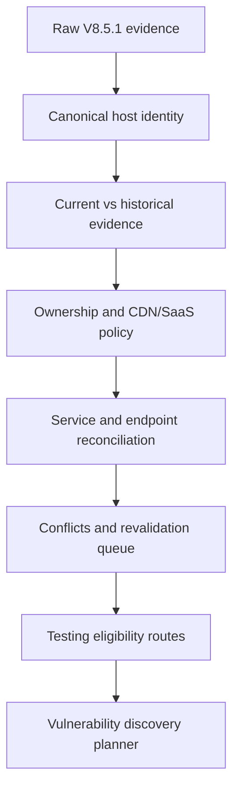
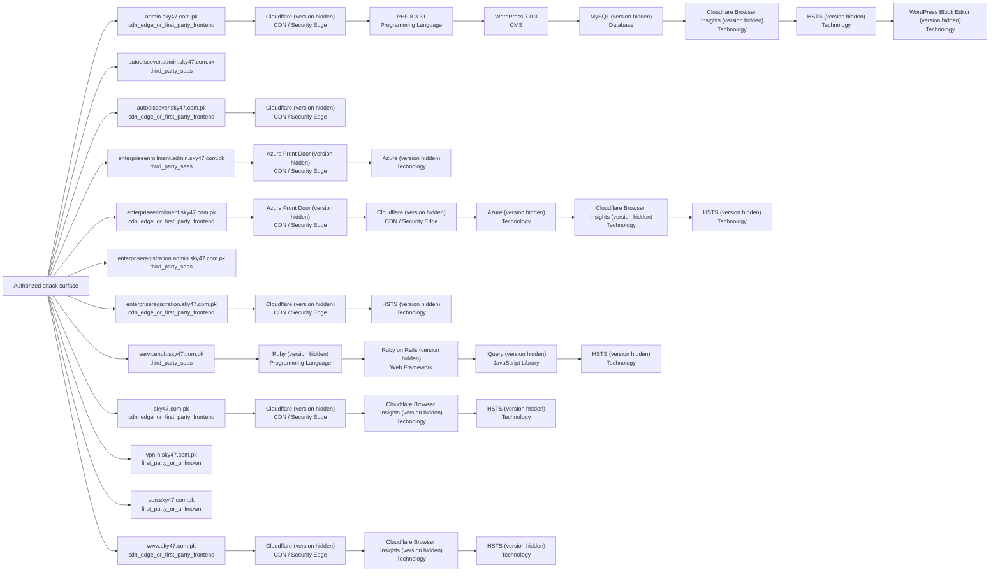

# Combined VAPT Intelligence Report: `sky47.com.pk`

- **Combined report status:** `PARTIAL`
- **Source run:** `/Users/talha/Downloads/0xCrawllerV10_updated 5/recon_runs/sky47.com.pk-20260811-153117`
- **Generated at:** `2026-08-11T11:53:10.866063Z`
- **Report generator:** `0xCrawller Combined Report v10.0.0`

> This document consolidates reconnaissance, normalized asset intelligence, and technology/service identification. It does **not** by itself prove exploitable vulnerabilities.

## Pipeline status

| Stage | Purpose | Status | Primary evidence |
|---|---|---|---|
| 1. Reconnaissance | Discover and validate hosts, URLs, DNS, WAF/CDN, screenshots, passive observations, and bounded ports | `COMPLETE` | `summary.json` |
| 2. Normalization | Convert raw tool outputs into canonical assets, services, endpoints, conflicts, and testing eligibility | `COMPLETE` | `normalization_v9/normalization_summary.json` |
| 3. Technology identification | Correlate HTTP, JavaScript, tool fingerprints, and eligible service evidence | `PARTIAL` | `technology_enrichment_v9_2/technology_enrichment_summary.json` |

## Executive coverage

| Metric | Count | Meaning |
|---|---:|---|
| Canonical assets | 12 | Unique normalized hosts in the current inventory |
| DNS-validated assets | 11 | Hosts resolved in the current run |
| Live web assets | 10 | Hosts with a current HTTP observation |
| Normalized endpoints | 204 | Canonical URLs/endpoints after deduplication |
| Suspicious endpoints | 12 | Crawler observations requiring focused revalidation |
| Current services | 11 | Normalized web/network service records |
| Confirmed/current services | 9 | Services supported by current validation evidence |
| Technology records | 27 | Per-host technology/component fingerprints |
| Exact versions | 2 | Versions supported by defensible evidence |
| Versions not exposed | 25 | Detected products without an exact observed version |
| Technology conflicts | 0 | Conflicting technology/version observations |
| Normalization conflicts | 4 | Evidence requiring reconciliation or revalidation |
| Normalization revalidation items | 3 | Assets/endpoints queued for additional validation |
| Technology revalidation items | 6 | Technology evidence requiring additional validation |
| Screenshot-covered assets | 10 | Assets with captured screenshot evidence |
| CDN-detected assets | 9 | Assets identified behind an edge/CDN |
| WAF-detected assets | 7 | Assets with passive or active WAF evidence |
| Active-testing eligible assets | 8 | Assets permitted by the generated routing policy |

## Important interpretation

- Reconnaissance discovers and validates the attack surface; it does not confirm a vulnerability.
- Normalization is the trust boundary that separates current first-party assets from historical, third-party, wildcard-like, conflicting, or unvalidated observations.
- Technology identification reports only evidence-backed products and versions. `NOT_EXPOSED` means the product was detected but an exact version was not defensibly observable.
- Vulnerability mapping and validation should consume normalized eligibility and technology evidence, not raw scanner output.

## Asset-level consolidated inventory

| Host | HTTP | Priority | Asset types | CDN / WAF | Current services | Technologies | Testing decision |
|---|---|---|---|---|---|---|---|
| `admin.sky47.com.pk` | 200 Sky47 \| AI-Ready Tier III/IV Data Centre & Sovereign Cloud Pakistan - Sky47 delivers Tier III/IV colocation, sovereign cloud, high-density compute and AI-ready infrastructure to power secure enterprise-grade digital transformation. | High | admin_or_management_surface, api_surface, cdn_fronted_web, web_application, wordpress_application | CDN: Cloudflare, WAF: Cloudflare | tcp/443 https | Cloudflare, Cloudflare Browser Insights, HSTS, MySQL, PHP 8.3.31, WordPress 7.0.3, WordPress Block Editor | `ALLOWED_ACTIVE` |
| `autodiscover.admin.sky47.com.pk` | not live | — | admin_or_management_surface, dns_only_asset, third_party_saas | — | — | — | `THIRD_PARTY_RESTRICTED` |
| `autodiscover.sky47.com.pk` | 521 Unknown / Needs Review | High | cdn_fronted_web, web_application | CDN: Cloudflare, WAF: Cloudflare | tcp/443 https | Cloudflare | `ALLOWED_ACTIVE` |
| `enterpriseenrollment.admin.sky47.com.pk` | 404 Page not found | Medium | admin_or_management_surface, third_party_saas, web_application | CDN: azure | tcp/443 https | Azure, Azure Front Door | `THIRD_PARTY_RESTRICTED` |
| `enterpriseenrollment.sky47.com.pk` | 404 Page not found | Medium | cdn_fronted_web, web_application | CDN: Cloudflare, WAF: Cloudflare / Azure Front Door | tcp/443 https | Azure, Azure Front Door, Cloudflare, Cloudflare Browser Insights, HSTS | `ALLOWED_ACTIVE` |
| `enterpriseregistration.admin.sky47.com.pk` | 404 Unknown / Needs Review | Medium | admin_or_management_surface, third_party_saas, web_application | CDN: azure | tcp/443 https | — | `THIRD_PARTY_RESTRICTED` |
| `enterpriseregistration.sky47.com.pk` | 404 Unknown / Needs Review | Medium | cdn_fronted_web, web_application | CDN: Cloudflare, WAF: Cloudflare | tcp/443 https | Cloudflare, HSTS | `ALLOWED_ACTIVE` |
| `servicehub.sky47.com.pk` | 200 - SolarWinds Service Desk | Medium | third_party_saas, web_application | CDN: Google | tcp/443 https | HSTS, Ruby, Ruby on Rails, jQuery | `THIRD_PARTY_RESTRICTED` |
| `sky47.com.pk` | 200 Unknown / Needs Review | Medium | api_surface, cdn_fronted_web, web_application | CDN: Cloudflare, WAF: Cloudflare | tcp/443 https | Cloudflare, Cloudflare Browser Insights, HSTS | `ALLOWED_ACTIVE` |
| `vpn-h.sky47.com.pk` | 200 fw-vpn-portal | Medium | network_service_host, vpn_or_security_appliance, web_application | WAF: Generic/Unknown WAF | tcp/443 https | — | `ALLOWED_ACTIVE` |
| `vpn.sky47.com.pk` | not live | — | dns_only_asset, network_service_host, vpn_or_security_appliance | — | tcp/179 tcpwrapped | — | `ALLOWED_ACTIVE` |
| `www.sky47.com.pk` | 200 Unknown / Needs Review | Medium | api_surface, cdn_fronted_web, web_application | CDN: Cloudflare, WAF: Cloudflare | tcp/443 https | Cloudflare, Cloudflare Browser Insights, HSTS | `ALLOWED_ACTIVE` |

## Technology intelligence

### Categories

| Category | Records |
|---|---:|
| Technology | 13 |
| CDN / Security Edge | 8 |
| Programming Language | 2 |
| CMS | 1 |
| Database | 1 |
| JavaScript Library | 1 |
| Web Framework | 1 |

### Exact observed versions

| Host | Technology | Version | Category | Confidence | Sources |
|---|---|---|---|---|---|
| `admin.sky47.com.pk` | PHP | `8.3.31` | Programming Language | medium | httpx_wappalyzer |
| `admin.sky47.com.pk` | WordPress | `7.0.3` | CMS | medium | httpx_wappalyzer |

### Technology tool lanes

| Lane | Status | Targets/records | Note |
|---|---|---:|---|
| `retirejs` | `FAILED` | 0 | javascript_downloads_failed |
| `http_evidence` | `PARTIAL` | 7 | — |
| `zgrab2` | `COMPLETE` | 2 | — |
| `whatweb` | `FAILED` | 7 | Unable to find image '0xcrawller/whatweb:0.6.4' locally docker: Error response from daemon: pull access denied for 0xcrawller/whatweb, repository does not exist or may require 'do… |
| `wappalyzer_next` | `FAILED` | 7 | Unable to find image '0xcrawller/wappalyzer-next:2.0.0' locally docker: Error response from daemon: pull access denied for 0xcrawller/wappalyzer-next, repository does not exist or… |
| `nuclei` | `COMPLETE` | 7 | — |

## Services and ports

| Host | Protocol | Port | Family/product | Version | Status |
|---|---|---:|---|---|---|
| `admin.sky47.com.pk` | tcp | 443 | https | — | `HTTP_VALIDATED` |
| `autodiscover.sky47.com.pk` | tcp | 443 | https | — | `HTTP_VALIDATED` |
| `enterpriseenrollment.admin.sky47.com.pk` | tcp | 443 | https | — | `HTTP_VALIDATED` |
| `enterpriseenrollment.sky47.com.pk` | tcp | 443 | https | — | `HTTP_VALIDATED` |
| `enterpriseregistration.admin.sky47.com.pk` | tcp | 443 | https | — | `HTTP_VALIDATED` |
| `enterpriseregistration.sky47.com.pk` | tcp | 443 | https | — | `HTTP_VALIDATED` |
| `servicehub.sky47.com.pk` | tcp | 443 | https | — | `HTTP_VALIDATED` |
| `sky47.com.pk` | tcp | 443 | https | — | `HTTP_VALIDATED` |
| `vpn-h.sky47.com.pk` | tcp | 443 | https | — | `NMAP_CONFIRMED_OPEN` |
| `vpn.sky47.com.pk` | tcp | 179 | tcpwrapped | — | `NMAP_CONFIRMED_OPEN` |
| `www.sky47.com.pk` | tcp | 443 | https | — | `HTTP_VALIDATED` |

## Revalidation and evidence conflicts

### Normalization revalidation queue

| Host | Priority | Reason | Recommended action |
|---|---|---|---|
| `admin.sky47.com.pk` | Medium | suspicious_endpoints | HTTP-revalidate only the suspicious URLs before vulnerability routing. |
| `sky47.com.pk` | Medium | suspicious_endpoints | HTTP-revalidate only the suspicious URLs before vulnerability routing. |
| `www.sky47.com.pk` | Medium | suspicious_endpoints | HTTP-revalidate only the suspicious URLs before vulnerability routing. |

### Normalization conflicts

| Host | Severity | Type | Description |
|---|---|---|---|
| `admin.sky47.com.pk` | low | suspicious_crawler_endpoints | One or more crawler-derived URLs appear syntactically malformed or derived from JavaScript strings. |
| `enterpriseenrollment.sky47.com.pk` | low | multi_layer_edge_attribution | Multiple edge or WAF providers were observed; preserve all evidence rather than selecting one silently. |
| `sky47.com.pk` | low | suspicious_crawler_endpoints | One or more crawler-derived URLs appear syntactically malformed or derived from JavaScript strings. |
| `www.sky47.com.pk` | low | suspicious_crawler_endpoints | One or more crawler-derived URLs appear syntactically malformed or derived from JavaScript strings. |

No conflicting exact technology versions were observed.

## Authorized next-stage routing

| Route | Eligible assets |
|---|---:|
| HTTP security headers, cookie flags, methods, and disclosure checks | 7 |
| Safe and rate-limited web vulnerability templates | 7 |
| Evidence-driven checks selected from confirmed technologies | 7 |
| TLS protocol, certificate, and cipher configuration checks | 7 |
| Protocol-specific checks against confirmed direct services | 2 |
| Remote vulnerability checks against eligible direct first-party services | 2 |

The next implementation layer should perform vulnerability discovery, CVE/CPE mapping, evidence-backed validation, false-positive control, and human approval for intrusive or authenticated checks.

## Evidence files consumed

- `summary.json` — read
- `final_report.md` — read
- `normalization_v9/normalization_summary.json` — read
- `normalization_v9/asset_inventory.json` — read
- `normalization_v9/service_inventory.json` — read
- `normalization_v9/endpoint_inventory.json` — read
- `normalization_v9/asset_conflicts.json` — read
- `normalization_v9/asset_revalidation_queue.json` — read
- `normalization_v9/testing_eligibility.json` — read
- `normalization_v9/asset_normalization_report.md` — read
- `technology_enrichment_v9_2/technology_enrichment_summary.json` — read
- `technology_enrichment_v9_2/technology_inventory.json` — read
- `technology_enrichment_v9_2/service_inventory_enriched.json` — read
- `technology_enrichment_v9_2/technology_conflicts.json` — read
- `technology_enrichment_v9_2/technology_revalidation_queue.json` — read
- `technology_enrichment_v9_2/technology_tool_status.json` — read
- `technology_enrichment_v9_2/technology_enrichment_report.md` — read

## Embedded source reports

The original stage reports are embedded below so the consolidated file remains self-contained.

### Reconnaissance source report

#### Smart Subdomain Recon Report: `sky47.com.pk`

**Overall run status: `COMPLETE`**

Run folder: `recon_runs/sky47.com.pk-20260811-153117`
Generated: `2026-08-11T16:18:33`

##### Run health and coverage

- Mode: `max`
- Canonical crawl target: `https://sky47.com.pk`
- Candidates selected: `4268`
- Candidates generated before cap: `4268`
- Candidate list truncated: `False`
- Bulk DNS coverage: `4139/4139` (`100.0%`)
- DNSX chunks completed: `1/1`
- Katana requested configuration: `{"depth": 5, "crawl_duration": "10m", "known_files": "all", "enabled": true}`
- Katana effective configuration: `{"depth": 5, "crawl_duration": "10m", "known_files": "all", "scope": "fqdn", "enabled": true, "concurrency": 10, "rate_limit": 50, "javascript_crawl": true, "ignore_query_params": true}`

##### Tool status

| Tool | Status | OK | Timed out | Warnings | Errors | Seconds | Return code |
|---|---|---:|---:|---:|---:|---:|---:|
| gobuster_base | Warning | True | False | 1 | 0 | 3.25 | 0 |
| subfinder | OK | True | False | 0 | 0 | 3.53 | 0 |
| bbot | Warning | True | False | 19 | 0 | 296.11 | 0 |
| amass | OK | True | False | 0 | 0 | 792.46 | 0 |
| httpx_root_probe | OK | True | False | 0 | 0 | 24.98 | 0 |
| katana_canonical | OK | True | False | 0 | 0 | 14.81 | 0 |
| dnsx_priority | OK | True | False | 0 | 0 | 4.81 | 0 |
| dnsx_chunk_0001 | OK | True | False | 0 | 0 | 147.60 | 0 |
| gobuster_custom | Warning | True | False | 1 | 0 | 0.91 | 0 |
| dnsx_wildcards | OK | True | False | 0 | 0 | 3.70 | 0 |
| httpx_probe | Warning | True | False | 2 | 0 | 50.88 | 0 |
| httpx_screenshot | OK | True | False | 0 | 0 | 45.74 | 0 |
| katana_recursive_l1_autodiscover.sky47.com.pk_e7ae19b3 | OK | True | False | 0 | 0 | 11.76 | 0 |
| katana_recursive_l1_enterpriseregistration.sky47.com.pk_3ff2c17b | OK | True | False | 0 | 0 | 13.68 | 0 |
| katana_recursive_l1_enterpriseenrollment.sky47.com.pk_83bc599d | OK | True | False | 0 | 0 | 14.32 | 0 |
| katana_recursive_l1_vpn-h.sky47.com.pk_5e5fc5ba | OK | True | False | 0 | 0 | 13.97 | 0 |
| katana_recursive_l1_www.sky47.com.pk_e17035e6 | OK | True | False | 0 | 0 | 14.81 | 0 |
| katana_recursive_l1_admin.sky47.com.pk_feef67d9 | OK | True | False | 0 | 0 | 47.05 | 0 |
| wafw00f | OK | True | False | 0 | 0 | 4.44 | 0 |
| naabu_port_scan | OK | True | False | 0 | 0 | 1653.96 | 0 |
| nmap_vpn.sky47.com.pk | OK | True | False | 0 | 0 | 1.38 | 0 |
| nmap_vpn-h.sky47.com.pk | OK | True | False | 0 | 0 | 24.15 | 0 |

###### Tool diagnostics

###### `gobuster_base`
- Warning: `[+] Timeout:    5s`

###### `bbot`
- Warning: `[INFO] Setup soft-failed for chaos: No API key set`
- Warning: `[INFO] Setup soft-failed for bevigil: No API key set`
- Warning: `[INFO] Setup soft-failed for bufferoverrun: No API key set`
- Warning: `[INFO] Setup soft-failed for builtwith: No API key set`
- Warning: `[INFO] Setup soft-failed for c99: No API key set`

###### `gobuster_custom`
- Warning: `[+] Timeout:    5s`

###### `httpx_probe`
- Warning: `443 chain="network is unreachable; connection refused"`
- Warning: `context deadline exceeded (Client.Timeout exceeded while awaiting headers)`

##### Wildcard analysis

Zones tested: `2`
Random probes sent: `6`

| Zone | Wildcard answer | Answers | Matching signature probes |
|---|---:|---:|---:|
| `admin.sky47.com.pk` | False | 0 | 0 |
| `sky47.com.pk` | False | 0 | 0 |

##### DNS-validated assets (11)

- `admin.sky47.com.pk` state=`dns_resolved` A=[104.26.14.133, 104.26.15.133, 172.67.69.24] CNAME=[]
- `autodiscover.admin.sky47.com.pk` state=`dns_resolved` A=[40.99.32.120, 40.99.60.8, 40.99.68.40, 40.99.70.184, 40.99.70.200, 40.99.70.216, 40.99.70.232, 52.98.61.56] CNAME=[acdcatm.autodiscover.mira.tm.svc.cloud.microsoft, atm.autodiscover.mira.tm.svc.cloud.microsoft, autod.ms-acdc-autod.office.com, autodiscover.outlook.cloud.microsoft, autodiscover.outlook.com]
- `autodiscover.sky47.com.pk` state=`dns_resolved` A=[104.26.14.133, 104.26.15.133, 172.67.69.24] CNAME=[]
- `enterpriseenrollment.admin.sky47.com.pk` state=`dns_resolved` A=[13.107.228.46] CNAME=[azurefd-t54-prod.trafficmanager.net, enterpriseenrollment-s.manage.microsoft.com, manage-pe.trafficmanager.net, pexsucp-drgzexethuh8cpen.b02.azurefd.net, s-part-0035.t-0009.t-s1-msedge.net, shed.dual-low.s-part-0035.t-0009.t-s1-msedge.net]
- `enterpriseenrollment.sky47.com.pk` state=`dns_resolved` A=[104.26.14.133, 104.26.15.133, 172.67.69.24] CNAME=[]
- `enterpriseregistration.admin.sky47.com.pk` state=`dns_resolved` A=[20.190.147.34, 20.190.147.35, 20.190.147.36, 20.190.147.37, 20.190.177.145, 20.190.177.17, 20.190.177.18, 20.190.177.81, 40.126.18.35, 40.126.18.36] CNAME=[enterpriseregistration.windows.net, na.privatelink.msidentity.com, prdf.aadg.msidentity.com, www.tm.f.prd.aadg.akadns.net]
- `enterpriseregistration.sky47.com.pk` state=`dns_resolved` A=[104.26.14.133, 104.26.15.133, 172.67.69.24] CNAME=[]
- `servicehub.sky47.com.pk` state=`dns_resolved` A=[35.185.32.151] CNAME=[sky47limited.samanage.com]
- `vpn-h.sky47.com.pk` state=`dns_resolved` A=[138.252.175.134] CNAME=[]
- `vpn.sky47.com.pk` state=`dns_resolved` A=[203.135.22.188] CNAME=[]
- `www.sky47.com.pk` state=`dns_resolved` A=[104.26.14.133, 104.26.15.133, 172.67.69.24] CNAME=[]

##### Accepted keyword evidence (9)

Rejected noisy/random tokens: `91`

| Keyword | Score | Source(s) |
|---|---:|---|
| `admin` | 100 | exact_subdomain_label |
| `vpn` | 100 | exact_subdomain_label |
| `new` | 92 | katana_url |
| `web` | 92 | katana_url |
| `servicehub` | 78 | exact_subdomain_label |
| `services` | 75 | katana_url |
| `autodiscover` | 73 | exact_subdomain_label |
| `enterpriseenrollment` | 71 | exact_subdomain_label |
| `enterpriseregistration` | 71 | exact_subdomain_label |

##### CDN, Wappalyzer technology, and WAF detection

Passive detection is always collected from HTTPX. Technology fingerprints come from HTTPX `-tech-detect` using the Wappalyzer dataset; CDN/WAF provider evidence comes primarily from HTTPX CDNCheck and DNS/CNAME context. Wappalyzer technology alone is supporting evidence, not proof of proxying.

- Assets with CDN evidence: `9`
- Assets with any WAF/security-edge evidence: `7`
- Assets with passive WAF/security-edge evidence: `6`
- Conflicting or multi-layer WAF attributions: `1`
- Generic active WAF detections: `1`
- Unique technologies detected: `12`
- Active WAFW00F requested: `True`
- Active WAFW00F targets: `7`
- Active WAFW00F detections: `7`

| Host | CDN | CDN confidence | WAF/security edge | WAF confidence | Attribution | Detection mode | Technologies |
|---|---|---|---|---|---|---|---|
| `admin.sky47.com.pk` | Cloudflare | high | Cloudflare | high | named_active_fingerprint | active_fingerprinting | Cloudflare, Cloudflare Browser Insights, HSTS, MySQL, PHP:8.3.31, WordPress Block Editor, WordPress:7.0.3 |
| `autodiscover.sky47.com.pk` | Cloudflare | high | Cloudflare | high | named_active_fingerprint | active_fingerprinting | Cloudflare |
| `enterpriseenrollment.sky47.com.pk` | Cloudflare | high | Cloudflare / Azure Front Door | medium | conflicting_or_multi_layer | active_fingerprinting | Azure, Azure Front Door, Cloudflare, Cloudflare Browser Insights, HSTS |
| `enterpriseregistration.sky47.com.pk` | Cloudflare | high | Cloudflare | high | named_active_fingerprint | active_fingerprinting | Cloudflare, HSTS |
| `sky47.com.pk` | Cloudflare | high | Cloudflare | high | named_active_fingerprint | active_fingerprinting | Cloudflare, Cloudflare Browser Insights, HSTS |
| `vpn-h.sky47.com.pk` |  | none | Generic/Unknown WAF | medium | generic_active_fingerprint | active_fingerprinting |  |
| `www.sky47.com.pk` | Cloudflare | high | Cloudflare | high | named_active_fingerprint | active_fingerprinting | Cloudflare, Cloudflare Browser Insights, HSTS |
| `enterpriseenrollment.admin.sky47.com.pk` | azure | high |  | none |  | passive | Azure, Azure Front Door |
| `enterpriseregistration.admin.sky47.com.pk` | azure | high |  | none |  | passive |  |
| `servicehub.sky47.com.pk` | Google | high |  | none |  | passive | HSTS, Ruby, Ruby on Rails, jQuery |

##### Passive Shodan reconnaissance

This stage queries Shodan's existing DNS, search, and host databases. It does not submit on-demand Shodan scans.

- Requested: `False`
- Status: `NOT_REQUESTED`
- API key configured: `False`
- Shodan DNS records collected: `0`
- Scoped dorks planned: `0`
- Dorks with non-zero counts: `0`
- Estimated query credits spent: `0` / `0`
- API-reported query-credit delta: `None`
- Host lookups completed: `0`
- Services collected: `0`
- Assets enriched: `0`
- Unique vulnerability identifiers observed in Shodan metadata: `0`

##### Recursive recon expansion, clustering, and topology

The canonical root is level 0. Newly discovered in-scope web hosts are revalidated and crawled in parallel for at most three descendant levels. Third-party SaaS is retained as evidence but excluded from active recursive crawling.

- Requested: `True`
- Status: `COMPLETE`
- Maximum descendant depth: `3`
- Levels completed: `1`
- Parallel crawl workers: `4`
- Hosts crawled: `6`
- In-scope hosts observed during expansion: `0`
- Newly DNS-validated hosts: `0`
- URLs observed across canonical and recursive crawls: `237`
- Maximum-depth boundary hosts not followed: `0`
- Host-cap truncation: `False`
- Recursive screenshots skipped because the host was already captured: `6`

###### Expansion by level

| Level | Crawled hosts | URLs observed | New hosts observed | New hosts validated | Next-level targets | Boundary |
|---:|---:|---:|---:|---:|---:|---:|
| 1 | 6 | 204 | 0 | 0 | 0 | False |

###### Asset clusters

| Cluster | Assets | Samples |
|---|---:|---|
| `dns_only` | 2 | `autodiscover.admin.sky47.com.pk` `vpn.sky47.com.pk` |
| `first_party_cdn_fronted` | 6 | `admin.sky47.com.pk` `autodiscover.sky47.com.pk` `enterpriseenrollment.sky47.com.pk` `enterpriseregistration.sky47.com.pk` `sky47.com.pk` `www.sky47.com.pk` |
| `first_party_waf_detected` | 1 | `vpn-h.sky47.com.pk` |
| `root` | 1 | `sky47.com.pk` |
| `third_party_saas` | 3 | `enterpriseenrollment.admin.sky47.com.pk` `enterpriseregistration.admin.sky47.com.pk` `servicehub.sky47.com.pk` |

###### Recon mind map

```mermaid
flowchart TD
  N0["admin.sky47.com.pk\nL1 | cdn_edge_or_first_party_frontend"]
  N1["autodiscover.sky47.com.pk\nL1 | cdn_edge_or_first_party_frontend"]
  N2["enterpriseenrollment.admin.sky47.com.pk\nL1 | third_party_saas"]
  N3["enterpriseenrollment.sky47.com.pk\nL1 | cdn_edge_or_first_party_frontend"]
  N4["enterpriseregistration.admin.sky47.com.pk\nL1 | third_party_saas"]
  N5["enterpriseregistration.sky47.com.pk\nL1 | cdn_edge_or_first_party_frontend"]
  N6["servicehub.sky47.com.pk\nL1 | third_party_saas"]
  N7["sky47.com.pk\nL0 | cdn_edge_or_first_party_frontend"]
  N8["vpn-h.sky47.com.pk\nL1 | first_party_or_unknown"]
  N9["www.sky47.com.pk\nL1 | cdn_edge_or_first_party_frontend"]
  N7 -->|initial_inventory| N0
  N7 -->|initial_inventory| N1
  N7 -->|initial_inventory| N2
  N7 -->|initial_inventory| N3
  N7 -->|initial_inventory| N4
  N7 -->|initial_inventory| N5
  N7 -->|initial_inventory| N6
  N7 -->|initial_inventory| N8
  N7 -->|initial_inventory| N9
```

The complete machine-readable graph is stored in `recon_topology.json`; the standalone Mermaid source is `recon_mindmap.mmd`.

##### HTTP probing and host classification

| Host | Status | Title | Category | Priority | Edge response | Ownership | Application/SaaS provider | Network CDN | WAF | WAF attribution |
|---|---:|---|---|---|---|---|---|---|---|---|
| `admin.sky47.com.pk` | 200 | Sky47 \| AI-Ready Tier III/IV Data Centre & Sovereign Cloud Pakistan - Sky47 delivers Tier III/IV colocation, sovereign cloud, high-density compute and AI-ready infrastructure to power secure enterprise-grade digital transformation. | Admin / Management Surface | High | application_live | cdn_edge_or_first_party_frontend |  | Cloudflare | Cloudflare | named_active_fingerprint |
| `autodiscover.sky47.com.pk` | 521 |  | Unknown / Needs Review | High | application_or_upstream_error | cdn_edge_or_first_party_frontend |  | Cloudflare | Cloudflare | named_active_fingerprint |
| `enterpriseenrollment.sky47.com.pk` | 404 | Page not found | Unknown / Needs Review | Medium | default_404_or_missing_root_route | cdn_edge_or_first_party_frontend |  | Cloudflare | Cloudflare / Azure Front Door | conflicting_or_multi_layer |
| `enterpriseregistration.sky47.com.pk` | 404 |  | Unknown / Needs Review | Medium | default_404_or_missing_root_route | cdn_edge_or_first_party_frontend |  | Cloudflare | Cloudflare | named_active_fingerprint |
| `sky47.com.pk` | 200 |  | Unknown / Needs Review | Medium | application_live | cdn_edge_or_first_party_frontend |  | Cloudflare | Cloudflare | named_active_fingerprint |
| `vpn-h.sky47.com.pk` | 200 | fw-vpn-portal | Unknown / Needs Review | Medium | application_live | first_party_or_unknown |  |  | Generic/Unknown WAF | generic_active_fingerprint |
| `www.sky47.com.pk` | 200 |  | Unknown / Needs Review | Medium | application_live | cdn_edge_or_first_party_frontend |  | Cloudflare | Cloudflare | named_active_fingerprint |
| `enterpriseenrollment.admin.sky47.com.pk` | 404 | Page not found | Unknown / Needs Review | Medium | default_404_or_missing_root_route | third_party_saas | Microsoft Intune | azure |  |  |
| `enterpriseregistration.admin.sky47.com.pk` | 404 |  | Unknown / Needs Review | Medium | default_404_or_missing_root_route | third_party_saas | Microsoft Azure / Entra ID | azure |  |  |
| `servicehub.sky47.com.pk` | 200 | - SolarWinds Service Desk | Unknown / Needs Review | Medium | application_live | third_party_saas | SolarWinds Service Desk | Google |  |  |

##### Controlled port enumeration

This stage is opt-in. DNS CNAME ownership is evaluated before HTTP classification. Third-party delegated services, CDN/security edges, and unresolved ownership are excluded by default. Naabu reports candidate TCP ports; Nmap independently rechecks only valid candidates. A Naabu result is not treated as confirmed open until Nmap reports the port state as `open`.

- Requested: `True`
- Targets selected: `2`
- Targets excluded: `10`
- Naabu candidate hosts: `2`
- Naabu candidate ports: `2`
- Rejected invalid Naabu records: `0`
- Nmap validation requested: `True`
- Nmap port-state/service records: `2`
- Nmap-confirmed open ports: `2`
- Nmap-not-confirmed candidates: `0`

| Host | Port | Naabu status | Nmap state | Final status | Service evidence |
|---|---:|---|---|---|---|
| `vpn-h.sky47.com.pk` | 443 | `NAABU_CANDIDATE` | `open` | `NMAP_CONFIRMED_OPEN` | https |
| `vpn.sky47.com.pk` | 179 | `NAABU_CANDIDATE` | `open` | `NMAP_CONFIRMED_OPEN` | tcpwrapped |

##### Endpoint classification across canonical and recursive crawls

Raw unique URLs seen: `237`
Normalized in-scope endpoints: `204`
Deduplicated/filtered/malformed/external: `33`
External references recorded but not crawled into candidate generation: `20`
OpenAPI/Swagger candidates: `0`

| Category | Count | Priority | Samples |
|---|---:|---|---|
| Other Endpoint | 141 | Low | `https://admin.sky47.com.pk/` `https://admin.sky47.com.pk/admin.sky47.com.pk/wp-admin/authorize-application.php` `https://admin.sky47.com.pk/?p=1114` `https://admin.sky47.com.pk/?p=1134` `https://admin.sky47.com.pk/?p=512` |
| API Endpoint | 22 | High | `https://admin.sky47.com.pk/wp-json/wp/v2/leadership/1114` `https://admin.sky47.com.pk/wp-json/wp/v2/leadership/512` `https://admin.sky47.com.pk/wp-json/wp/v2/leadership/513` `https://admin.sky47.com.pk/wp-json/wp/v2/leadership/515` `https://admin.sky47.com.pk/wp-json/wp/v2/leadership/516` |
| CSS/Font Asset | 19 | Low | `https://admin.sky47.com.pk/cdn-cgi/styles/cf.errors.css` `https://admin.sky47.com.pk/cdn-cgi/styles/cf.errors.ie.css` `https://admin.sky47.com.pk/wp-content/cache/wpspeed/css/98244f1aefb944ed671c2def296f228f.css` `https://admin.sky47.com.pk/wp-content/themes/sky47/github.com/necolas/normalize.css` `https://admin.sky47.com.pk/wp-content/themes/sky47/style.css?ver=1.0.0` |
| JavaScript/Static Bundle | 16 | Medium | `https://admin.sky47.com.pk/wp-content/cache/wpspeed/js/01cfc99daabf5b6a636a0c87ad8bbb89.js` `https://admin.sky47.com.pk/wp-content/cache/wpspeed/js/44f22cd1f98901867995af460d75f1fa.js` `https://admin.sky47.com.pk/wp-content/plugins/optimole-wp/assets/build/optimizer/optimizer.js?v=4.2.10` `https://admin.sky47.com.pk/wp-content/plugins/wpspeed/media/core/js/instantpage-5.2.0.js?ver=2.6.10` `https://admin.sky47.com.pk/wp-content/plugins/wpspeed/media/core/js/ls.loader.js?ver=2.6.10` |
| File/Storage Endpoint | 6 | Medium | `https://admin.sky47.com.pk/wp-content/plugins/wpspeed/media/core/js/Chrome` `https://admin.sky47.com.pk/wp-content/plugins/wpspeed/media/core/js/Chrome/` `https://admin.sky47.com.pk/wp-content/plugins/wpspeed/media/lazysizes/types/global` `https://admin.sky47.com.pk/wp-content/plugins/wpspeed/media/lazysizes/types/lazysizes-config` `https://sky47.com.pk/static/js/image/` |

##### Internal IP leak / private address references

No private IP reference was found in fields classified as target-controlled response content.

##### Screenshot capture

Screenshot execution status: `OK`
Eligible unique hosts: `10`
Selected unique hosts: `10`
Skipped by configured limit: `0`
Coverage: `100.0%`
Main screenshot JSON records: `10`
Unique hosts captured: `10`
Unique screenshot contents: `8`
Total screenshot artifacts retained: `10`
Duplicate-content artifacts: `2`
- Selection policy: One best URL per host; high-priority assets first, then successful/redirecting HTTPS responses, then remaining live responses.
- Screenshot image files were created for the selected URLs.
- `httpx_screenshots/screenshot/admin.sky47.com.pk/67850d20affe62963409c6f68e1b74880de9c305.png`
- `httpx_screenshots/screenshot/autodiscover.sky47.com.pk/e80f5608a478a34777c2254bc44542774c3ee19f.png`
- `httpx_screenshots/screenshot/enterpriseenrollment.admin.sky47.com.pk/513e500767f9fad9abae1c1f0fb2a12611f63b17.png`
- `httpx_screenshots/screenshot/enterpriseenrollment.sky47.com.pk/e1688569ad9e0450a4687da9f95b45d245d1605e.png`
- `httpx_screenshots/screenshot/enterpriseregistration.admin.sky47.com.pk/1ba4a951105857cfc0fe48a6efe74ae361aa80fd.png`
- `httpx_screenshots/screenshot/enterpriseregistration.sky47.com.pk/2498e273fe2373e0ae36ce2ef67dac98dda64cb3.png`
- `httpx_screenshots/screenshot/servicehub.sky47.com.pk/bcb4ad6be20dde9927993783bce47933cb71e4af.png`
- `httpx_screenshots/screenshot/sky47.com.pk/e8d743d5f1dd55056e280e7a6a4d2c8d51b670be.png`
- `httpx_screenshots/screenshot/vpn-h.sky47.com.pk/742b2c2fe9702b8c676c91fc9006a8e6e4a8e84d.png`
- `httpx_screenshots/screenshot/www.sky47.com.pk/cf0b9f171dbdf8efc9b9a4f8fb00ed1a8aeea7ef.png`

##### Browser-rendered host/API discovery

Target-scope URLs observed by browser: `66`
All target-scope hosts observed by browser: `10`
New browser-only hosts: `0`
New browser-only hosts validated by DNS: `0`

##### Manual VAPT review plan

> These are review tasks, not vulnerability claims. Perform only with explicit authorization and test accounts.

###### Admin / Management Surface
- `admin.sky47.com.pk` status=`200` title=`Sky47 \| AI-Ready Tier III/IV Data Centre & Sovereign Cloud Pakistan - Sky47 delivers Tier III/IV colocation, sovereign cloud, high-density compute and AI-ready infrastructure to power secure enterprise-grade digital transformation.` ownership=`cdn_edge_or_first_party_frontend`
  - CDN/WAF edge evidence exists; do not treat edge IP ports as confirmed origin exposure.
  - Check role separation, session timeout, MFA and rate limiting if in scope.
  - Verify authentication is enforced on every administrative route.

###### Unknown / Needs Review
- `autodiscover.sky47.com.pk` status=`521` title=`` ownership=`cdn_edge_or_first_party_frontend`
  - CDN/WAF edge evidence exists; do not treat edge IP ports as confirmed origin exposure.
  - The response indicates an application, origin, routing, or TLS problem that requires manual verification.
- `enterpriseenrollment.sky47.com.pk` status=`404` title=`Page not found` ownership=`cdn_edge_or_first_party_frontend`
  - CDN/WAF edge evidence exists; do not treat edge IP ports as confirmed origin exposure.
  - The host answered, but the root route was not found.
- `enterpriseregistration.sky47.com.pk` status=`404` title=`` ownership=`cdn_edge_or_first_party_frontend`
  - CDN/WAF edge evidence exists; do not treat edge IP ports as confirmed origin exposure.
  - The host answered, but the root route was not found.
- `sky47.com.pk` status=`200` title=`` ownership=`cdn_edge_or_first_party_frontend`
  - CDN/WAF edge evidence exists; do not treat edge IP ports as confirmed origin exposure.
- `vpn-h.sky47.com.pk` status=`200` title=`fw-vpn-portal` ownership=`first_party_or_unknown`
- `www.sky47.com.pk` status=`200` title=`` ownership=`cdn_edge_or_first_party_frontend`
  - CDN/WAF edge evidence exists; do not treat edge IP ports as confirmed origin exposure.
- `enterpriseenrollment.admin.sky47.com.pk` status=`404` title=`Page not found` ownership=`third_party_saas`
  - CDN/WAF edge evidence exists; do not treat edge IP ports as confirmed origin exposure.
  - The host answered, but the root route was not found.
  - Third-party managed service; intrusive testing requires explicit authorization for that provider/service.
- `enterpriseregistration.admin.sky47.com.pk` status=`404` title=`` ownership=`third_party_saas`
  - CDN/WAF edge evidence exists; do not treat edge IP ports as confirmed origin exposure.
  - The host answered, but the root route was not found.
  - Third-party managed service; intrusive testing requires explicit authorization for that provider/service.
- `servicehub.sky47.com.pk` status=`200` title=`- SolarWinds Service Desk` ownership=`third_party_saas`
  - CDN/WAF edge evidence exists; do not treat edge IP ports as confirmed origin exposure.
  - Third-party managed service; intrusive testing requires explicit authorization for that provider/service.

##### Output files

- `summary.json`
- `command_manifest.json`
- `tool_versions.json`
- `validated_dns_hosts.txt` / `.json` / `.csv`
- `wildcard_suspected_hosts.json`
- `wildcard_check.json`
- `candidate_manifest.jsonl` / `.csv`
- `keyword_evidence.json`
- `rejected_keywords.json`
- `dnsx_chunk_manifest.json`
- `canonical_target.json`
- `katana_urls.txt`
- `endpoint_classification.json`
- `external_references.txt`
- `openapi_candidates.txt`
- `httpx_probe.jsonl`
- `http_review_classification.json` / `.csv`
- `edge_detection_summary.json`
- `waf_targets.txt`
- `waf_detection.json` / `.csv`
- `wafw00f.json` when active WAF fingerprinting is enabled
- `port_scan_target_manifest.json` / `.csv`
- `port_scan_targets.txt`
- `naabu_ports_raw.jsonl` (unaltered tool evidence when available)
- `naabu_ports.jsonl` / `.json` / `.csv` (normalized valid candidates)
- `naabu_rejected_records.jsonl`
- `nmap/*.xml` when Nmap service validation is enabled
- `nmap_services.json` / `.csv`
- `port_candidate_reconciliation.json` / `.csv`
- `port_scan_summary.json`
- `shodan_summary.json` / `shodan_api_info.json` / `shodan_credit_ledger.json`
- `shodan_dork_plan.json` / `shodan_dork_counts.json`
- `shodan_dns_domain.jsonl` / `shodan_search_results.jsonl` / `shodan_host_lookups.jsonl`
- `shodan_services.jsonl` / `shodan_assets.json` / `shodan_ports.csv` / `shodan_vulnerabilities.json`
- `shodan_discovered_hosts.txt` / `shodan_search_filters.json` / `shodan_host_no_data.jsonl`
- `recursive_recon_summary.json` / `recursive_hosts_by_level.json` / `recursive_urls_all.txt`
- `recon_topology.json` / `recon_clusters.json` / `recon_mindmap.mmd`
- `recursive/level_*/` per-level DNS, HTTP, Katana, screenshot, and Shodan evidence
- `screenshot_status.json`
- `internal_ip_leaks.json`
- `final_report.md`

Compatibility aliases are also retained as `confirmed_subdomains.*`.

### Normalization source report

#### V9 Asset Validation and Normalization Report: `sky47.com.pk`

- Schema version: `9.0.0`
- Source recon version: `8.5.1-normalization-fixed`
- Source run: `/Users/talha/Downloads/0xCrawllerV10_updated 5/recon_runs/sky47.com.pk-20260811-153117`
- Normalized: `2026-08-11T11:20:24.646304Z`

##### Executive normalization result

- Canonical assets: `12`
- Current validated assets: `12`
- Historical/unresolved assets: `0`
- Third-party assets restricted: `4`
- Assets eligible for some active testing: `8`
- Canonical services: `11`
- Current confirmed HTTP/network services: `11`
- Endpoints normalized: `204`
- Syntactically suspicious endpoints: `12`
- Evidence conflicts: `4`
- Revalidation queue items: `3`

> This report does not claim vulnerabilities. It converts recon evidence into policy-controlled assets that can be safely routed to later vulnerability-discovery stages.

##### Normalization decision flow

##### Canonical asset inventory

| Host | Types | Ownership | Freshness | DNS | HTTP | Confirmed ports | Testing decision |
|---|---|---|---|---:|---:|---|---|
| `admin.sky47.com.pk` | admin_or_management_surface, api_surface, cdn_fronted_web, web_application, wordpress_application | cdn_edge_or_first_party_frontend | current_validated | Yes | 200 |  | ALLOWED_ACTIVE |
| `autodiscover.admin.sky47.com.pk` | admin_or_management_surface, dns_only_asset, third_party_saas | third_party_saas | current_validated | Yes |  |  | THIRD_PARTY_RESTRICTED |
| `autodiscover.sky47.com.pk` | cdn_fronted_web, web_application | cdn_edge_or_first_party_frontend | current_validated | Yes | 521 |  | ALLOWED_ACTIVE |
| `enterpriseenrollment.admin.sky47.com.pk` | admin_or_management_surface, third_party_saas, web_application | third_party_saas | current_validated | Yes | 404 |  | THIRD_PARTY_RESTRICTED |
| `enterpriseenrollment.sky47.com.pk` | cdn_fronted_web, web_application | cdn_edge_or_first_party_frontend | current_validated | Yes | 404 |  | ALLOWED_ACTIVE |
| `enterpriseregistration.admin.sky47.com.pk` | admin_or_management_surface, third_party_saas, web_application | third_party_saas | current_validated | Yes | 404 |  | THIRD_PARTY_RESTRICTED |
| `enterpriseregistration.sky47.com.pk` | cdn_fronted_web, web_application | cdn_edge_or_first_party_frontend | current_validated | Yes | 404 |  | ALLOWED_ACTIVE |
| `servicehub.sky47.com.pk` | third_party_saas, web_application | third_party_saas | current_validated | Yes | 200 |  | THIRD_PARTY_RESTRICTED |
| `sky47.com.pk` | api_surface, cdn_fronted_web, web_application | cdn_edge_or_first_party_frontend | current_validated | No | 200 |  | ALLOWED_ACTIVE |
| `vpn-h.sky47.com.pk` | network_service_host, vpn_or_security_appliance, web_application | first_party_or_unknown | current_validated | Yes | 200 | 443 | ALLOWED_ACTIVE |
| `vpn.sky47.com.pk` | dns_only_asset, network_service_host, vpn_or_security_appliance | first_party_or_unknown | current_validated | Yes |  | 179 | ALLOWED_ACTIVE |
| `www.sky47.com.pk` | api_surface, cdn_fronted_web, web_application | cdn_edge_or_first_party_frontend | current_validated | Yes | 200 |  | ALLOWED_ACTIVE |

##### Scanner eligibility

| Host | Decision | Headers | TLS | Safe web | Technology-specific | Network/OpenVAS | Reasons |
|---|---|---:|---:|---:|---:|---:|---|
| `admin.sky47.com.pk` | ALLOWED_ACTIVE | Yes | Yes | Yes | Yes | No | web_vhost_checks_only_on_cdn_edge; waf_present_use_rate_limited_checks |
| `autodiscover.admin.sky47.com.pk` | THIRD_PARTY_RESTRICTED | No | No | No | No | No | third_party_infrastructure_restricted |
| `autodiscover.sky47.com.pk` | ALLOWED_ACTIVE | Yes | Yes | Yes | Yes | No | web_vhost_checks_only_on_cdn_edge; waf_present_use_rate_limited_checks |
| `enterpriseenrollment.admin.sky47.com.pk` | THIRD_PARTY_RESTRICTED | No | No | No | No | No | third_party_infrastructure_restricted |
| `enterpriseenrollment.sky47.com.pk` | ALLOWED_ACTIVE | Yes | Yes | Yes | Yes | No | web_vhost_checks_only_on_cdn_edge; waf_present_use_rate_limited_checks |
| `enterpriseregistration.admin.sky47.com.pk` | THIRD_PARTY_RESTRICTED | No | No | No | No | No | third_party_infrastructure_restricted |
| `enterpriseregistration.sky47.com.pk` | ALLOWED_ACTIVE | Yes | Yes | Yes | Yes | No | web_vhost_checks_only_on_cdn_edge; waf_present_use_rate_limited_checks |
| `servicehub.sky47.com.pk` | THIRD_PARTY_RESTRICTED | No | No | No | No | No | third_party_infrastructure_restricted |
| `sky47.com.pk` | ALLOWED_ACTIVE | Yes | Yes | Yes | Yes | No | web_vhost_checks_only_on_cdn_edge; waf_present_use_rate_limited_checks |
| `vpn-h.sky47.com.pk` | ALLOWED_ACTIVE | Yes | Yes | Yes | Yes | Yes | security_appliance_requires_product_specific_review; waf_present_use_rate_limited_checks |
| `vpn.sky47.com.pk` | ALLOWED_ACTIVE | No | No | No | No | Yes | security_appliance_requires_product_specific_review |
| `www.sky47.com.pk` | ALLOWED_ACTIVE | Yes | Yes | Yes | Yes | No | web_vhost_checks_only_on_cdn_edge; waf_present_use_rate_limited_checks |

##### Service reconciliation

Final service states:
- `HTTP_VALIDATED`: `9`
- `NMAP_CONFIRMED_OPEN`: `2`

| Host | Protocol | Port | Final state | Service | Product/version |
|---|---|---:|---|---|---|
| `admin.sky47.com.pk` | tcp | 443 | `HTTP_VALIDATED` | https |  |
| `autodiscover.sky47.com.pk` | tcp | 443 | `HTTP_VALIDATED` | https |  |
| `enterpriseenrollment.admin.sky47.com.pk` | tcp | 443 | `HTTP_VALIDATED` | https |  |
| `enterpriseenrollment.sky47.com.pk` | tcp | 443 | `HTTP_VALIDATED` | https |  |
| `enterpriseregistration.admin.sky47.com.pk` | tcp | 443 | `HTTP_VALIDATED` | https |  |
| `enterpriseregistration.sky47.com.pk` | tcp | 443 | `HTTP_VALIDATED` | https |  |
| `servicehub.sky47.com.pk` | tcp | 443 | `HTTP_VALIDATED` | https |  |
| `sky47.com.pk` | tcp | 443 | `HTTP_VALIDATED` | https |  |
| `vpn-h.sky47.com.pk` | tcp | 443 | `NMAP_CONFIRMED_OPEN` | https |  |
| `vpn.sky47.com.pk` | tcp | 179 | `NMAP_CONFIRMED_OPEN` | tcpwrapped |  |
| `www.sky47.com.pk` | tcp | 443 | `HTTP_VALIDATED` | https |  |

##### Endpoint normalization

- `CRAWLER_OBSERVED`: `137`
- `STATIC_ASSET`: `35`
- `SYNTACTICALLY_SUSPICIOUS`: `12`
- `VALIDATED_ROOT_ENDPOINT`: `20`

Top categories:
- `Other Endpoint`: `141`
- `API Endpoint`: `22`
- `CSS/Font Asset`: `19`
- `JavaScript/Static Bundle`: `16`
- `File/Storage Endpoint`: `6`

###### Suspicious crawler observations

These URLs must be HTTP-revalidated before any vulnerability tool uses them:

- `https://admin.sky47.com.pk/admin.sky47.com.pk/wp-admin/authorize-application.php` — encoded_or_literal_backslash, hostname_repeated_inside_path
- `https://admin.sky47.com.pk/wp-content/cache/wpspeed/js/Chrome` — javascript_string_misclassified_as_path
- `https://admin.sky47.com.pk/wp-content/cache/wpspeed/js/Chrome/` — javascript_string_misclassified_as_path
- `https://admin.sky47.com.pk/wp-content/plugins/wpspeed/media/core/js/Chrome` — javascript_string_misclassified_as_path
- `https://admin.sky47.com.pk/wp-content/plugins/wpspeed/media/core/js/Chrome/` — javascript_string_misclassified_as_path
- `https://admin.sky47.com.pk/wp-content/plugins/wpspeed/media/lazysizes/types/global` — javascript_string_misclassified_as_path
- `https://admin.sky47.com.pk/wp-content/plugins/wpspeed/media/lazysizes/types/lazysizes-config` — javascript_string_misclassified_as_path
- `https://admin.sky47.com.pk/wp-includes/js/wp-embed.min.js/n` — encoded_or_literal_backslash
- `https://sky47.com.pk/static/js/BT/n/` — encoded_or_literal_backslash
- `https://sky47.com.pk/static/js/chrome/` — javascript_string_misclassified_as_path
- `https://www.sky47.com.pk/static/js/BT/n/` — encoded_or_literal_backslash
- `https://www.sky47.com.pk/static/js/chrome/` — javascript_string_misclassified_as_path

##### Evidence conflicts

| ID | Host | Type | Severity | Description |
|---|---|---|---|---|
| `C-0001` | `admin.sky47.com.pk` | suspicious_crawler_endpoints | low | One or more crawler-derived URLs appear syntactically malformed or derived from JavaScript strings. |
| `C-0002` | `enterpriseenrollment.sky47.com.pk` | multi_layer_edge_attribution | low | Multiple edge or WAF providers were observed; preserve all evidence rather than selecting one silently. |
| `C-0003` | `sky47.com.pk` | suspicious_crawler_endpoints | low | One or more crawler-derived URLs appear syntactically malformed or derived from JavaScript strings. |
| `C-0004` | `www.sky47.com.pk` | suspicious_crawler_endpoints | low | One or more crawler-derived URLs appear syntactically malformed or derived from JavaScript strings. |

##### Revalidation queue

| Queue ID | Host | Priority | Reason | Recommended action |
|---|---|---|---|---|
| `R-0001` | `admin.sky47.com.pk` | Medium | suspicious_endpoints | HTTP-revalidate only the suspicious URLs before vulnerability routing. |
| `R-0002` | `sky47.com.pk` | Medium | suspicious_endpoints | HTTP-revalidate only the suspicious URLs before vulnerability routing. |
| `R-0003` | `www.sky47.com.pk` | Medium | suspicious_endpoints | HTTP-revalidate only the suspicious URLs before vulnerability routing. |

##### V10 handoff

The next stage should consume `testing_eligibility.json`, not raw scanner output.

Recommended first vulnerability-discovery routes:

1. HTTP headers, cookie flags, TLS configuration, methods, and disclosure checks.
2. Safe technology-specific templates only for current, owned assets.
3. OpenVAS remote checks only for direct first-party services with confirmed current ports.
4. Third-party SaaS and historical/unresolved assets remain blocked pending explicit authorization or revalidation.

### Technology source report

#### V9.2 Technology and Service Intelligence Report

Source run: `/Users/talha/Downloads/0xCrawllerV10_updated 5/recon_runs/sky47.com.pk-20260811-153117`
Overall status: **PARTIAL**

##### Coverage

- Canonical assets considered: `12`
- Web targets enriched: `7`
- Network services fingerprinted: `2`
- JavaScript assets considered: `16`
- Technologies/components consolidated: `27`
- Exact versions observed: `2`
- Technology detected but version not exposed: `25`
- Technology version conflicts: `0`

`NOT_EXPOSED` means the product/framework was detected, but the remote evidence did not reveal a defensible exact version. It is not treated as a scanner failure.

##### Parallel tool lanes

| Lane | Status | Targets | Notes |
|---|---|---:|---|
| `http_evidence` | `PARTIAL` | 7 |  |
| `whatweb` | `FAILED` | 7 | Unable to find image '0xcrawller/whatweb:0.6.4' locally docker: Error response from daemon: pull access denied for 0xcrawller/whatweb, repository does not exist or may require 'docker login'  Run 'docker run --help' for more information  |
| `wappalyzer_next` | `FAILED` | 7 |  |
| `retirejs` | `FAILED` | 0 | javascript_downloads_failed |
| `zgrab2` | `COMPLETE` | 2 |  |
| `nuclei` | `COMPLETE` | 7 |  |

##### Technology categories

| Category | Count |
|---|---:|
| Technology | 13 |
| CDN / Security Edge | 8 |
| Programming Language | 2 |
| CMS | 1 |
| Database | 1 |
| JavaScript Library | 1 |
| Web Framework | 1 |

##### Exact observed versions

| Host | Technology | Version | Category | Confidence | Sources |
|---|---|---|---|---|---|
| `admin.sky47.com.pk` | WordPress | `7.0.3` | CMS | `medium` | httpx_wappalyzer |
| `admin.sky47.com.pk` | PHP | `8.3.31` | Programming Language | `medium` | httpx_wappalyzer |

##### Database, cache, search, and queue evidence

| Host | Component | Version state | Scope | Service confirmed | Confidence |
|---|---|---|---|---:|---|
| `admin.sky47.com.pk` | MySQL | `NOT_EXPOSED` | application_reference_not_service_confirmation | False | `medium` |

##### Service handshakes

| Host | Port | Module | Status | Product | Version | Sources |
|---|---:|---|---|---|---|---|
| `vpn-h.sky47.com.pk` | 443 | `banner` | `` |  | `NOT_EXPOSED` | nmap |
| `vpn.sky47.com.pk` | 179 | `banner` | `` |  | `NOT_EXPOSED` | nmap |

##### Vulnerability findings (Nuclei)

Template matches are corroborating evidence for manual review — they are **not** auto-merged into technology confidence scoring above, since a template match can be behavior-based rather than a confirmed exact version.

| Host | Severity | Template | CVE | Matched at |
|---|---|---|---|---|
| `admin.sky47.com.pk` | `INFO` | AAAA Record - IPv6 Detection | — | admin.sky47.com.pk |
| `admin.sky47.com.pk` | `INFO` | Microsoft Azure Domain Tenant ID - Detect | — | https://login.microsoftonline.com:443/admin.sky47.com.pk/v2.0/.well-known/openid-configuration |
| `admin.sky47.com.pk` | `INFO` | DNS DMARC - Detect | — | _dmarc.admin.sky47.com.pk |
| `admin.sky47.com.pk` | `INFO` | HTTP Missing Security Headers | — | https://admin.sky47.com.pk/ |
| `admin.sky47.com.pk` | `INFO` | MX Record Detection | — | admin.sky47.com.pk |
| `admin.sky47.com.pk` | `INFO` | Email Service Detector | — | admin.sky47.com.pk |
| `admin.sky47.com.pk` | `INFO` | Find Pages with Old Copyright Dates | — | https://admin.sky47.com.pk/ |
| `admin.sky47.com.pk` | `INFO` | robots.txt file | — | https://admin.sky47.com.pk/robots.txt |
| `admin.sky47.com.pk` | `INFO` | robots.txt endpoint prober | — | https://admin.sky47.com.pk/robots.txt |
| `admin.sky47.com.pk` | `INFO` | SPF Record - Detection | — | admin.sky47.com.pk |
| `admin.sky47.com.pk` | `INFO` | SSL DNS Names | — | admin.sky47.com.pk:443 |
| `admin.sky47.com.pk` | `INFO` | Detect SSL Certificate Issuer | — | admin.sky47.com.pk:443 |
| `admin.sky47.com.pk` | `INFO` | Wappalyzer Technology Detection | — | https://admin.sky47.com.pk/ |
| `admin.sky47.com.pk` | `INFO` | TLS Version - Detect | — | admin.sky47.com.pk:443 |
| `admin.sky47.com.pk` | `INFO` | DNS TXT Record Detected | — | admin.sky47.com.pk |
| `admin.sky47.com.pk` | `INFO` | WAF Detection | — | https://admin.sky47.com.pk/ |
| `admin.sky47.com.pk` | `INFO` | Wildcard TLS Certificate | — | admin.sky47.com.pk:443 |
| `autodiscover.sky47.com.pk` | `INFO` | AAAA Record - IPv6 Detection | — | autodiscover.sky47.com.pk |
| `autodiscover.sky47.com.pk` | `INFO` | Add DOM EventListener - Detection | — | https://autodiscover.sky47.com.pk/ |
| `autodiscover.sky47.com.pk` | `INFO` | HTTP Missing Security Headers | — | https://autodiscover.sky47.com.pk/ |
| `autodiscover.sky47.com.pk` | `INFO` | robots.txt file | — | https://autodiscover.sky47.com.pk/robots.txt |
| `autodiscover.sky47.com.pk` | `INFO` | robots.txt endpoint prober | — | https://autodiscover.sky47.com.pk/robots.txt |
| `autodiscover.sky47.com.pk` | `INFO` | SSL DNS Names | — | autodiscover.sky47.com.pk:443 |
| `autodiscover.sky47.com.pk` | `INFO` | Detect SSL Certificate Issuer | — | autodiscover.sky47.com.pk:443 |
| `autodiscover.sky47.com.pk` | `INFO` | Wappalyzer Technology Detection | — | https://autodiscover.sky47.com.pk/ |
| `autodiscover.sky47.com.pk` | `INFO` | TLS Version - Detect | — | autodiscover.sky47.com.pk:443 |
| `autodiscover.sky47.com.pk` | `INFO` | WAF Detection | — | https://autodiscover.sky47.com.pk/ |
| `autodiscover.sky47.com.pk` | `INFO` | Wildcard TLS Certificate | — | autodiscover.sky47.com.pk:443 |
| `enterpriseenrollment.sky47.com.pk` | `INFO` | AAAA Record - IPv6 Detection | — | enterpriseenrollment.sky47.com.pk |
| `enterpriseenrollment.sky47.com.pk` | `INFO` | HTTP Missing Security Headers | — | https://enterpriseenrollment.sky47.com.pk/ |
| `enterpriseenrollment.sky47.com.pk` | `INFO` | robots.txt file | — | https://enterpriseenrollment.sky47.com.pk/robots.txt |
| `enterpriseenrollment.sky47.com.pk` | `INFO` | robots.txt endpoint prober | — | https://enterpriseenrollment.sky47.com.pk/robots.txt |
| `enterpriseenrollment.sky47.com.pk` | `INFO` | SSL DNS Names | — | enterpriseenrollment.sky47.com.pk:443 |
| `enterpriseenrollment.sky47.com.pk` | `INFO` | Detect SSL Certificate Issuer | — | enterpriseenrollment.sky47.com.pk:443 |
| `enterpriseenrollment.sky47.com.pk` | `INFO` | Wappalyzer Technology Detection | — | https://enterpriseenrollment.sky47.com.pk/ |
| `enterpriseenrollment.sky47.com.pk` | `INFO` | TLS Version - Detect | — | enterpriseenrollment.sky47.com.pk:443 |
| `enterpriseenrollment.sky47.com.pk` | `INFO` | WAF Detection | — | https://enterpriseenrollment.sky47.com.pk/ |
| `enterpriseenrollment.sky47.com.pk` | `INFO` | Wildcard TLS Certificate | — | enterpriseenrollment.sky47.com.pk:443 |
| `enterpriseregistration.sky47.com.pk` | `INFO` | AAAA Record - IPv6 Detection | — | enterpriseregistration.sky47.com.pk |
| `enterpriseregistration.sky47.com.pk` | `INFO` | HTTP Missing Security Headers | — | https://enterpriseregistration.sky47.com.pk/ |
| `enterpriseregistration.sky47.com.pk` | `INFO` | robots.txt file | — | https://enterpriseregistration.sky47.com.pk/robots.txt |
| `enterpriseregistration.sky47.com.pk` | `INFO` | robots.txt endpoint prober | — | https://enterpriseregistration.sky47.com.pk/robots.txt |
| `enterpriseregistration.sky47.com.pk` | `INFO` | SSL DNS Names | — | enterpriseregistration.sky47.com.pk:443 |
| `enterpriseregistration.sky47.com.pk` | `INFO` | Detect SSL Certificate Issuer | — | enterpriseregistration.sky47.com.pk:443 |
| `enterpriseregistration.sky47.com.pk` | `INFO` | Wappalyzer Technology Detection | — | https://enterpriseregistration.sky47.com.pk/ |
| `enterpriseregistration.sky47.com.pk` | `INFO` | TLS Version - Detect | — | enterpriseregistration.sky47.com.pk:443 |
| `enterpriseregistration.sky47.com.pk` | `INFO` | WAF Detection | — | https://enterpriseregistration.sky47.com.pk/ |
| `enterpriseregistration.sky47.com.pk` | `INFO` | Wildcard TLS Certificate | — | enterpriseregistration.sky47.com.pk:443 |
| `sky47.com.pk` | `INFO` | AAAA Record - IPv6 Detection | — | sky47.com.pk |
| `sky47.com.pk` | `INFO` | Microsoft Azure Domain Tenant ID - Detect | — | https://login.microsoftonline.com:443/sky47.com.pk/v2.0/.well-known/openid-configuration |
| `sky47.com.pk` | `INFO` | DKIM Record - Detection | — | selector1._domainkey.sky47.com.pk |
| `sky47.com.pk` | `INFO` | DNS DMARC - Detect | — | _dmarc.sky47.com.pk |
| `sky47.com.pk` | `INFO` | DNS WAF Detection | — | sky47.com.pk |
| `sky47.com.pk` | `INFO` | HTTP Missing Security Headers | — | https://sky47.com.pk/ |
| `sky47.com.pk` | `INFO` | MX Record Detection | — | sky47.com.pk |
| `sky47.com.pk` | `INFO` | Email Service Detector | — | sky47.com.pk |
| `sky47.com.pk` | `INFO` | NS Record Detection | — | sky47.com.pk |
| `sky47.com.pk` | `INFO` | Find Pages with Old Copyright Dates | — | https://sky47.com.pk/ |
| `sky47.com.pk` | `INFO` | robots.txt file | — | https://sky47.com.pk/robots.txt |
| `sky47.com.pk` | `INFO` | robots.txt endpoint prober | — | https://sky47.com.pk/robots.txt |
| `sky47.com.pk` | `INFO` | SPF Record - Detection | — | sky47.com.pk |
| `sky47.com.pk` | `INFO` | SSL DNS Names | — | sky47.com.pk:443 |
| `sky47.com.pk` | `INFO` | Detect SSL Certificate Issuer | — | sky47.com.pk:443 |
| `sky47.com.pk` | `INFO` | Wappalyzer Technology Detection | — | https://sky47.com.pk/ |
| `sky47.com.pk` | `INFO` | TLS Version - Detect | — | sky47.com.pk:443 |
| `sky47.com.pk` | `INFO` | DNS TXT Record Detected | — | sky47.com.pk |
| `sky47.com.pk` | `INFO` | WAF Detection | — | https://sky47.com.pk/ |
| `sky47.com.pk` | `INFO` | Weak Content Security Policy - Detect | — | https://sky47.com.pk/ |
| `sky47.com.pk` | `INFO` | Wildcard TLS Certificate | — | sky47.com.pk:443 |
| `www.sky47.com.pk` | `INFO` | AAAA Record - IPv6 Detection | — | www.sky47.com.pk |
| `www.sky47.com.pk` | `INFO` | HTTP Missing Security Headers | — | https://www.sky47.com.pk/ |
| `www.sky47.com.pk` | `INFO` | Find Pages with Old Copyright Dates | — | https://www.sky47.com.pk/ |
| `www.sky47.com.pk` | `INFO` | robots.txt file | — | https://www.sky47.com.pk/robots.txt |
| `www.sky47.com.pk` | `INFO` | robots.txt endpoint prober | — | https://www.sky47.com.pk/robots.txt |
| `www.sky47.com.pk` | `INFO` | SSL DNS Names | — | www.sky47.com.pk:443 |
| `www.sky47.com.pk` | `INFO` | Detect SSL Certificate Issuer | — | www.sky47.com.pk:443 |
| `www.sky47.com.pk` | `INFO` | Wappalyzer Technology Detection | — | https://www.sky47.com.pk/ |
| `www.sky47.com.pk` | `INFO` | TLS Version - Detect | — | www.sky47.com.pk:443 |
| `www.sky47.com.pk` | `INFO` | WAF Detection | — | https://www.sky47.com.pk/ |
| `www.sky47.com.pk` | `INFO` | Wildcard TLS Certificate | — | www.sky47.com.pk:443 |

High/Critical severity findings: `0` (also added to `technology_revalidation_queue.json`)

##### Version conflicts

No conflicting exact versions were observed.

##### Technology stack map

##### Interpretation rules

- A framework-like login page can establish a technology fingerprint, but it cannot guarantee an exact backend version.
- Database or queue names found in application errors, HTML, or JavaScript are recorded as application references until a current protocol handshake confirms an exposed service.
- Current Nmap/ZGrab2 evidence has precedence over passive historical records.
- CDN-fronted hostnames receive bounded HTTP technology enrichment, not direct origin-service attribution.
- Third-party SaaS is excluded from active enrichment unless separately authorized.

##### Output files

- `technology_inventory.json` / `.csv`
- `technology_evidence.jsonl`
- `technology_conflicts.json`
- `service_fingerprints.json` / `.csv`
- `wappalyzer_next_results.json`
- `javascript_components.json`
- `asset_inventory_enriched.json` / `.csv`
- `service_inventory_enriched.json` / `.csv`
- `technology_revalidation_queue.json`
- `vulnerability_findings.json`
- `technology_stack_map.mmd`
- `technology_enrichment_summary.json`
