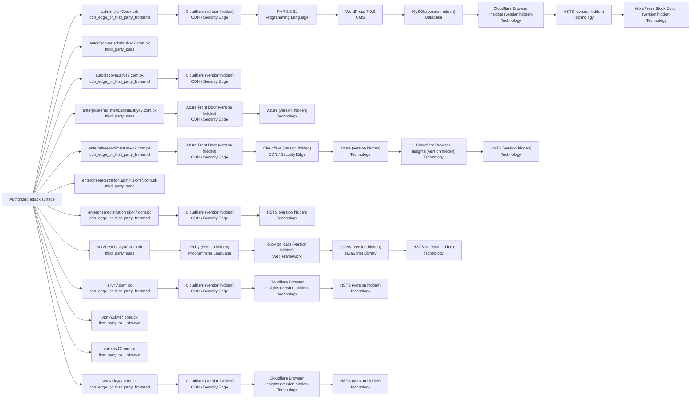

# V9.2 Technology and Service Intelligence Report

Source run: `/Users/talha/Downloads/0xCrawllerV10_updated 5/recon_runs/sky47.com.pk-20260811-153117`
Overall status: **PARTIAL**

## Coverage

- Canonical assets considered: `12`
- Web targets enriched: `7`
- Network services fingerprinted: `2`
- JavaScript assets considered: `16`
- Technologies/components consolidated: `27`
- Exact versions observed: `2`
- Technology detected but version not exposed: `25`
- Technology version conflicts: `0`

`NOT_EXPOSED` means the product/framework was detected, but the remote evidence did not reveal a defensible exact version. It is not treated as a scanner failure.

## Parallel tool lanes

| Lane | Status | Targets | Notes |
|---|---|---:|---|
| `http_evidence` | `PARTIAL` | 7 |  |
| `whatweb` | `FAILED` | 7 | Unable to find image '0xcrawller/whatweb:0.6.4' locally docker: Error response from daemon: pull access denied for 0xcrawller/whatweb, repository does not exist or may require 'docker login'  Run 'docker run --help' for more information  |
| `wappalyzer_next` | `FAILED` | 7 |  |
| `retirejs` | `FAILED` | 0 | javascript_downloads_failed |
| `zgrab2` | `COMPLETE` | 2 |  |
| `nuclei` | `COMPLETE` | 7 |  |

## Technology categories

| Category | Count |
|---|---:|
| Technology | 13 |
| CDN / Security Edge | 8 |
| Programming Language | 2 |
| CMS | 1 |
| Database | 1 |
| JavaScript Library | 1 |
| Web Framework | 1 |

## Exact observed versions

| Host | Technology | Version | Category | Confidence | Sources |
|---|---|---|---|---|---|
| `admin.sky47.com.pk` | WordPress | `7.0.3` | CMS | `medium` | httpx_wappalyzer |
| `admin.sky47.com.pk` | PHP | `8.3.31` | Programming Language | `medium` | httpx_wappalyzer |

## Database, cache, search, and queue evidence

| Host | Component | Version state | Scope | Service confirmed | Confidence |
|---|---|---|---|---:|---|
| `admin.sky47.com.pk` | MySQL | `NOT_EXPOSED` | application_reference_not_service_confirmation | False | `medium` |

## Service handshakes

| Host | Port | Module | Status | Product | Version | Sources |
|---|---:|---|---|---|---|---|
| `vpn-h.sky47.com.pk` | 443 | `banner` | `` |  | `NOT_EXPOSED` | nmap |
| `vpn.sky47.com.pk` | 179 | `banner` | `` |  | `NOT_EXPOSED` | nmap |

## Vulnerability findings (Nuclei)

Template matches are corroborating evidence for manual review — they are **not** auto-merged into technology confidence scoring above, since a template match can be behavior-based rather than a confirmed exact version.

| Host | Severity | Template | CVE | Matched at |
|---|---|---|---|---|
| `admin.sky47.com.pk` | `INFO` | AAAA Record - IPv6 Detection | — | admin.sky47.com.pk |
| `admin.sky47.com.pk` | `INFO` | Microsoft Azure Domain Tenant ID - Detect | — | https://login.microsoftonline.com:443/admin.sky47.com.pk/v2.0/.well-known/openid-configuration |
| `admin.sky47.com.pk` | `INFO` | DNS DMARC - Detect | — | _dmarc.admin.sky47.com.pk |
| `admin.sky47.com.pk` | `INFO` | HTTP Missing Security Headers | — | https://admin.sky47.com.pk/ |
| `admin.sky47.com.pk` | `INFO` | MX Record Detection | — | admin.sky47.com.pk |
| `admin.sky47.com.pk` | `INFO` | Email Service Detector | — | admin.sky47.com.pk |
| `admin.sky47.com.pk` | `INFO` | Find Pages with Old Copyright Dates | — | https://admin.sky47.com.pk/ |
| `admin.sky47.com.pk` | `INFO` | robots.txt file | — | https://admin.sky47.com.pk/robots.txt |
| `admin.sky47.com.pk` | `INFO` | robots.txt endpoint prober | — | https://admin.sky47.com.pk/robots.txt |
| `admin.sky47.com.pk` | `INFO` | SPF Record - Detection | — | admin.sky47.com.pk |
| `admin.sky47.com.pk` | `INFO` | SSL DNS Names | — | admin.sky47.com.pk:443 |
| `admin.sky47.com.pk` | `INFO` | Detect SSL Certificate Issuer | — | admin.sky47.com.pk:443 |
| `admin.sky47.com.pk` | `INFO` | Wappalyzer Technology Detection | — | https://admin.sky47.com.pk/ |
| `admin.sky47.com.pk` | `INFO` | TLS Version - Detect | — | admin.sky47.com.pk:443 |
| `admin.sky47.com.pk` | `INFO` | DNS TXT Record Detected | — | admin.sky47.com.pk |
| `admin.sky47.com.pk` | `INFO` | WAF Detection | — | https://admin.sky47.com.pk/ |
| `admin.sky47.com.pk` | `INFO` | Wildcard TLS Certificate | — | admin.sky47.com.pk:443 |
| `autodiscover.sky47.com.pk` | `INFO` | AAAA Record - IPv6 Detection | — | autodiscover.sky47.com.pk |
| `autodiscover.sky47.com.pk` | `INFO` | Add DOM EventListener - Detection | — | https://autodiscover.sky47.com.pk/ |
| `autodiscover.sky47.com.pk` | `INFO` | HTTP Missing Security Headers | — | https://autodiscover.sky47.com.pk/ |
| `autodiscover.sky47.com.pk` | `INFO` | robots.txt file | — | https://autodiscover.sky47.com.pk/robots.txt |
| `autodiscover.sky47.com.pk` | `INFO` | robots.txt endpoint prober | — | https://autodiscover.sky47.com.pk/robots.txt |
| `autodiscover.sky47.com.pk` | `INFO` | SSL DNS Names | — | autodiscover.sky47.com.pk:443 |
| `autodiscover.sky47.com.pk` | `INFO` | Detect SSL Certificate Issuer | — | autodiscover.sky47.com.pk:443 |
| `autodiscover.sky47.com.pk` | `INFO` | Wappalyzer Technology Detection | — | https://autodiscover.sky47.com.pk/ |
| `autodiscover.sky47.com.pk` | `INFO` | TLS Version - Detect | — | autodiscover.sky47.com.pk:443 |
| `autodiscover.sky47.com.pk` | `INFO` | WAF Detection | — | https://autodiscover.sky47.com.pk/ |
| `autodiscover.sky47.com.pk` | `INFO` | Wildcard TLS Certificate | — | autodiscover.sky47.com.pk:443 |
| `enterpriseenrollment.sky47.com.pk` | `INFO` | AAAA Record - IPv6 Detection | — | enterpriseenrollment.sky47.com.pk |
| `enterpriseenrollment.sky47.com.pk` | `INFO` | HTTP Missing Security Headers | — | https://enterpriseenrollment.sky47.com.pk/ |
| `enterpriseenrollment.sky47.com.pk` | `INFO` | robots.txt file | — | https://enterpriseenrollment.sky47.com.pk/robots.txt |
| `enterpriseenrollment.sky47.com.pk` | `INFO` | robots.txt endpoint prober | — | https://enterpriseenrollment.sky47.com.pk/robots.txt |
| `enterpriseenrollment.sky47.com.pk` | `INFO` | SSL DNS Names | — | enterpriseenrollment.sky47.com.pk:443 |
| `enterpriseenrollment.sky47.com.pk` | `INFO` | Detect SSL Certificate Issuer | — | enterpriseenrollment.sky47.com.pk:443 |
| `enterpriseenrollment.sky47.com.pk` | `INFO` | Wappalyzer Technology Detection | — | https://enterpriseenrollment.sky47.com.pk/ |
| `enterpriseenrollment.sky47.com.pk` | `INFO` | TLS Version - Detect | — | enterpriseenrollment.sky47.com.pk:443 |
| `enterpriseenrollment.sky47.com.pk` | `INFO` | WAF Detection | — | https://enterpriseenrollment.sky47.com.pk/ |
| `enterpriseenrollment.sky47.com.pk` | `INFO` | Wildcard TLS Certificate | — | enterpriseenrollment.sky47.com.pk:443 |
| `enterpriseregistration.sky47.com.pk` | `INFO` | AAAA Record - IPv6 Detection | — | enterpriseregistration.sky47.com.pk |
| `enterpriseregistration.sky47.com.pk` | `INFO` | HTTP Missing Security Headers | — | https://enterpriseregistration.sky47.com.pk/ |
| `enterpriseregistration.sky47.com.pk` | `INFO` | robots.txt file | — | https://enterpriseregistration.sky47.com.pk/robots.txt |
| `enterpriseregistration.sky47.com.pk` | `INFO` | robots.txt endpoint prober | — | https://enterpriseregistration.sky47.com.pk/robots.txt |
| `enterpriseregistration.sky47.com.pk` | `INFO` | SSL DNS Names | — | enterpriseregistration.sky47.com.pk:443 |
| `enterpriseregistration.sky47.com.pk` | `INFO` | Detect SSL Certificate Issuer | — | enterpriseregistration.sky47.com.pk:443 |
| `enterpriseregistration.sky47.com.pk` | `INFO` | Wappalyzer Technology Detection | — | https://enterpriseregistration.sky47.com.pk/ |
| `enterpriseregistration.sky47.com.pk` | `INFO` | TLS Version - Detect | — | enterpriseregistration.sky47.com.pk:443 |
| `enterpriseregistration.sky47.com.pk` | `INFO` | WAF Detection | — | https://enterpriseregistration.sky47.com.pk/ |
| `enterpriseregistration.sky47.com.pk` | `INFO` | Wildcard TLS Certificate | — | enterpriseregistration.sky47.com.pk:443 |
| `sky47.com.pk` | `INFO` | AAAA Record - IPv6 Detection | — | sky47.com.pk |
| `sky47.com.pk` | `INFO` | Microsoft Azure Domain Tenant ID - Detect | — | https://login.microsoftonline.com:443/sky47.com.pk/v2.0/.well-known/openid-configuration |
| `sky47.com.pk` | `INFO` | DKIM Record - Detection | — | selector1._domainkey.sky47.com.pk |
| `sky47.com.pk` | `INFO` | DNS DMARC - Detect | — | _dmarc.sky47.com.pk |
| `sky47.com.pk` | `INFO` | DNS WAF Detection | — | sky47.com.pk |
| `sky47.com.pk` | `INFO` | HTTP Missing Security Headers | — | https://sky47.com.pk/ |
| `sky47.com.pk` | `INFO` | MX Record Detection | — | sky47.com.pk |
| `sky47.com.pk` | `INFO` | Email Service Detector | — | sky47.com.pk |
| `sky47.com.pk` | `INFO` | NS Record Detection | — | sky47.com.pk |
| `sky47.com.pk` | `INFO` | Find Pages with Old Copyright Dates | — | https://sky47.com.pk/ |
| `sky47.com.pk` | `INFO` | robots.txt file | — | https://sky47.com.pk/robots.txt |
| `sky47.com.pk` | `INFO` | robots.txt endpoint prober | — | https://sky47.com.pk/robots.txt |
| `sky47.com.pk` | `INFO` | SPF Record - Detection | — | sky47.com.pk |
| `sky47.com.pk` | `INFO` | SSL DNS Names | — | sky47.com.pk:443 |
| `sky47.com.pk` | `INFO` | Detect SSL Certificate Issuer | — | sky47.com.pk:443 |
| `sky47.com.pk` | `INFO` | Wappalyzer Technology Detection | — | https://sky47.com.pk/ |
| `sky47.com.pk` | `INFO` | TLS Version - Detect | — | sky47.com.pk:443 |
| `sky47.com.pk` | `INFO` | DNS TXT Record Detected | — | sky47.com.pk |
| `sky47.com.pk` | `INFO` | WAF Detection | — | https://sky47.com.pk/ |
| `sky47.com.pk` | `INFO` | Weak Content Security Policy - Detect | — | https://sky47.com.pk/ |
| `sky47.com.pk` | `INFO` | Wildcard TLS Certificate | — | sky47.com.pk:443 |
| `www.sky47.com.pk` | `INFO` | AAAA Record - IPv6 Detection | — | www.sky47.com.pk |
| `www.sky47.com.pk` | `INFO` | HTTP Missing Security Headers | — | https://www.sky47.com.pk/ |
| `www.sky47.com.pk` | `INFO` | Find Pages with Old Copyright Dates | — | https://www.sky47.com.pk/ |
| `www.sky47.com.pk` | `INFO` | robots.txt file | — | https://www.sky47.com.pk/robots.txt |
| `www.sky47.com.pk` | `INFO` | robots.txt endpoint prober | — | https://www.sky47.com.pk/robots.txt |
| `www.sky47.com.pk` | `INFO` | SSL DNS Names | — | www.sky47.com.pk:443 |
| `www.sky47.com.pk` | `INFO` | Detect SSL Certificate Issuer | — | www.sky47.com.pk:443 |
| `www.sky47.com.pk` | `INFO` | Wappalyzer Technology Detection | — | https://www.sky47.com.pk/ |
| `www.sky47.com.pk` | `INFO` | TLS Version - Detect | — | www.sky47.com.pk:443 |
| `www.sky47.com.pk` | `INFO` | WAF Detection | — | https://www.sky47.com.pk/ |
| `www.sky47.com.pk` | `INFO` | Wildcard TLS Certificate | — | www.sky47.com.pk:443 |

High/Critical severity findings: `0` (also added to `technology_revalidation_queue.json`)

## Version conflicts

No conflicting exact versions were observed.

## Technology stack map

## Interpretation rules

- A framework-like login page can establish a technology fingerprint, but it cannot guarantee an exact backend version.
- Database or queue names found in application errors, HTML, or JavaScript are recorded as application references until a current protocol handshake confirms an exposed service.
- Current Nmap/ZGrab2 evidence has precedence over passive historical records.
- CDN-fronted hostnames receive bounded HTTP technology enrichment, not direct origin-service attribution.
- Third-party SaaS is excluded from active enrichment unless separately authorized.

## Output files

- `technology_inventory.json` / `.csv`
- `technology_evidence.jsonl`
- `technology_conflicts.json`
- `service_fingerprints.json` / `.csv`
- `wappalyzer_next_results.json`
- `javascript_components.json`
- `asset_inventory_enriched.json` / `.csv`
- `service_inventory_enriched.json` / `.csv`
- `technology_revalidation_queue.json`
- `vulnerability_findings.json`
- `technology_stack_map.mmd`
- `technology_enrichment_summary.json`
